<p align="center">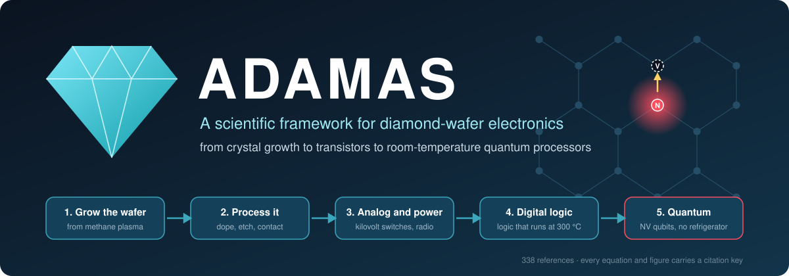</p>

<p align="center">
<b>466 references</b> · <b>25 reproducible figures</b> · <b>22 chapters</b> · <b>tested Python, SPICE, and Verilog</b> · <b>65 proposed experiments and projects</b>
</p>

> **ADAMAS** (Greek *adámas*, "unconquerable," the root of the word *diamond*) is an open, fully referenced framework for building electronics on **diamond wafers instead of silicon wafers**: how to make the wafer, how to process it, how to build analog, digital, and quantum circuits on it, and how all of that compares with today's silicon industry. Its central quantum idea is the **nitrogen-vacancy (NV) center**, an atom-sized defect in diamond that works as a quantum bit (qubit) **at room temperature**.

---

## 💎 Pick your level

<details open>
<summary><b>🧒 I am ten years old</b></summary>

Computer chips are drawn on shiny plates made of silicon, which comes from sand. Diamond is made of carbon, the same stuff as pencil lead, and its atoms hold hands *much* tighter. That makes diamond amazing at two things: it moves heat away super fast, and it does not break when you push a lot of electricity through it.

Diamond has one more trick. If you take out two carbon atoms and put one nitrogen atom in, you get a tiny spot that glows red when you shine green light on it. That tiny spot acts like a spinning top that can point up, down, or *both at once*. That is a quantum bit. Other quantum computers need freezers colder than outer space. This one works on a desk.
</details>

<details>
<summary><b>🎒 I am in high school</b></summary>

Silicon and carbon are in the same column of the periodic table, and both form crystals with the exact same pattern (it is even *called* "diamond cubic"). Carbon atoms are smaller and bond more strongly, so diamond has a huge **bandgap** (5.47 electron-volts against silicon's 1.12). A big bandgap means a diamond transistor can block thousands of volts and run at hundreds of degrees.

The **nitrogen-vacancy center** is a nitrogen atom next to a missing carbon atom. Its electrons have a **spin** that behaves like a tiny magnet. A green laser resets the spin, microwaves near 2.87 gigahertz rotate it, and the brightness of its red glow tells you the answer. The rigid diamond lattice protects the spin so well that this works at room temperature.

The hard parts: diamond wafers are still small (3 inches against silicon's 12), and two qubits must sit within about 30 nanometers of each other to interact.
</details>

<details>
<summary><b>🎓 I am an undergraduate in engineering or physics</b></summary>

Diamond's Baliga figure of merit $\varepsilon\mu E_c^3$ is about 49,000 times silicon's, and its thermal conductivity is 22 W/(cm·K). Its dopants are deep (boron 0.37 eV, phosphorus 0.57 eV), so under 1 percent ionize at 300 K, and practical transistors use a surface-transfer-doped two-dimensional hole gas on hydrogen-terminated diamond. Logic is p-channel only today; the first n-channel Metal-Oxide-Semiconductor Field-Effect Transistor (MOSFET) appeared in 2024.

The NV⁻ ground state is a spin triplet with $H/h = D S_z^2 + \gamma_e \mathbf{B}\cdot\mathbf{S}$, $D = 2.87$ GHz. Optical pumping polarizes $m_s = 0$ through a spin-selective intersystem crossing, which also gives roughly 30 percent fluorescence contrast for readout. Room-temperature $T_2$ reaches 1.8 to 2.4 ms in carbon-12-enriched crystals, and nearby nuclear spins store states for over a second. NV-NV gates use magnetic dipolar coupling, 52 MHz·nm³/r³. Start at [Chapter 1](docs/01_materials_physics.md) and [Chapter 6](docs/06_nv_center_physics.md).
</details>

<details>
<summary><b>🔬 I am a researcher or process engineer</b></summary>

The framework's thesis: (1) the intra-cell physics (electron plus nuclear register, gates above the surface-code threshold, room-temperature error correction) is mature; (2) the inter-cell link and deterministic placement are the bottleneck, with pair yield bounded by the square of the nitrogen-to-NV conversion yield; (3) photoelectric readout plus diamond-on-CMOS chiplet bonding is the manufacturable interface; (4) diamond's own p-channel hole-gas transistors are sufficient for the interface layer, so n-type doping is not on the critical path for a hybrid quantum chip. Go to [Chapter 7](docs/07_nv_fabrication_and_placement.md), [Chapter 8](docs/08_quantum_processor_architecture.md), and the experiment list in [Chapter 11](docs/11_proposed_experiments_and_roadmap.md). Limits are stated plainly: no single-shot electron readout and no photonic entanglement at 300 K; group-IV color centers need cryogenics.
</details>

---

## 🧭 The framework at a glance

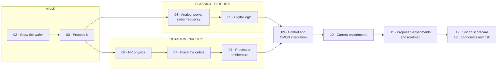

## 1 · Same crystal pattern, tighter bonds

Silicon chips already use the "diamond cubic" lattice. Diamond is that lattice with a 34 percent smaller spacing and far stronger bonds ([sze2006], [wort2008]). The NV center is one nitrogen (N) beside one vacancy (V) ([doherty2013]).

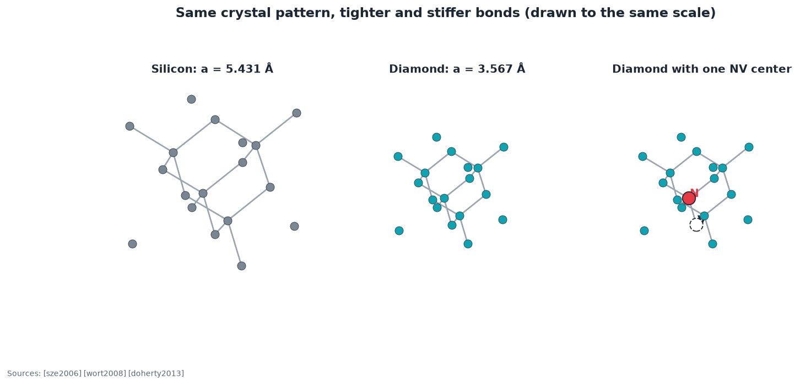

## 2 · Why diamond: the raw numbers

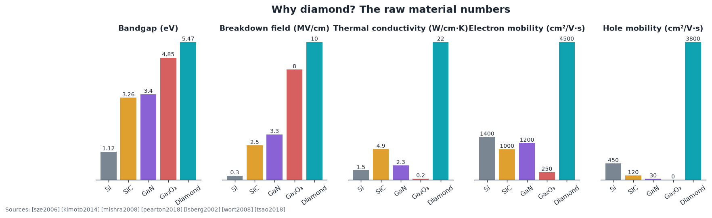

| Relative to silicon = 1 | Silicon carbide | Gallium nitride | Gallium oxide | **Diamond** |
|---|---|---|---|---|
| Power-switch score, Baliga figure of merit [baliga1982] | 343 | 878 | 2,894 | **48,976** |
| High-frequency switching score [baliga1989] | 50 | 104 | 127 | **3,016** |
| Power × frequency score [johnson1965] | 278 | 756 | 1,600 | **2,500** |
| Heat-limited density score [keyes1972] | 5.1 | 2.7 | 0.18 | **25.7** |

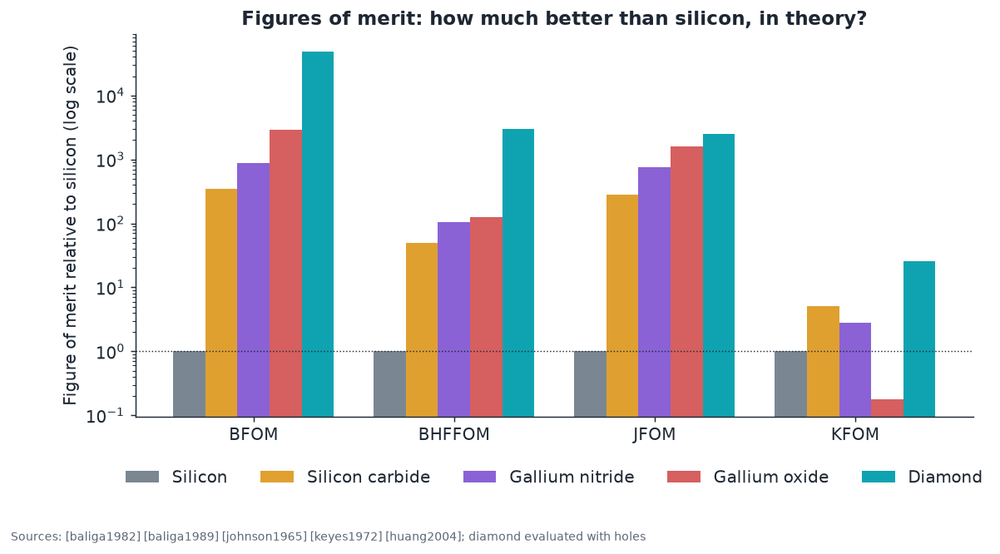

A real diamond transistor on a wafer-scale substrate already blocks 2608 V [saha2021]. It beats silicon's theoretical limit by about 35 times and still sits about 1000 times above diamond's own limit, which marks the room left to improve ([Chapter 4](docs/04_analog_power_rf_devices.md)).

<p align="center">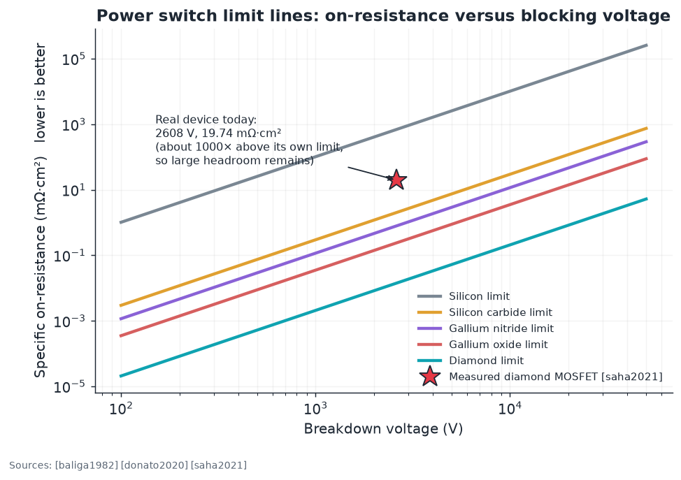</p>

## 3 · The catch: doping, and wafer size

Diamond's dopant atoms hold their carriers too tightly. At room temperature about 90 percent of boron atoms in silicon are active; in diamond, under 1 percent ([lagrange1998], [sze2006]). Engineers work around this with **surface transfer doping** ([maier2000], [crawford2021]; [Chapter 3](docs/03_process_flow_vs_cmos.md)).

| | |
|---|---|
| 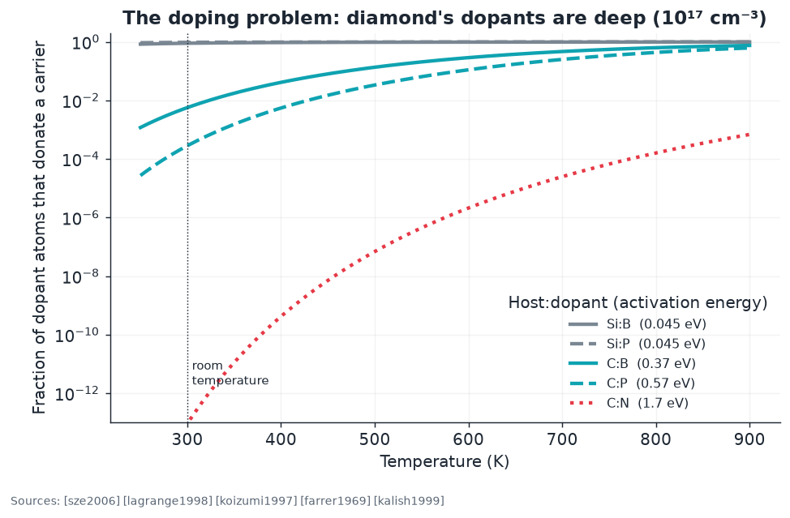 | 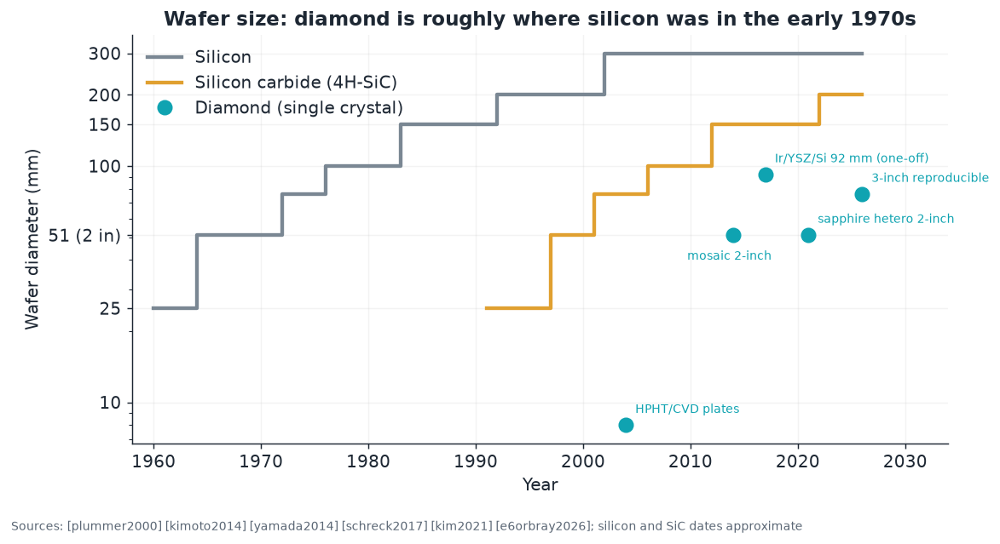 |

Wafers are catching up: reproducible 3-inch single-crystal diamond was reported in 2026 [e6orbray2026], about where silicon stood in the early 1970s ([Chapter 2](docs/02_wafer_manufacturing.md)).

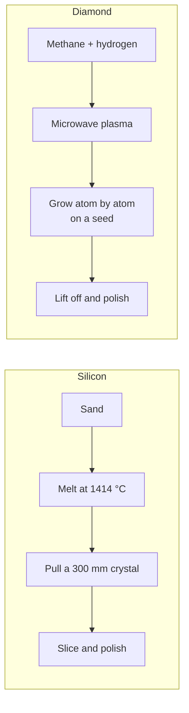

## 4 · The room-temperature qubit

| Green light sets it, microwaves turn it, red light reads it | Its resonance is a precise magnetic fingerprint |
|---|---|
| 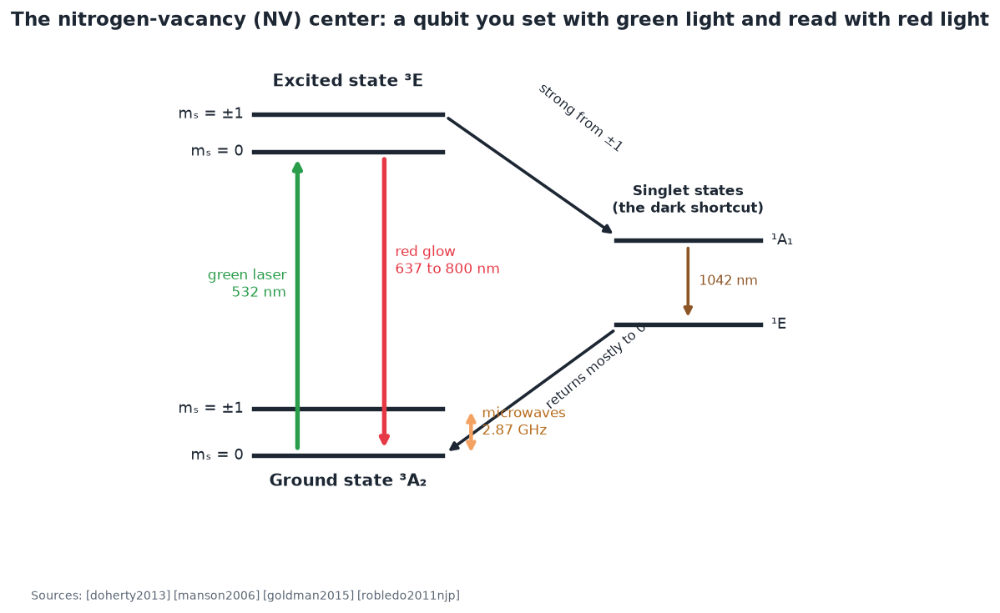 | 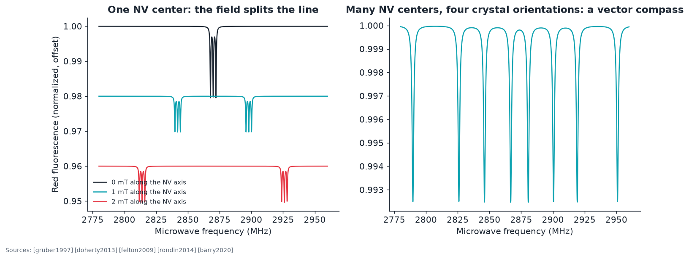 |

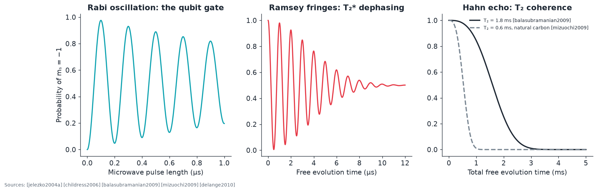

How long does quantum information survive with no refrigerator? Long enough for tens of thousands of gate operations ([balasubramanian2009], [herbschleb2019], [maurer2012], [fuchs2009]):

<p align="center">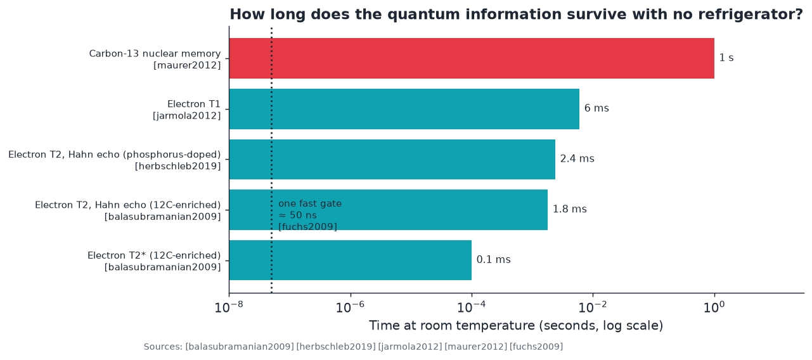</p>

## 5 · From one qubit to a processor

Each NV center is a small register: a fast electron spin plus long-lived nuclear spins ([dutt2007], [waldherr2014]). Centers link through magnetic dipolar coupling, which fades with the cube of distance, so qubits must sit within about 15 to 30 nm ([dolde2013]).


Placing two working NV centers that close is the central manufacturing problem. The model in `adamas.coupling` shows why conversion yield matters most ([pezzagna2010], [luhmann2019], [chen2019]; [Chapter 7](docs/07_nv_fabrication_and_placement.md)):

<p align="center"></p>

The proposed chip is a partnership. Silicon does the heavy classical work, and a diamond chiplet bonded on top carries qubits, sensors, and rugged interface transistors ([li2024], [siyushev2019], [kim2019cmos]; [Chapter 9](docs/09_cmos_control_integration.md)):

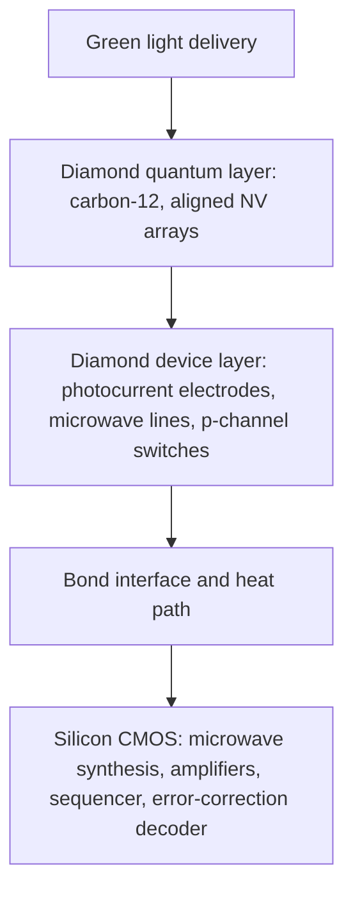

## 6 · What is proven and what is proposed

| ✅ Demonstrated (peer reviewed) | 🧪 Proposed here |
|---|---|
| 2- and 3-inch-class single-crystal wafers ([kim2021], [schreck2017]) | Detect-and-repair NV arrays with laser writing (C-5) |
| 2608 V diamond MOSFET [saha2021]; operation at 400 °C [kawarada2014] | Hole-gas transistors and NV qubits on one patterned-termination chip (C-7) |
| Inverter, NOR, NAND logic [liu2017]; first n-channel MOSFET [liao2024] | On-chip photoelectric qubit readout through a diamond switch (C-6) |
| Room-temperature gates above the fault-tolerance threshold [rong2015] | Nuclear-nuclear entanglement across two NV centers at 300 K (C-8) |
| Room-temperature quantum error correction [waldherr2014] | 16-cell microscope-free chiplet on CMOS (F-1) |
| Two NV centers entangled at 25 nm ([dolde2013], [dolde2014]) | Dark-spin chain bus beyond 50 nm (F-2, after [yao2012]) |
| Diamond chiplets on foundry CMOS [li2024] | Room-temperature logical qubit in one NV cluster (F-6) |

Full list with success metrics, budget tiers, and decision gates: [Chapter 11](docs/11_proposed_experiments_and_roadmap.md). The expert track adds 39 more, sized from a weekend to a doctoral program: [E8](docs/expert/E8_projects_and_thesis_topics.md).

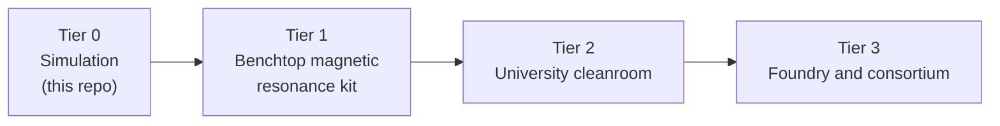

## 7 · Expert track: from the lithography tool to the logical qubit

Eight research-level chapters follow the technology stack in order. Each adds tested models, new references, and numbered experiments.


| # | Chapter | Headline result |
|---|---|---|
| E1 | [Patterning diamond: extreme ultraviolet (EUV) to electron beam](docs/expert/E1_lithography_from_euv_to_electron_beam.md) | EUV scanners are 300 mm-only and leave 45 to 124 nm of focus depth, so diamond needs co-planar carriers; the one layer that truly needs EUV-class resolution is the qubit implant mask |
| E2 | [Process integration and a process design kit (PDK)](docs/expert/E2_process_integration_and_pdk.md) | A six-mask "PDK-0" with monitor structures, a compact-model ladder, and an open-source flow |
| E3 | [Digital and processor design](docs/expert/E3_digital_and_cpu_design.md) | **DIA-4**, a working 4-bit processor synthesized to 830 to 900 diamond transistors; static power caps single-polarity diamond logic near 10⁴ gates |
| E4 | [Analog and mixed signal](docs/expert/E4_analog_and_mixed_signal_design.md) | Threshold-difference references replace bandgaps; the picoampere qubit-readout noise budget |
| E5 | [NV qubit engineering](docs/expert/E5_nv_qubit_engineering.md) | Lindblad gate model tightens the spacing rule to about 12 nm; bath and decoupling models reproduce published $T_2^{*}$ and $T_2$ |
| E6 | [Error correction and architecture](docs/expert/E6_error_correction_and_system_architecture.md) | 145 NV cells per logical qubit at 10⁻³ error; link fidelity matters more than qubit count |
| E7 | [Beyond](docs/expert/E7_beyond_the_framework.md) | Masers, hyperpolarization, gyroscopes, simulators, harsh-environment systems, rival hosts, six moonshots |
| E8 | [Project ladder](docs/expert/E8_projects_and_thesis_topics.md) | Every experiment sized from a weekend to a multi-group program |

| Lithography limits on diamond | Processors built with one transistor polarity |
|---|---|
| 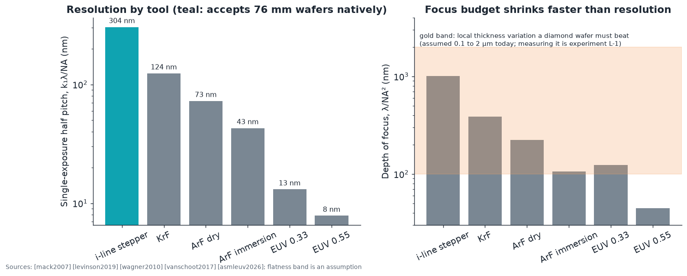 |  |

| Open-system NV–NV gate | Surface-code overhead in NV cells |
|---|---|
|  |  |

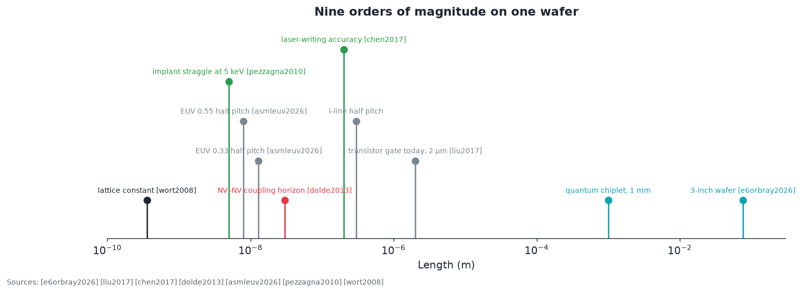

## 📚 Chapters

| # | Chapter | In one line |
|---|---|---|
| 00 | [Overview for everyone](docs/00_overview_for_everyone.md) | The whole idea in 8 minutes |
| 01 | [Materials physics](docs/01_materials_physics.md) | Figures of merit, deep dopants, heat |
| 02 | [Wafer manufacturing](docs/02_wafer_manufacturing.md) | Gas-phase growth against Czochralski silicon |
| 03 | [Process flow versus CMOS](docs/03_process_flow_vs_cmos.md) | Every fab step compared; surface transfer doping |
| 04 | [Analog, power, radio-frequency devices](docs/04_analog_power_rf_devices.md) | Diodes, transistors, amplifiers |
| 05 | [Digital logic](docs/05_digital_logic.md) | p-channel logic, its limits, the hybrid answer |
| 06 | [NV center physics](docs/06_nv_center_physics.md) | Hamiltonian, optical cycle, coherence, sensing |
| 07 | [NV fabrication and placement](docs/07_nv_fabrication_and_placement.md) | Implantation, laser writing, the yield model |
| 08 | [Quantum processor architecture](docs/08_quantum_processor_architecture.md) | Cells, links, readout, error correction, honest limits |
| 09 | [Control and CMOS integration](docs/09_cmos_control_integration.md) | The five-layer reference stack |
| 10 | [Current experiments and industry](docs/10_current_experiments_and_industry.md) | Who has shown what, with evidence labels |
| 11 | [Proposed experiments and roadmap](docs/11_proposed_experiments_and_roadmap.md) | 26 experiments in four tiers |
| 12 | [Silicon versus diamond scorecard](docs/12_silicon_vs_diamond_scorecard.md) | Row-by-row comparison |
| 13 | [Economics and risk](docs/13_economics_and_risk.md) | Product sequence and risk register |
| E1–E8 | [Expert track](docs/expert/) | Lithography → design kit → processors → analog → qubit engineering → error correction → beyond → projects |
| — | [Glossary](docs/glossary.md) · [All 466 references](references/REFERENCES.md) · [BibTeX](references/references.bib) · [Ubuntu development guide](docs/DEVELOPMENT_UBUNTU.md) | |

## ⚙️ Quick start

```bash
git clone git@github.com:Normansrule/adamas-diamond-framework.git
cd adamas-diamond-framework
sudo apt install -y ngspice iverilog yosys      # optional: circuit and logic tools
conda env create -f environment.yml && conda activate adamas

python -m pytest -q                     # 29 tests, including the citation check
make spice rtl synth                    # ngspice ring oscillator; DIA-4 processor simulation and synthesis
python examples/01_why_diamond.py       # figures of merit, doping, on-resistance
python examples/02_nv_qubit_basics.py   # resonance lines, coupling, register fidelity
python examples/make_all_figures.py     # regenerate every figure in docs/img/
```

Full step-by-step terminal guide, including GitHub publishing: [docs/DEVELOPMENT_UBUNTU.md](docs/DEVELOPMENT_UBUNTU.md).

| Module | What it computes | Key sources |
|---|---|---|
| `adamas.materials` | Properties and four figures of merit for five semiconductors | [baliga1982], [johnson1965], [keyes1972] |
| `adamas.doping` | Incomplete ionization of deep dopants | [sze2006], [lagrange1998] |
| `adamas.thermal` | Hot-spot spreading resistance | [carslaw1959] |
| `adamas.wafer` | Dies per wafer, Poisson and Murphy yield, wafer history | [murphy1964], [stapper1983] |
| `adamas.power` | Unipolar limit, transit frequency, measured points | [baliga1982], [saha2021] |
| `adamas.logic` | Square-law transistor, inverter transfer curve, noise margins | [sze2006], [liu2017] |
| `adamas.nv` | Spin Hamiltonian, magnetic resonance spectra, Rabi, Ramsey, echo, sensitivity | [doherty2013], [dreau2011] |
| `adamas.coupling` | Dipolar coupling, gate bound, Monte Carlo placement yield | [dolde2013], [neumann2010natphys] |
| `adamas.register` | Electron plus nuclear two-qubit gate simulation | [felton2009], [dutt2007] |
| `adamas.litho` | Rayleigh scaling, EUV photon statistics, mirror throughput, electron range | [mack2007], [debisschop2017], [kanaya1972] |
| `adamas.digital` | Delay, power, and gate budgets for single-polarity logic; reference processors | [rabaey2003], [faggin1996], [biggs2021] |
| `adamas.analog` | gm/I_D, gain, mismatch, noise, references, photocurrent readout budget | [silveira1996], [pelgrom1989], [blauschild1978] |
| `adamas.opensys` | Lindblad two-qubit gate, carbon-13 bath, dynamical decoupling | [lindblad1976], [maze2008prb], [delange2010] |
| `adamas.qec` | Surface-code overhead mapped to NV cells | [fowler2012], [waldherr2014] |
| `adamas.figures`, `adamas.figures_expert` | Every figure in this repository | all of the above |
| `circuits/spice`, `circuits/digital` | ngspice decks; DIA-4 Verilog, cell library, Yosys flow | [nagel1973], [wolf2013], [liu2017] |

## 🔖 The citation rule

1. Every equation, constant, and figure carries a `[bibkey]` that resolves in [`references/`](references/REFERENCES.md).
2. `tools/check_citations.py` runs in continuous integration and fails the build on any unknown key.
3. Models that originate in this repository (the gate-fidelity bound, the placement Monte Carlo, the yield plot's defect densities) are labeled as such wherever they appear.

**Honest status of the reference list.** 34 of the 466 entries (marked ✅) were checked against an online source while this repository was written. The remaining entries (marked 📚) were entered from knowledge of the literature and **may contain errors in volume, page, or year**. No Digital Object Identifiers (DOIs) were typed by hand. Before citing anything in a paper, run:

```bash
python tools/verify_refs.py        # queries Crossref, writes references/verification_report.csv
```

Company announcements are labeled as news or vendor statements in [Chapter 10](docs/10_current_experiments_and_industry.md) and are never used as evidence for a physics claim.

## 🤝 Contributing, license, citation

See [CONTRIBUTING.md](CONTRIBUTING.md). Code is released under the [MIT License](LICENSE). To cite the framework, use [CITATION.cff](CITATION.cff).
