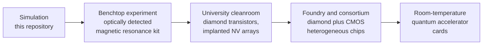

# 00 · The whole idea, for everyone

> Reading time: 8 minutes. No background needed. Every claim links to a numbered chapter where the evidence and the citations live.

## The one-paragraph version

Almost every computer chip is carved into a thin, mirror-flat disk of silicon called a **wafer**. ADAMAS asks a simple question with a complicated answer: *what would it take to carve chips into a disk of diamond instead?* Diamond carries heat five times better than copper, withstands electric fields roughly thirty times stronger than silicon can, and keeps working at temperatures that destroy silicon chips ([wort2008], [isberg2002]). Diamond also hosts a tiny flaw, the **nitrogen-vacancy (NV) center**, that behaves as a quantum bit (qubit) at ordinary room temperature, with no refrigerator ([doherty2013], [balasubramanian2009]). The same wafer could therefore carry power electronics, logic, and quantum processors.

## Silicon and diamond are cousins

Silicon and carbon sit in the same column of the periodic table. Both form four bonds, and both crystallize in the identical pattern, which crystallographers named the **diamond cubic** lattice. Silicon chips already use the diamond pattern. Diamond is the same pattern with smaller atoms and much stronger bonds ([sze2006], [wort2008]).

Shorter, stiffer bonds explain nearly every headline property:

| Stronger bonds cause... | Which gives diamond... | Which matters because... |
|---|---|---|
| Electrons need 5.47 electron-volts to break free (silicon: 1.12) | A very wide **bandgap** | Devices hold kilovolts and survive 500 °C ([wort2008], [kawarada2014]) |
| Atoms vibrate fast and in step | Thermal conductivity of 22 W/(cm·K), 15 times silicon | Heat leaves hot spots quickly ([wei1993], [olson1993]) |
| A rigid, quiet, mostly spin-free crystal | Defect spins stay coherent for milliseconds at room temperature | Qubits and sensors without cryogenics ([balasubramanian2009], [herbschleb2019]) |

## The qubit is a flaw on purpose

Remove two neighboring carbon atoms. Put a nitrogen atom in one empty spot and leave the other empty. That pair is the nitrogen-vacancy center. Its electrons carry a magnetic moment (a **spin**) that acts like a tiny compass needle with quantum behavior ([doherty2013]):

1. **Green light resets it.** A green laser pumps the spin into a known starting state ([manson2006]).
2. **Microwaves steer it.** A 2.87 gigahertz signal, close to the Wi-Fi and microwave-oven band, rotates the spin. This is the quantum logic gate ([jelezko2004a]).
3. **Red light reads it.** The center glows red, and it glows about 30 percent brighter in one spin state than the other ([gruber1997], [hopper2018]).

All three steps work on a lab bench at room temperature. That is the primary reason this framework exists.

## What is solved, and what is still hard

ADAMAS keeps a strict separation between what has been demonstrated and what is proposed.

| Topic | Status in 2026 | Chapter |
|---|---|---|
| Single-crystal diamond wafers | Reproducible 3-inch (76 mm) wafers reported; 4-inch in development ([e6orbray2026]). Silicon uses 300 mm. | [02](02_wafer_manufacturing.md) |
| p-type (boron) doping | Works, yet fewer than 1 percent of boron atoms are active at room temperature ([lagrange1998]) | [03](03_process_flow_vs_cmos.md) |
| n-type (phosphorus) doping | Works only weakly; first n-channel transistor shown in 2024 ([liao2024]) | [03](03_process_flow_vs_cmos.md), [05](05_digital_logic.md) |
| Power transistors | 2608 V blocking demonstrated on a heteroepitaxial wafer ([saha2021]) | [04](04_analog_power_rf_devices.md) |
| Logic gates | Inverters, NOR, and NAND from p-channel transistors only ([liu2017]) | [05](05_digital_logic.md) |
| Room-temperature qubits | Millisecond coherence, high-fidelity gates, small registers ([rong2015], [waldherr2014]) | [06](06_nv_center_physics.md), [08](08_quantum_processor_architecture.md) |
| Connecting many qubits | Two NV centers entangled at about 25 nm spacing ([dolde2013]). Placing pairs that close, reliably, is the central manufacturing problem. | [07](07_nv_fabrication_and_placement.md) |
| Reading a qubit in one try at room temperature | Possible for nuclear spins ([neumann2010science]); not yet for the electron spin directly | [08](08_quantum_processor_architecture.md) |

## The roadmap in one picture

Each step has a success metric and a budget class in [Chapter 11](11_proposed_experiments_and_roadmap.md).

## Where to go next

| You are... | Start with |
|---|---|
| Curious, no science background | The README "Pick your level" section, then this page |
| A student in electrical engineering or physics | [01](01_materials_physics.md) → [04](04_analog_power_rf_devices.md) → [06](06_nv_center_physics.md) |
| A process or device engineer | [02](02_wafer_manufacturing.md), [03](03_process_flow_vs_cmos.md), [12](12_silicon_vs_diamond_scorecard.md) |
| A quantum researcher | [07](07_nv_fabrication_and_placement.md), [08](08_quantum_processor_architecture.md), [11](11_proposed_experiments_and_roadmap.md) |
| An investor or program manager | [10](10_current_experiments_and_industry.md), [13](13_economics_and_risk.md) |
