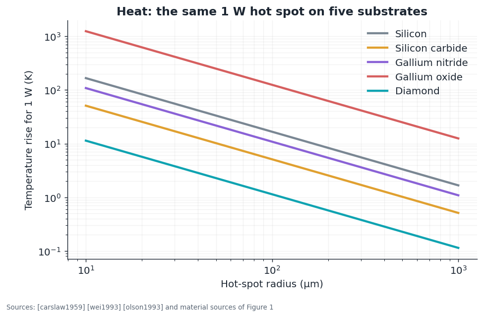

# 01 · Materials physics: why diamond, in numbers

**Plain-language summary.** Engineers rank semiconductors with a handful of scorecards called figures of merit. Diamond wins almost all of them on paper. This chapter defines each scorecard, gives its source, and computes it with `adamas.materials`.

## 1.1 The property table

Values are representative room-temperature numbers for high-quality single crystals. Mobility in particular varies with purity, and the diamond values are the high end reported for ultrapure chemical vapor deposition (CVD) material ([isberg2002]); more typical Hall mobilities in doped layers are 1000 to 2000 cm²/(V·s) for holes ([pernot2010], [volpe2009]) and several hundred for electrons ([pernot2008]). Treat the diamond column as an upper bound.

| Property | Silicon (Si) | Silicon carbide (4H-SiC) | Gallium nitride (GaN) | Gallium oxide (β-Ga₂O₃) | Diamond (C) |
|---|---|---|---|---|---|
| Bandgap $E_g$ (eV) | 1.12 | 3.26 | 3.4 | 4.85 | 5.47 |
| Critical field $E_c$ (MV/cm) | 0.3 | 2.5 | 3.3 | 8 | 10 |
| Electron mobility $\mu_n$ (cm²/V·s) | 1400 | 1000 | 1200 | 250 | 4500 |
| Hole mobility $\mu_p$ (cm²/V·s) | 450 | 120 | 30 | n/a | 3800 |
| Relative permittivity $\varepsilon_r$ | 11.7 | 9.7 | 9.0 | 10 | 5.7 |
| Saturation velocity (10⁷ cm/s) | 1.0 | 2.0 | 2.5 | 1.5 | 1.5 |
| Thermal conductivity $\kappa$ (W/cm·K) | 1.5 | 4.9 | 2.3 | 0.2 | 22 |
| Sources | [sze2006] | [kimoto2014] | [mishra2008] | [pearton2018], [higashiwaki2012] | [isberg2002], [wort2008], [donato2020] |

Cross-material surveys: [tsao2018], [hudgins2003], [chow1994], [millan2014]. Breakdown field measurements in boron-doped diamond: [volpe2010]. Carrier transport fundamentals in diamond: [nava1980], [reggiani1981], [akimoto2014], [pernegger2005]. Optical bandgap: [clark1964]. Mechanical properties: [field2012].

## 1.2 Figures of merit

**Baliga figure of merit (BFOM)**, conduction loss of a vertical unipolar power switch [baliga1982]:

$$\mathrm{BFOM} = \varepsilon \mu E_c^{3}$$

**Baliga high-frequency figure of merit (BHFFOM)**, switching loss [baliga1989]:

$$\mathrm{BHFFOM} = \mu E_c^{2}$$

**Johnson figure of merit (JFOM)**, power-frequency product of a transistor [johnson1965]:

$$\mathrm{JFOM} = \left(\frac{E_c v_{sat}}{2\pi}\right)^{2}$$

**Keyes figure of merit (KFOM)**, thermal limit on switching density [keyes1972]:

$$\mathrm{KFOM} = \kappa \sqrt{\frac{c\, v_{sat}}{4\pi\varepsilon}}$$

Output of `adamas.materials.normalized_foms()`, each divided by the silicon value. Diamond is evaluated with **holes**, since boron p-type material is what can be built today ([kalish1999], [donato2020]):

| Material | BFOM | BHFFOM | JFOM | KFOM |
|---|---|---|---|---|
| Silicon | 1 | 1 | 1 | 1 |
| Silicon carbide | 343 | 50 | 278 | 5.1 |
| Gallium nitride | 878 | 104 | 756 | 2.7 |
| Gallium oxide | 2,894 | 127 | 1,600 | 0.18 |
| Diamond (holes) | 48,976 | 3,016 | 2,500 | 25.7 |


**Caution.** Figures of merit assume every dopant atom is ionized. In diamond that assumption fails badly at room temperature (Section 1.3), so [huang2004] and [donato2020] recommend temperature-aware comparisons. ADAMAS therefore always reports the ideal limit and the measured device side by side ([Chapter 4](04_analog_power_rf_devices.md)).

## 1.3 The catch: deep dopants and incomplete ionization

For a single acceptor level at energy $E_A$ above the valence band, with density $N_A$, compensation $N_D$, and degeneracy $g = 4$, charge neutrality gives [sze2006]:

$$\frac{p\,(p + N_D)}{N_A - N_D - p} = \frac{N_V(T)}{g}\exp\left(-\frac{E_A}{k_B T}\right), \qquad N_V(T) = 2\left(\frac{2\pi m^{*} k_B T}{h^{2}}\right)^{3/2}$$

| Host : dopant | Activation energy | Source | Ionized at 300 K, 10¹⁷ cm⁻³ (`adamas.doping`) |
|---|---|---|---|
| Si : boron | 0.045 eV | [sze2006] | about 90% |
| Si : phosphorus | 0.045 eV | [sze2006] | about 90% |
| Diamond : boron | 0.37 eV | [collins1971], [chrenko1973], [lagrange1998] | 0.57% |
| Diamond : phosphorus | 0.57 eV | [koizumi1997], [katagiri2004] | 0.03% |
| Diamond : nitrogen | 1.7 eV | [farrer1969] | effectively zero |


Three engineering consequences follow:

1. **Diamond devices get better when hot.** Carrier density rises with temperature, which is the opposite of silicon's behavior and suits high-temperature electronics ([neudeck2002], [kawarada2014]).
2. **Designers avoid bulk doping where they can.** Surface transfer doping of hydrogen-terminated diamond creates a two-dimensional hole gas with no thermal activation ([maier2000], [strobel2004], [crawford2021]). Heavy boron doping above about 3×10²⁰ cm⁻³ produces metallic conduction ([lagrange1998]) and even superconductivity ([ekimov2004]).
3. **Nitrogen is useless as a donor and priceless as a qubit.** The same deep level that makes nitrogen a poor dopant isolates the nitrogen-vacancy center's electrons from the bands ([goss2004], [doherty2013]).

## 1.4 Heat

Thermal conductivity of natural-abundance diamond is about 22 W/(cm·K) and rises to about 33 W/(cm·K) when the crystal is isotopically enriched to 99.9 percent carbon-12 ([anthony1990], [wei1993], [olson1993], [inyushkin2018]). Isotope purification is also what extends qubit coherence ([Chapter 6](06_nv_center_physics.md)), so one process step pays twice.

The temperature rise of a circular hot spot of radius $a$ dissipating power $P$ on a thick substrate is [carslaw1959]:

$$\Delta T = \frac{P}{4\kappa a}$$



This is the reason gallium nitride radio amplifiers are already bonded to diamond heat spreaders ([francis2010], [pomeroy2014], [sun2015], [malakoutian2021], [liang2021]).

## 1.5 Reproduce

```bash
python -c "from adamas.materials import normalized_foms; import pprint; pprint.pprint(normalized_foms())"
python examples/make_all_figures.py
```
