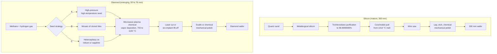
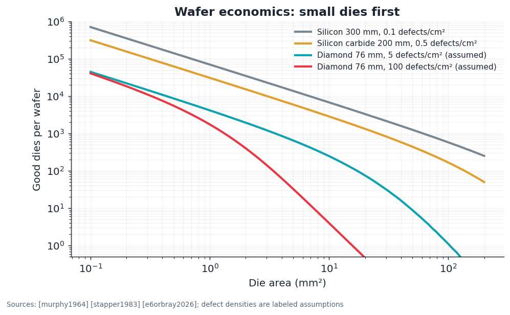

# 02 · Wafer manufacturing: from methane to a polished disk

**Plain-language summary.** Silicon wafers are sliced from a giant crystal pulled out of molten sand. Diamond cannot be melted at any practical pressure, so diamond wafers are *grown from gas*, atom by atom, on top of a seed. The seed is the bottleneck. This chapter compares the two supply chains step by step.

## 2.1 Side-by-side flow

Silicon sources: [czochralski1918], [teal1950], [plummer2000]. Diamond sources follow in each section.

## 2.2 Growth methods

### High pressure, high temperature (HPHT)

The first reproducible synthesis dissolved graphite in molten metal at about 5 to 6 gigapascals and 1300 to 1600 °C, mimicking the Earth's mantle [bundy1955]. Modern temperature-gradient presses produce type IIa crystals with very low dislocation density, in plates up to roughly 10 mm ([sumiya2012], [burns2009]). These are the best seeds available, and they are small.

### Chemical vapor deposition (CVD)

Diamond is metastable at low pressure, yet it grows from a hydrogen-rich plasma because atomic hydrogen etches graphite faster than diamond and keeps the surface bonds open ([angus1968], [matsumoto1982], [kamo1983], [butler2009]). The Bachmann diagram maps the carbon-hydrogen-oxygen gas compositions that yield diamond [bachmann1991], and scaling laws relate growth rate to atomic hydrogen and methyl radical flux [goodwin1993]. High-power-density plasmas reach tens of micrometers per hour ([yan2002], [tallaire2013]). Reviews: [balmer2009], [gicquel2001], [teraji2015].

Simplified surface chemistry [butler2009]:

$$\mathrm{C_d H + H^{\bullet} \rightarrow C_d^{\bullet} + H_2}, \qquad \mathrm{C_d^{\bullet} + CH_3^{\bullet} \rightarrow C_d CH_3}$$

### Three seed strategies for large area

| Strategy | How it works | Best reported size | Main defect issue | Sources |
|---|---|---|---|---|
| A. Enlarged homoepitaxy | Grow on an HPHT seed, regrow on side faces, repeat | about 10 to 15 mm | Slow; polycrystalline rim | [mokuno2009], [tallaire2013], [friel2009] |
| B. Mosaic wafers | Clone identical tiles from one seed by ion-implant lift-off, tile them, overgrow the seams | 2 inch (40 × 60 mm) | Dislocation bundles and stress at tile boundaries | [yamada2014], [shikata2016] |
| C. Heteroepitaxy | Nucleate oriented diamond on a foreign single crystal | 92 mm on iridium/yttria-stabilized zirconia/silicon; 2 inch on sapphire; reproducible 3 inch reported in 2026 | Dislocation density 10⁶ to 10⁸ cm⁻² | [ohtsuka1996], [gsell2004], [schreck2014], [schreck2017], [aida2016], [kim2020], [kim2021], [e6orbray2026] |

Heteroepitaxy is the route that resembles a real wafer industry, since sapphire and silicon substrates already exist at large diameters. The 2608 V transistor in [Chapter 4](04_analog_power_rf_devices.md) was built on a heteroepitaxial wafer ([saha2021], [saha2020]).

### Quantum-grade material

Qubit layers need far higher purity than power layers: substitutional nitrogen below about one part per billion and carbon-13 depleted below 0.01 percent ([balasubramanian2009], [markham2011], [teraji2015], [achard2020], [itoh2014]). In practice a thin quantum-grade epitaxial layer is grown on an electronic-grade substrate, which keeps isotopically enriched methane consumption small.

## 2.3 Separation and polishing

- **Lift-off.** A high-energy ion implant creates a buried damaged layer that is graphitized and etched electrochemically, releasing the grown plate and saving the seed ([mokuno2009], [yamada2014]).
- **Polishing.** Diamond is the hardest known material, so silicon-style slurry polishing is slow. Traditional scaife polishing is strongly anisotropic; chemical-mechanical and plasma-assisted methods reach sub-nanometer roughness ([schuelke2013]).
- **Metrology.** X-ray topography and birefringence map dislocations ([gaukroger2008], [burns2009]).

## 2.4 Scorecard against silicon

| Parameter | Silicon | Diamond (2026) | Gap | Source |
|---|---|---|---|---|
| Production diameter | 300 mm | 50 to 76 mm | about 4 to 6× in diameter, 16 to 36× in area | [irds2023], [e6orbray2026] |
| Dislocation density | near 0 cm⁻² | 10³ (HPHT) to 10⁷ (heteroepitaxial) cm⁻² | many orders | [sumiya2012], [schreck2017] |
| Growth rate | about 1 mm/min pull | 1 to 100 µm/h | about 1000× | [plummer2000], [yan2002] |
| Native oxide | SiO₂, excellent | none (carbon oxidizes to gas) | needs deposited dielectrics | [dealgrove1965], [kawarada2014] |
| Thickness for handling | 775 µm | 300 to 500 µm | comparable | [shikata2016] |

## 2.5 What the yield math says

Gross dies per wafer of diameter $d$ and die area $A$ (standard edge-loss estimate, [plummer2000]):

$$N \approx \frac{\pi (d/2)^2}{A} - \frac{\pi d}{\sqrt{2A}}$$

Yield with defect density $D_0$: Poisson $Y = e^{-A D_0}$; Murphy $Y = \left[(1 - e^{-A D_0})/(A D_0)\right]^2$ ([murphy1964], [stapper1983]).

The diamond defect densities in this plot are **labeled assumptions**, since no public killer-defect statistics exist yet for diamond devices. The qualitative result is robust: **first products must be small dies**, which suits discrete power switches, radio-frequency transistors, sensors, and quantum chiplets of about 1 mm². That is exactly where industry is starting ([pen2026], [ookuma2026], [patsnap2026]).

Code: `adamas.wafer`.
