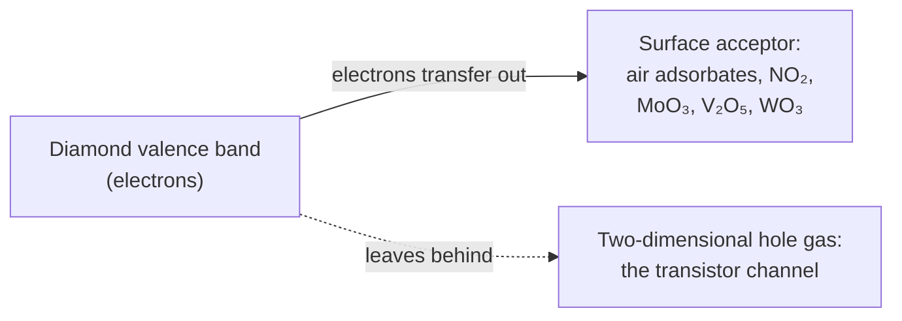
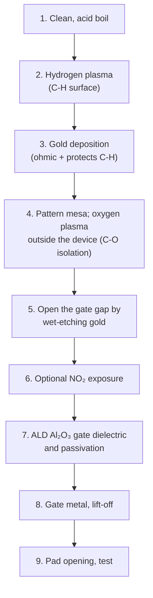

# 03 · Process flow: building devices on diamond versus Complementary Metal-Oxide-Semiconductor (CMOS) silicon

**Plain-language summary.** A chip factory repeats a short list of steps: add a layer, print a pattern, etch, add impurities, heat, repeat. Most steps transfer to diamond. Three do not: growing an oxide, doping by ion implantation, and making n-type material. This chapter lists the workarounds.

## 3.1 Step-by-step comparison

| Step | Silicon CMOS | Diamond today | Transfer difficulty | Sources |
|---|---|---|---|---|
| Lithography | Optical, extreme ultraviolet | Identical tools; small, sometimes non-round substrates need carriers | Low | [plummer2000] |
| Gate dielectric | Thermal SiO₂, then high-κ | Atomic layer deposition (ALD) of Al₂O₃; hexagonal boron nitride | Medium | [dealgrove1965], [kawarada2014], [sasama2018] |
| p-type doping | Boron implant + anneal | Boron added **during growth**; implantation is poor | Medium | [kalish1999], [prins1988] |
| n-type doping | Phosphorus or arsenic implant | Phosphorus during growth, best on (111); 0.57 eV deep | **High** | [koizumi1997], [kato2005], [katagiri2004] |
| Implant damage repair | Anneal recrystallizes silicon | Above about 10²² vacancies/cm³, diamond turns to graphite on annealing | **High** | [uzansaguy1995], [kalish1999] |
| Etching | Fluorine and chlorine plasmas | Oxygen-based inductively coupled plasma; metal or oxide hard masks | Low | [hwang2004], [lee2008], [hausmann2010] |
| Ohmic contacts | Silicides | Titanium/platinum/gold annealed to form titanium carbide; gold on hydrogen-terminated surfaces | Low | [moazed1990], [tachibana1992] |
| Schottky contacts | Many metals | Zirconium, platinum, and others on oxygen-terminated surfaces | Low | [traore2014], [butler2003] |
| Surface termination | Hydrogen passivation of dangling bonds | **A design variable**: hydrogen gives hole conduction, oxygen gives insulation | New capability | [maier2000], [kawarada1996] |
| Isolation | Shallow trench, wells | Oxygen termination or mesa etch; the substrate itself is an insulator | Easier | [kawarada2014] |
| Interconnect | Copper damascene | Standard metals; or bond a diamond chiplet to a CMOS back end | Medium | [li2024] |

## 3.2 Surface transfer doping: diamond's unique trick

A hydrogen-terminated diamond surface has **negative electron affinity**: its conduction band sits above the vacuum level ([himpsel1979]). Its valence band therefore lies unusually high, and any surface acceptor with a deep enough unoccupied level pulls electrons out of the diamond. What remains is a two-dimensional hole gas of 10¹² to 10¹⁴ cm⁻² a few nanometers below the surface, with **no thermal activation energy** ([landstrass1989], [maier2000], [strobel2004]).

| Acceptor layer | Note | Sources |
|---|---|---|
| Atmospheric adsorbates | The original discovery; unstable | [maier2000] |
| Nitrogen dioxide (NO₂) + Al₂O₃ cap | Highest hole density; used in the 2608 V device | [kubovic2010], [saha2021] |
| Molybdenum trioxide (MoO₃), vanadium pentoxide (V₂O₅) | Stable to several hundred °C | [russell2013], [tordjman2014], [crawford2016], [verona2016], [ren2017] |
| ALD Al₂O₃ alone | Stabilizes the hole gas to 400 °C and beyond | [kawarada2014], [kawarada2017] |

Review: [crawford2021]. Hexagonal boron nitride gates reach Hall mobilities above 300 to 600 cm²/(V·s) by removing charged surface acceptors ([sasama2018], [sasama2022]).

## 3.3 A reference process flow for a hydrogen-terminated diamond Metal-Oxide-Semiconductor Field-Effect Transistor (MOSFET)

Sources for the flow: [kawarada1994], [kasu2005], [russell2012], [kawarada2014], [kitabayashi2017], [saha2021]. Mask count is roughly 4 to 6, against 40 or more for an advanced CMOS node ([irds2023]), which makes it realistic for a university cleanroom ([Chapter 11](11_proposed_experiments_and_roadmap.md)).

## 3.4 Inversion-channel and bulk-doped devices

An inversion-channel MOSFET on phosphorus-doped n-type diamond with a wet-annealed Al₂O₃ interface was first shown in 2016 [matsumoto2016]. Bulk-doped devices (Schottky diodes, junction field-effect transistors, bipolar transistors) use boron and phosphorus layers grown in sequence ([koizumi2001], [makino2009], [iwasaki2013jfet], [kato2012bjt]). Book-length treatment: [koizumi2018book].

## 3.5 What this means for qubits

Nitrogen implantation for NV centers operates **far below** the graphitization threshold of [uzansaguy1995], with doses of 10⁸ to 10¹² ions/cm², so the implant-damage problem that blocks transistor doping does not block qubit fabrication. Surface termination still matters: NV centers within about 10 nm of a hydrogen-terminated surface lose their electron and go dark, so qubit regions need oxygen (or fluorine or nitrogen) termination ([hauf2011], [grotz2012]). A combined chip therefore patterns **C-H where it wants transistors and C-O where it wants qubits**, which is a lithography step that silicon has no analog for.
