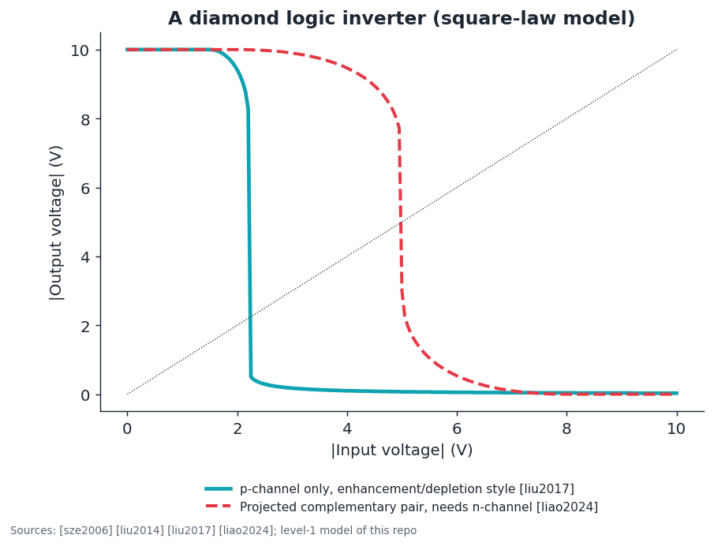
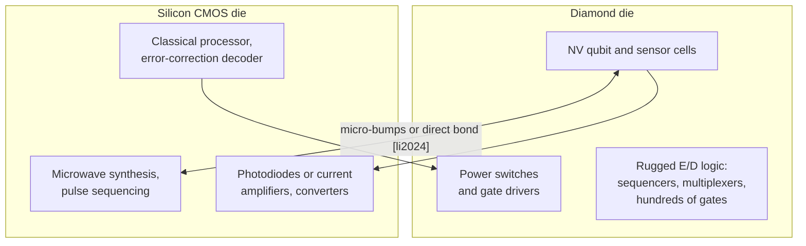

# 05 · Digital logic on diamond

**Plain-language summary.** Silicon logic pairs two kinds of transistor, one that conducts with electrons (n-type) and one with holes (p-type). The pairing, called Complementary Metal-Oxide-Semiconductor (CMOS), wastes almost no power when idle. Diamond has excellent p-type transistors and only embryonic n-type ones. So diamond logic today resembles silicon logic from the 1970s, and its best use is a small amount of rugged logic placed where silicon cannot survive, plus a bonded silicon chip for everything else.

## 5.1 The state of the art

| Milestone | Source |
|---|---|
| Enhancement-mode and depletion-mode hydrogen-terminated transistors on one chip; inverter | [liu2014] |
| NOR and NAND gates from hydrogenated-diamond transistors | [liu2017] |
| Normally-off operation through partial oxygen termination of the channel | [kitabayashi2017] |
| Inversion-channel p-MOSFET | [matsumoto2016] |
| First n-channel MOSFET, the missing half of diamond CMOS | [liao2024] |
| p-channel MOSFET on a phosphorus-doped n-type body | [zhao2024] |

## 5.2 Inverter model

`adamas.logic` uses the long-channel square-law model [sze2006]:

$$I_D = \begin{cases} k\left[(V_{GS}-V_T)V_{DS} - V_{DS}^2/2\right], & V_{DS} < V_{GS}-V_T \\ \tfrac{k}{2}(V_{GS}-V_T)^2, & V_{DS} \ge V_{GS}-V_T \end{cases} \qquad k = \mu C_{ox}\frac{W}{L}$$

and solves $I_{driver} = I_{load}$ for each input voltage.

The single-carrier enhancement/depletion (E/D) inverter has a **ratioed** output: its low level is not zero, and it draws static current whenever the output is low. For the 25 µm wide depletion load of the figure ($|V_T| = 2$ V, 30 nm Al₂O₃, 2 µm gate length), the model gives about 1 mA of static current, or 10 mW per gate at 10 V. Shrinking the load to a width-to-length ratio of 1 cuts this to about 0.08 mA (under 1 mW) at the cost of a slower rising edge. Even then, a thousand-gate block dissipates on the order of a watt, which diamond can remove thermally ([Chapter 1](01_materials_physics.md)) yet which rules out million-gate processors. This is the same wall that pushed silicon from n-channel-only logic to CMOS in the early 1980s ([plummer2000]).

## 5.3 Scaling expectations

Dennard scaling [dennard1974] and Moore's law [moore1965] rested on thin thermal oxide, shallow implanted junctions, and 10¹⁸ cm⁻³-class fully ionized doping. None of the three exists in diamond ([Chapter 3](03_process_flow_vs_cmos.md)). ADAMAS therefore does **not** propose diamond as a replacement for leading-edge silicon logic ([irds2023]). The realistic roles are:

1. **High-temperature and radiation-hard control logic** (hundreds to thousands of gates), following the silicon carbide precedent of [neudeck2016].
2. **Heterogeneous integration**: diamond chiplets bonded on silicon CMOS, already demonstrated for quantum devices ([li2024], [wan2020], [kim2019cmos], [ibrahim2021]). See [Chapter 9](09_cmos_control_integration.md).
3. **Future complementary logic** once n-channel mobility, threshold control, and p/n integration on one wafer mature ([liao2024], [zhao2024]). Both orientations matter here: phosphorus incorporates best on (111) ([koizumi1997]), while large wafers are (001) ([kato2005], [kim2021]).

## 5.4 Design rules ADAMAS proposes for p-only logic

These are proposals of this repository, derived from the model above, and are flagged as such.

| Rule | Reason |
|---|---|
| Driver-to-load strength ratio ≥ 8 | Keeps the low noise margin above 10 percent of the supply in `adamas.logic.noise_margins` |
| Supply magnitude 5 to 10 V | Thresholds of reported devices scatter by about ±1 V ([liu2017], [kitabayashi2017]) |
| Prefer NOR-style pull networks | Series stacks suffer most from the ratioed low level |
| Budget 1 to 10 mW per gate static | From the E/D current estimate above |
| Keep qubit regions oxygen-terminated and at least several micrometers from hole-gas channels | Charge-state stability of NV centers ([hauf2011], [grotz2012]) |

SPICE starting point: [`circuits/spice/`](../circuits/spice/README.md).
