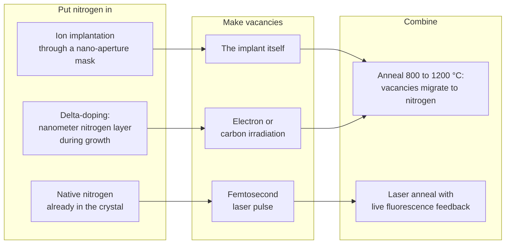
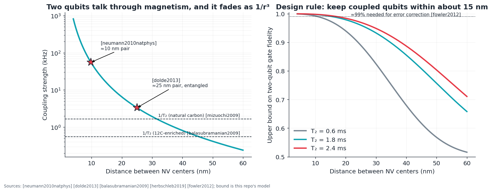
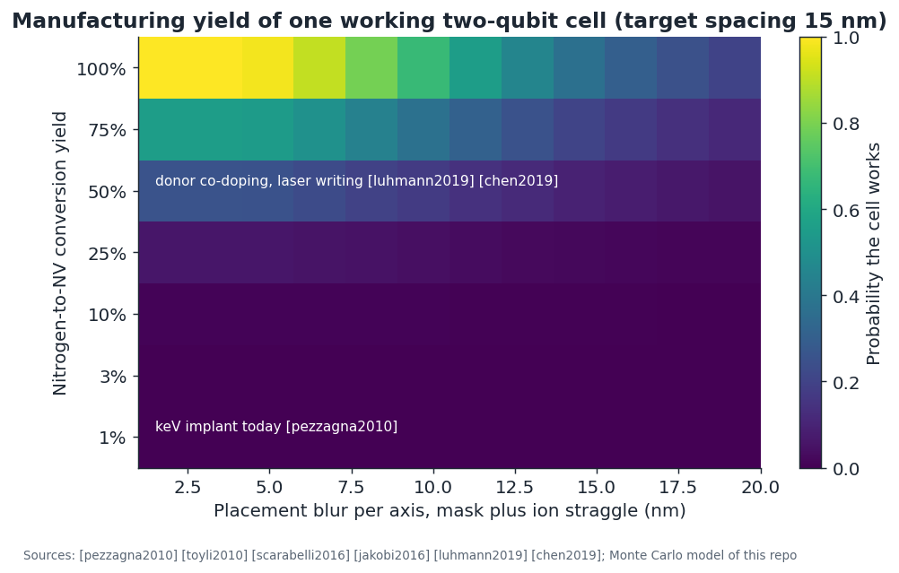

# 07 · Making NV centers where you want them

**Plain-language summary.** Two NV qubits can only "talk" directly if they sit closer than about 30 nanometers, roughly one ten-thousandth the width of a hair. Today's tools can aim nitrogen atoms to within about 10 to 20 nanometers, and only a few percent of them become working qubits. Closing that gap is the single most important manufacturing problem in this framework.

## 7.1 Methods

| Method | Lateral precision | Depth control | N→NV yield | Coherence | Sources |
|---|---|---|---|---|---|
| Focused or masked ion implant, keV | 10 to 30 nm | straggle ≈ 40% of depth | about 1% at 5 keV, rising to tens of % at MeV | reduced by residual damage | [meijer2005], [rabeau2006], [pezzagna2010], [pezzagna2010small], [toyli2010], [spinicelli2011], [bayn2015] |
| Implant through mask for coupled pairs | pairs at 10 to 40 nm | same | low pair yield | sufficient for entanglement | [scarabelli2016], [jakobi2016], [dolde2013] |
| Delta-doping + irradiation | none laterally (unless masked) | about 1 to 2 nm | few % | $T_2$ > 100 µs at 5 nm depth class | [ohno2012], [ohno2014], [mclellan2016] |
| Femtosecond laser writing | about 200 nm lateral (diffraction), sub-100 nm shown | about 1 µm, improving | near-unity **per site** with feedback | bulk-like | [chen2017], [chen2019] |
| Donor co-doping (phosphorus, sulfur, oxygen) | as implant | as implant | raised about tenfold, toward 75% | improved | [luhmann2019], [luhmann2018], [favaro2017] |
| High-temperature anneal (1000 to 1200 °C) | n/a | n/a | n/a | removes paramagnetic vacancy clusters | [naydenov2010], [yamamoto2013], [deak2014] |
| Focused ion beam into photonic structures | < 50 nm | as implant | few % | optical linewidth concerns | [schroder2017], [schukraft2016], [vandam2019], [chu2014] |

Review: [smith2019]. Ion range simulation: [ziegler2010]. Deterministic single-ion sources with detection of each ion, developed for silicon donor qubits and rare-earth ions, are transferable ([jamieson2005], [grootberning2019]).

**Orientation.** Growth on (111) or (113) surfaces under the right conditions aligns nearly all NV centers along one axis, which removes a four-fold loss in addressability ([michl2014], [lesik2014], [fukui2014], [edmonds2012], [ozawa2017]).

**Isotopes.** ¹²C enrichment to 99.99 percent removes the nuclear-spin bath ([balasubramanian2009], [ishikawa2012], [itoh2014], [teraji2015]).

## 7.2 Why distance matters: dipolar coupling

Two electron spins a distance $r$ apart, with their joining vector at angle $\theta$ to the quantization axis, couple with strength ([neumann2010natphys], [dolde2013]):

$$\nu_{dd} = \frac{\mu_0 \gamma_e^{2} \hbar}{8\pi^2 r^{3}}\left|1 - 3\cos^2\theta\right| \approx \frac{52\ \mathrm{MHz\cdot nm^3}}{r^{3}}$$

A controlled-phase gate takes $t_g = 1/(2\nu_{dd})$. ADAMAS uses the simple upper bound $F \le \tfrac12\left(1 + e^{-t_g/T_2}\right)$ (this repository's model; it ignores control error):

| Spacing | Coupling | Gate time | Fidelity bound, $T_2$ = 1.8 ms |
|---|---|---|---|
| 10 nm | 52 kHz | 9.6 µs | 0.997 |
| 15 nm | 15 kHz | 32 µs | 0.991 |
| 25 nm | 3.3 kHz | 150 µs | 0.960 |
| 30 nm | 1.9 kHz | 260 µs | 0.933 |

Experiments: about 10 nm pair with 40 kHz-class coupling [neumann2010natphys]; about 25 nm pair entangled at room temperature with fidelity 0.67 [dolde2013], improved to 0.82 with optimal control [dolde2014].

## 7.3 The placement-yield model

`adamas.coupling.pair_yield` draws both sites' positions from a three-dimensional Gaussian blur $\sigma$ (mask aperture plus ion straggle), creates each NV with probability $y$, and asks whether exactly one NV formed per site and the pair landed within 30 nm.

With one ion per site the pair yield can never exceed $y^2$: 1 percent conversion gives 10⁻⁴. An array of $N$ coupled qubits scales as roughly $y^{N}$, which is hopeless at today's keV-implant yields and merely difficult at 50 to 75 percent. The three levers, in order of impact:

1. **Conversion yield** → donor co-doping [luhmann2019], laser writing with feedback [chen2019].
2. **Detect, then repair**: image the array by super-resolution or optically detected magnetic resonance, and laser-write missing sites. Proposed experiment P-5 in [Chapter 11](11_proposed_experiments_and_roadmap.md).
3. **Blur** → lower energy with thinner masks, channeling-aware design ([toyli2010], [bayn2015], [scarabelli2016]).

The alternative is to relax the spacing requirement with a **quantum bus**: chains of dark nitrogen spins [yao2012], nuclear-spin-mediated coupling [bermudez2011], mechanical resonators [rabl2010], or ferromagnet-mediated coupling [trifunovic2013]. None has been demonstrated between NV centers at room temperature yet. ADAMAS states this plainly.

Code: `adamas.coupling`.
