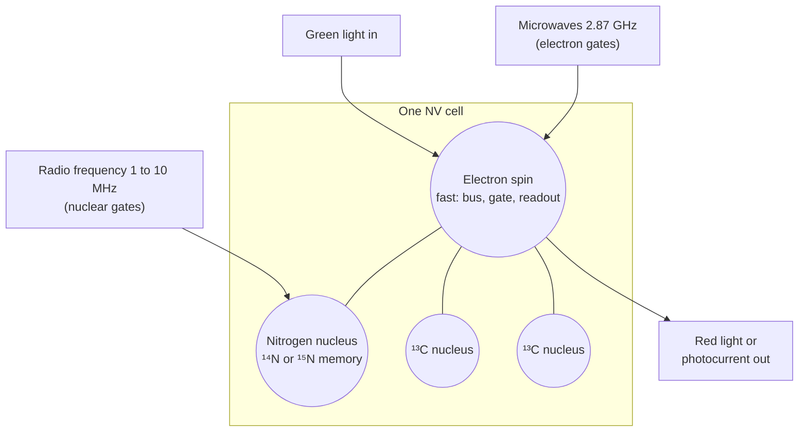
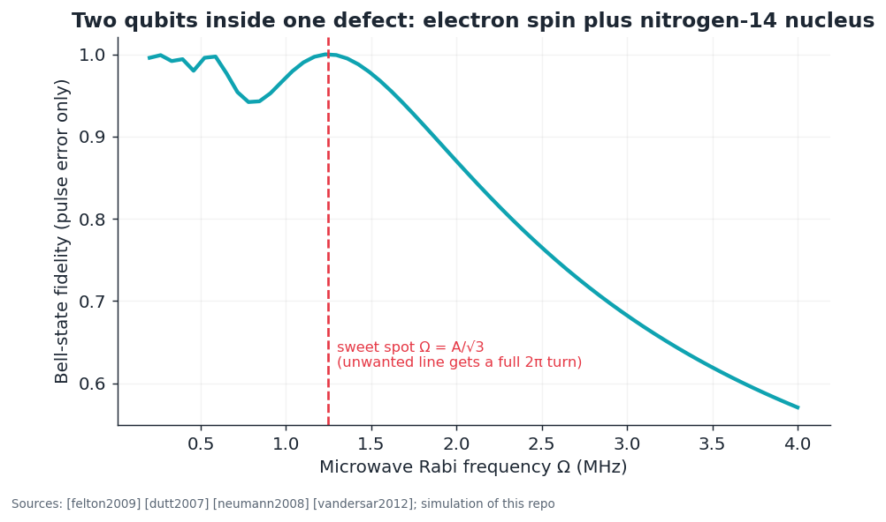
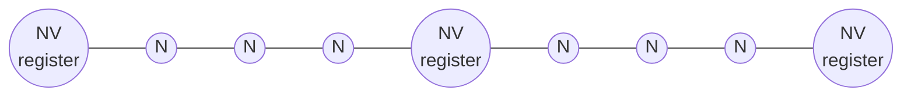

# 08 · Room-temperature quantum processor architecture

**Plain-language summary.** One NV center is a tiny quantum computer of its own: a fast electron-spin qubit for talking to the outside, plus slow, long-lived nuclear-spin qubits for memory. A processor is many of these cells linked together. The cells work today. The links are the open problem. This chapter lays out the architecture, checks it against the standard criteria for a quantum computer, and states candidly what has not been shown at room temperature.

## 8.1 The DiVincenzo checklist

Criteria from [divincenzo2000]; general background in [nielsen2010], [ladd2010], [preskill2018].

| Criterion | Room-temperature NV status | Evidence |
|---|---|---|
| 1. Well-defined, scalable qubits | Qubits: yes. Scalable placement: **not yet**. | [Chapter 7](07_nv_fabrication_and_placement.md) |
| 2. Initialization | Electron by green light; nuclei by swap or level anticrossing polarization (> 95%) | [manson2006], [jacques2009], [dutt2007] |
| 3. Coherence ≫ gate time | Gates 10 ns to 10 µs; $T_2$ ≈ 2 ms; nuclear memory > 1 s | [fuchs2009], [balasubramanian2009], [maurer2012] |
| 4. Universal gates | Single-qubit > 99.99% and two-qubit 99.2% (electron-nuclear), at room temperature | [rong2015]; see also [xie2023], [zu2014], [arroyo2014] |
| 5. Qubit-specific readout | Single-shot for **nuclear** spins via repetitive readout; electron readout is averaged | [neumann2010science], [jiang2009], [steiner2010], [hopper2018] |

## 8.2 The cell: one defect, several qubits

Demonstrations: two- and three-qubit electron-nuclear registers and entanglement ([dutt2007], [neumann2008], [jelezko2004b]); quantum error correction at room temperature on a three-nuclear-spin register [waldherr2014]; decoherence-protected electron-nuclear gates [vandersar2012]; programmable two-qubit processor [wu2019]; quantum Fourier transform for sensing [vorobyov2021]; coherent feedback and nuclear-assisted metrology ([hirose2016], [unden2016], [pfender2017]). Theory of register control: [cappellaro2009].

**A worked example.** A conditional electron flip must address one hyperfine line (splitting $A = 2.16$ MHz for ¹⁴N [felton2009]) without disturbing its neighbors. Choosing the Rabi frequency $\Omega = A/\sqrt{3}$ makes the off-resonant line complete a full $2\pi$ rotation during the π pulse. `adamas.register.bell_fidelity` gives pulse-limited Bell fidelity 0.99999 at that setting against 0.87 at $\Omega = 2$ MHz.

At cryogenic temperature the same physics has reached a 10-qubit register [bradley2019], a 27-nuclear-spin map [abobeih2019], repeated error correction [cramer2016], universal control with error correction [taminiau2014], a fault-tolerant logical qubit [abobeih2022], a time crystal [randall2021], and gate fidelities above 99.9 percent ([bartling2025]). These set the ceiling that room-temperature registers can approach, since the nuclear-spin control itself does not require cold; **single-shot electron readout does**, because it relies on spectrally narrow optical transitions that phonons broaden above about 20 K ([robledo2011]).

## 8.3 Linking cells: three options

| Link | Range | Temperature | Status | Sources |
|---|---|---|---|---|
| Direct magnetic dipole coupling | < 30 nm | room | Two NVs entangled | [neumann2010natphys], [dolde2013], [dolde2014] |
| Dark-spin chain bus (implanted nitrogen "wires") | 10s to 100s of nm | room (proposed) | Theory; chains not yet built | [yao2012] |
| Photonic entanglement (emit, interfere, herald) | meters to kilometers | **cryogenic only**, about 4 K | Three-node network, teleportation, metropolitan links | [togan2010], [bernien2013], [hensen2015], [kalb2017], [humphreys2018], [pompili2021], [hermans2022], [stolk2024] |

Modular photonic architectures with small cells are well analyzed ([nemoto2014], [nickerson2014], [choi2019], [barrett2005]) yet need cryogenics for indistinguishable photons. A room-temperature repeater proposal using optomechanics exists on paper [ji2022]. Hybrid coupling to superconducting circuits also requires millikelvin temperatures ([kubo2010], [zhu2011]).

### The Yao architecture, in brief [yao2012]

Each plaquette holds one optically addressable NV whose nitrogen nuclear spin is the data qubit. NVs are spaced by optical-resolution distances (hundreds of nanometers), far beyond direct coupling, and are connected by chains of implanted dark nitrogen electron spins that carry quantum states by a globally driven, disorder-tolerant state transfer. The appeal is that optical addressing stays diffraction limited. The cost is that every chain must be complete, which returns to the yield problem of [Chapter 7](07_nv_fabrication_and_placement.md).

## 8.4 Readout without a microscope: electrical detection

Photoelectric Detection of Magnetic Resonance (PDMR) ionizes the NV with two photons and collects the carriers on electrodes. The photocurrent shows the spin resonance, works at room temperature, reaches single centers, and needs no objective lens or photon counter ([bourgeois2015], [siyushev2019]). Spin-to-charge conversion raises optical readout fidelity as well ([shields2015], [hopper2018]). For a wafer-scale processor, electrodes are manufacturable and microscope objectives are not, so ADAMAS treats electrical readout as the default long-term interface ([Chapter 9](09_cmos_control_integration.md)).

## 8.5 Error-correction arithmetic

The surface code tolerates physical error rates near 1 percent and becomes efficient near 0.1 percent [fowler2012]. Room-temperature electron-nuclear gates already meet this ([rong2015]). Inter-cell gates do not: the best room-temperature NV-NV entanglement fidelity is 0.82 [dolde2014], and the bound of Chapter 7 requires spacing below about 15 nm with $T_2 \ge 1.8$ ms to even permit 99 percent.

## 8.6 What room-temperature NV processors are good for in the near term

Commercial efforts target small accelerators, a handful to tens of qubits in a rack-mount or portable box with no cryostat, embedded next to classical processors ([qbpawsey2023], [olcf2025], [qbtech2026], [saxonq2026], [tqi2026]). Vendor performance claims in those sources are not peer reviewed and are marked as such in [Chapter 10](10_current_experiments_and_industry.md). Broader perspective: [wrachtrup2006], [weber2010], [childress2013], [awschalom2018], [wolfowicz2021], [atature2018], [pezzagna2021].

## 8.7 Other diamond color centers, for completeness

Group-IV centers, silicon-vacancy (SiV), germanium-vacancy (GeV), and tin-vacancy (SnV), have inversion symmetry and superb optical properties, and they anchor the most advanced diamond photonic network nodes ([sipahigil2016], [bhaskar2020], [stas2022], [knaut2024], [hepp2014], [rose2018], [iwasaki2015], [iwasaki2017], [trusheim2020], [rugar2021], [bradac2019], [ruf2021]). Their spin coherence collapses above a few kelvin because of phonon-driven orbital relaxation (SiV needs about 100 mK, SnV about 1 to 2 K) [sukachev2017]. For a **room-temperature** framework, NV remains the only proven diamond qubit.

Code: `adamas.register`, `adamas.coupling`.
