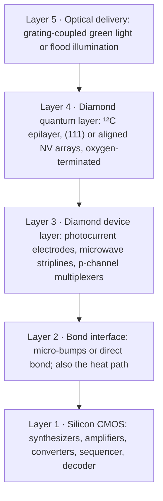

# 09 · Control electronics and heterogeneous integration

**Plain-language summary.** A qubit needs a supporting cast: a microwave generator, a light source, a detector, and a classical computer to run the sequence. If those stay on an optical table, the technology stays in the laboratory. The goal is a stack where a diamond chip sits directly on a silicon chip that does all of that.

## 9.1 What one NV cell needs

| Signal | Typical specification | Silicon-side block | Sources |
|---|---|---|---|
| Microwave drive | 2.6 to 3.1 GHz, phase-coherent pulses, 10 ns resolution, Rabi frequency 1 to 20 MHz | Phase-locked loop, in-phase/quadrature modulator, on-chip loop or stripline | [kim2019cmos], [ibrahim2021], [fuchs2009] |
| Radio-frequency drive | 1 to 10 MHz for nuclear spins | Direct digital synthesis | [dutt2007] |
| Static magnetic field | 1 to 100 mT, aligned to the NV axis, stable to parts per million | Permanent magnet + trim coil | [jacques2009] |
| Optical pump | 532 nm, about 0.1 to 1 mW per site; pulsed | External laser, grating couplers, or on-chip light-emitting diode in future | [li2024], [mizuochi2012] |
| Readout | Red photons through a filter, or picoampere photocurrent | Photodiode with plasmonic/metal-grating filter, or transimpedance amplifier | [kim2019cmos], [ibrahim2021], [bourgeois2015], [siyushev2019] |
| Sequencer | Deterministic timing, feedback in < 1 ms | Digital logic; eventually error-correction decoder | [hirose2016], [cramer2016] |

## 9.2 Demonstrated integration

- **CMOS-integrated NV magnetometer.** Microwave generation, inductor, optical filter, and photodiode on one silicon chip with diamond on top ([kim2019cmos], [ibrahim2021]).
- **Large-scale artificial-atom integration.** 128-channel arrays of diamond "quantum micro-chiplets" placed into aluminum nitride photonics [wan2020].
- **Diamond chiplets on a CMOS back end.** Lock-and-release transfer of thousands of color-center channels onto a foundry CMOS chip with integrated control [li2024]; electrical and nanoelectromechanical control of the spin-photon interface ([golter2023], [clark2024]).
- **Diamond nanophotonics** for collection efficiency: solid immersion lenses, nanowires, cavities, and thin membranes ([hadden2010], [babinec2010], [faraon2011], [riedel2017], [burek2012], [hausmann2012], [mouradian2015], [aharonovich2011], [lenzini2018]).

## 9.3 The ADAMAS reference stack (proposed)

Design rationale:

1. **Keep silicon for what silicon is best at.** Billions of cheap, low-power transistors ([irds2023]).
2. **Use diamond's own transistors only at the interface**, for multiplexing picoampere photocurrents and switching microwave lines next to the qubits, where a p-channel-only technology is sufficient ([Chapter 5](05_digital_logic.md)).
3. **Heat.** Microwave drive dissipates milliwatts per site. Temperature shifts the resonance by −74.2 kHz/K [acosta2010], so a 1 K gradient across an array detunes qubits by many linewidths. Diamond's thermal conductivity flattens gradients ([Chapter 1](01_materials_physics.md)); `adamas.thermal` quantifies it.
4. **Crosstalk.** At 15 nm spacing, two NVs cannot be distinguished optically or by microwave position. They are distinguished **spectrally**: different crystal orientations, a magnetic field gradient, or different nitrogen isotopes ([neumann2010natphys], [dolde2013]). This limits directly coupled clusters to a few NVs, and sets the natural unit of the architecture: a small cluster (2 to 4 NVs, each with nuclear memories) per optical spot.

## 9.4 Control software

The repository's simulation functions use the same pulse vocabulary that laboratory control software uses (π pulse, Ramsey, Hahn echo, selective pulse), so a sequence validated in `adamas.nv` and `adamas.register` maps directly onto an arbitrary-waveform-generator script. An instructional open-hardware NV setup is described in [sewani2020]; optimal-control pulse shaping in [dolde2014]; noise-filtering gates in [xie2023].
