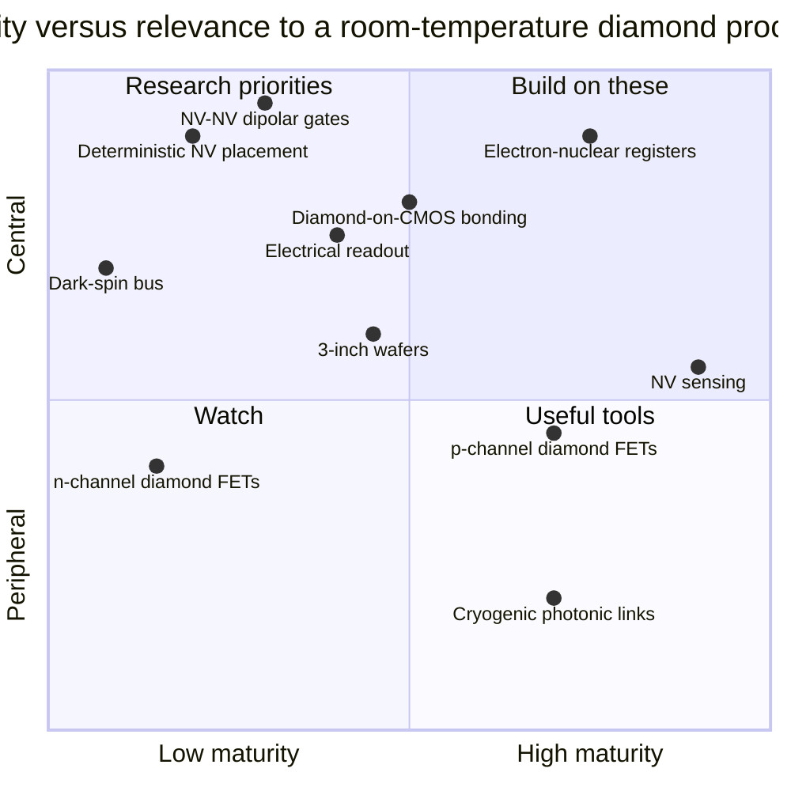

# 10 · Current experiments and industry (status: September 2026)

**Plain-language summary.** This chapter is the "what is actually happening" list. Peer-reviewed results come first. Company announcements come second and are labeled, since a press release is not a measurement.

Evidence labels used below: **P** = peer-reviewed paper, **N** = news or trade press, **V** = vendor statement (not independently verified).

## 10.1 Wafers and materials

| Who | What | Label | Source |
|---|---|---|---|
| Element Six and Orbray | Reproducible 3-inch (76 mm) wafer-scale single-crystal diamond; 4-inch in development | N/V | [e6orbray2026] |
| Orbray with Saga University | 1-inch and 2-inch heteroepitaxial diamond on sapphire with misoriented substrates | P | [kim2020], [kim2021] |
| University of Augsburg | 92 mm heteroepitaxial diamond on iridium/yttria-stabilized zirconia/silicon | P | [schreck2017] |
| National Institute of Advanced Industrial Science and Technology (AIST), Japan | Mosaic wafers, lift-off cloning | P | [yamada2014], [mokuno2009] |
| Industry overview | Scaling efforts and patent landscape | N | [pen2026], [patsnap2026] |

## 10.2 Classical devices

| Who | What | Label | Source |
|---|---|---|---|
| Saga University | 2608 V, 345 MW/cm² MOSFET on heteroepitaxial diamond | P | [saha2021] |
| National Institute for Materials Science (NIMS), Japan | First n-channel diamond MOSFET; p-channel on n-type body | P | [liao2024], [zhao2024] |
| NIMS | Hexagonal-boron-nitride-gated high-mobility transistors | P | [sasama2018], [sasama2022] |
| Waseda University | 400 °C operation, normally-off and vertical hydrogen-terminated FETs | P | [kawarada2014], [kitabayashi2017] |
| Kanazawa University and AIST | Inversion-channel MOSFET | P | [matsumoto2016] |
| NIMS | Logic inverters, NOR, NAND | P | [liu2014], [liu2017] |
| Ookuma Diamond Device | Production plant for diamond semiconductors completed in northeastern Japan, aimed at radiation-hard electronics | N | [ookuma2026] |
| Gallium-nitride-on-diamond suppliers | Commercial heat-spreading substrates | P | [francis2010], [pomeroy2014] |

## 10.3 Quantum devices

| Who | What | Temperature | Label | Source |
|---|---|---|---|---|
| University of Stuttgart | Entanglement of two NV centers 25 nm apart; optimal-control improvement | Room | P | [dolde2013], [dolde2014] |
| University of Stuttgart | Room-temperature quantum error correction in a hybrid register | Room | P | [waldherr2014] |
| University of Science and Technology of China | Fault-tolerant-threshold gate fidelities; 99.92 percent CNOT | Room | P | [rong2015], [xie2023] |
| Harvard University | Nuclear-spin memory beyond one second | Room | P | [maurer2012] |
| University of Tsukuba and partners | 2.4 ms electron coherence in n-type diamond | Room | P | [herbschleb2019] |
| Hasselt University and partners | Photoelectric readout down to single NV centers | Room | P | [bourgeois2015], [siyushev2019] |
| Massachusetts Institute of Technology (MIT) | Diamond chiplets on CMOS; CMOS-integrated NV sensors | Room and cryogenic | P | [li2024], [wan2020], [kim2019cmos], [ibrahim2021] |
| Delft University of Technology (QuTech) | 10-qubit register, logical qubit, three-node network, metropolitan link | 4 K | P | [bradley2019], [abobeih2022], [pompili2021], [hermans2022], [stolk2024] |
| Harvard University | Silicon-vacancy network nodes and memory-enhanced communication | < 1 K | P | [bhaskar2020], [stas2022], [knaut2024] |
| Quantum Brilliance | Rack-mounted room-temperature NV accelerators installed at supercomputing centers | Room | N/V | [qbpawsey2023], [olcf2025], [qbtech2026] |
| SaxonQ | Portable diamond quantum computer; sulfur co-implantation for yield (compare [luhmann2019]) | Room | N/V | [saxonq2026] |
| Company landscape | List of diamond NV computing companies | — | N | [tqi2026] |

## 10.4 Reading the landscape

Positions in this chart are this repository's judgment, offered as a discussion aid, and are not measurements.

**The pattern:** everything inside one NV cell is mature. Everything between cells, and everything about manufacturing cells in bulk, is early. The proposed experiments in [Chapter 11](11_proposed_experiments_and_roadmap.md) target exactly that boundary.
