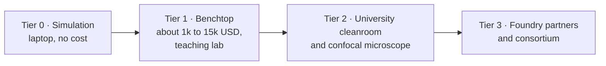
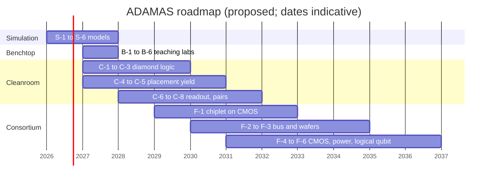

# 11 · Proposed experiments and a tiered roadmap

**Plain-language summary.** A framework is only useful if someone can act on it. This chapter lists concrete experiments, from "free, on a laptop tonight" to "needs a consortium," each with a hypothesis, a method, a number that defines success, and the literature it builds on. Everything in this chapter is a **proposal of this repository** unless a citation says otherwise.

## 11.1 The ladder

## 11.2 Tier 0: simulation (this repository)

| ID | Experiment | Success metric | Builds on |
|---|---|---|---|
| S-1 | Reproduce every figure with `python examples/make_all_figures.py` | All 37 figures regenerate; tests pass | whole repository |
| S-2 | Extend `adamas.coupling.pair_yield` to chains of $N$ sites and to multiple ions per site with post-selection | Yield-versus-$N$ curves; identify the conversion yield at which a 3×3 cluster reaches 10 percent yield | [yao2012], [luhmann2019] |
| S-3 | Add a carbon-13 bath (cluster-correlation expansion) to predict $T_2$ versus enrichment | Match 0.6 ms (natural) and 1.8 ms (99.7 percent ¹²C) within a factor of two | [zhao2012], [mizuochi2009], [balasubramanian2009] |
| S-4 | Lindblad model of NV-NV controlled-phase gate including $T_1$, $T_2$, and charge-state blinking | Replace the simple bound of Chapter 7 with a simulated fidelity; compare with 0.67 and 0.82 | [dolde2013], [dolde2014], [aslam2013] |
| S-5 | SPICE library for hydrogen-terminated FETs fitted to published curves | Inverter transfer curve within 10 percent of [liu2017] | [liu2014], [liu2017], [kawarada2014] |
| S-6 | Thermal-detuning map of a driven NV array on diamond versus on silicon | Gradient-induced detuning below 10 kHz across 100 µm | [acosta2010], [carslaw1959] |

## 11.3 Tier 1: benchtop optically detected magnetic resonance (ODMR)

A classroom-grade NV setup needs a green laser diode or light-emitting diode, a diamond chip with dense NV ensembles (commercially available for tens to hundreds of dollars), a red long-pass filter, a photodiode, a wire-loop antenna, and a 2.9 GHz synthesizer. Published instructional and compact designs: [sewani2020], [stuerner2021], [bucher2019].

| ID | Experiment | Success metric | Builds on |
|---|---|---|---|
| B-1 | Continuous-wave ODMR at zero field | Dip at 2.87 GHz with > 1 percent ensemble contrast | [gruber1997], [dreau2011] |
| B-2 | Vector magnetometry with a permanent magnet | Eight resolved lines; recover the field vector; compare with `adamas.nv.odmr_spectrum` | [rondin2014], [barry2020] |
| B-3 | Thermometry: track $D(T)$ on a hot plate | Slope within 15 percent of −74.2 kHz/K | [acosta2010], [toyli2013] |
| B-4 | Sensitivity budget | Measured noise floor within 10× of the shot-noise formula of Chapter 6 | [dreau2011], [barry2020] |
| B-5 | Pulsed control (needs a microwave switch and fast digitizer) | Rabi oscillations; ensemble $T_2^{*}$ and Hahn-echo $T_2$ | [jelezko2004a], [childress2006], [bauch2018] |
| B-6 | Diamond heat-spreader demonstration: identical resistive heaters on diamond, silicon, and glass, imaged with a thermal camera | Hot-spot rise ratio consistent with $\Delta T \propto 1/\kappa$ | [carslaw1959], [wei1993] |

These double as teaching laboratories: B-1 to B-3 fit a single afternoon session each.

## 11.4 Tier 2: university cleanroom and confocal microscope

| ID | Experiment | Success metric | Builds on |
|---|---|---|---|
| C-1 | Hydrogen-terminated diamond FET, 4-mask process of Chapter 3, on a 3 to 5 mm commercial plate | Working transistor; sheet hole density 10¹² to 10¹³ cm⁻²; stable for 30 days under ALD Al₂O₃ | [kawarada1994], [kawarada2014], [crawford2021] |
| C-2 | Enhancement/depletion inverter and 5-stage ring oscillator | Oscillation; gain > 5; measure the static power predicted in Chapter 5 | [liu2014], [liu2017] |
| C-3 | High-temperature logic: operate C-2 from 25 to 400 °C | Functional across the range; record threshold drift | [kawarada2014], [neudeck2016] |
| C-4 | Masked nitrogen implant (5 to 10 keV) through electron-beam-written apertures; with and without donor co-implant | Conversion yield measured by counting; test the roughly tenfold gain of [luhmann2019] | [toyli2010], [pezzagna2010], [luhmann2019] |
| C-5 | **Detect-and-repair arrays**: confocal map of a C-4 array, then laser-write missing sites with fluorescence feedback | Array fill factor raised from < 10 percent to > 80 percent | [chen2019], [chen2017] |
| C-6 | On-chip photoelectric readout next to a diamond FET | PDMR contrast > 1 percent from an ensemble with an on-chip p-channel switch in the current path | [bourgeois2015], [siyushev2019] |
| C-7 | Patterned termination: hydrogen-terminated transistor regions and oxygen-terminated NV regions on one chip | NV⁻ charge fraction in the qubit region unchanged within error by the neighboring channel | [hauf2011], [grotz2012] |
| C-8 | Coupled NV pair with nuclear memories: entangle two ¹⁵N or ¹⁴N nuclear spins in different NV centers through the electron dipolar link | Nuclear-nuclear Bell fidelity > 0.5 at room temperature | [dolde2013], [bermudez2011], [neumann2010science] |

C-5, C-6, C-7, and C-8 are, to this repository's knowledge, not yet reported in the form stated, and would be publishable results.

## 11.5 Tier 3: foundry and consortium

| ID | Experiment | Success metric | Builds on |
|---|---|---|---|
| F-1 | Diamond quantum chiplet bonded on a silicon CMOS controller with integrated microwave synthesis and photocurrent amplifiers | 16 individually addressed room-temperature NV cells, no microscope objective | [li2024], [kim2019cmos], [siyushev2019] |
| F-2 | Dark-spin chain bus | State transfer between two NVs separated by > 50 nm through an implanted nitrogen chain | [yao2012] |
| F-3 | (111)-oriented, ¹²C, phosphorus-doped quantum epilayer on a 2- to 3-inch heteroepitaxial wafer | Wafer-mapped $T_2$ > 1 ms with > 90 percent axis alignment | [herbschleb2019], [michl2014], [kim2021], [e6orbray2026] |
| F-4 | Complementary diamond inverter | First monolithic p-channel plus n-channel gate | [liao2024], [zhao2024] |
| F-5 | Vertical diamond power MOSFET with integrated p-channel gate driver | > 3 kV, < 5 mΩ·cm² | [saha2021], [donato2020] |
| F-6 | Small error-corrected room-temperature module: one logical qubit from one NV cluster | Logical memory lifetime exceeding the best physical nuclear lifetime | [waldherr2014], [abobeih2022], [fowler2012] |

## 11.6 Milestones and decision gates

| Gate | Question | If no |
|---|---|---|
| G-1 (after C-5) | Can arrays of single NVs reach > 80 percent fill with < 15 nm placement? | Shift emphasis to bus-mediated or modular designs (F-2) |
| G-2 (after C-8) | Does NV-NV gate fidelity exceed 0.95 with 12C material and optimal control? | Room-temperature processor stays at few-qubit accelerators; sensing remains the product |
| G-3 (after F-1) | Does electrical readout work per cell at scale? | Retain optical readout with integrated photonics ([wan2020]) |

## 11.7 Safety and practical notes

Class 3B green lasers require eyewear and interlocks. Microwave amplifiers above 1 W need proper termination. Acid cleaning of diamond (boiling tri-acid) is a trained-user cleanroom process only. Hydrogen plasma tools follow facility gas-safety rules.
