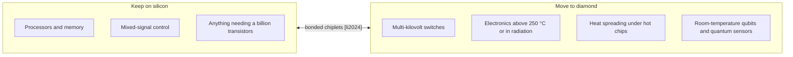

# 12 · Silicon versus diamond: the complete scorecard

**Plain-language summary.** Silicon wins on size, cost, maturity, and transistor count, by enormous margins. Diamond wins on voltage, heat, harsh environments, and room-temperature quantum behavior. The sensible conclusion is a partnership: silicon computes, diamond handles the extremes and the qubits.

## 12.1 Manufacturing

| Item | Silicon | Diamond | Advantage | Sources |
|---|---|---|---|---|
| Raw material | Quartz → polysilicon | Methane + hydrogen | Both abundant | [plummer2000], [butler2009] |
| Crystal growth | Czochralski from the melt, about 1 mm/min, 300 mm boules | Plasma CVD from gas, 1 to 100 µm/h, on a seed | **Silicon** | [czochralski1918], [teal1950], [yan2002] |
| Wafer diameter | 300 mm | 50 to 76 mm | **Silicon** | [irds2023], [e6orbray2026] |
| Dislocations | near zero | 10³ to 10⁷ cm⁻² | **Silicon** | [sumiya2012], [schreck2017] |
| Native oxide | Thermal SiO₂ | None | **Silicon** | [dealgrove1965] |
| Doping | Both types shallow (0.045 eV); implant + anneal | Boron 0.37 eV, phosphorus 0.57 eV; growth doping only | **Silicon** | [sze2006], [kalish1999] |
| Surface doping without atoms | Not available | Transfer doping of C-H surface | **Diamond** | [maier2000], [crawford2021] |
| Mask count for a basic transistor | many | 4 to 6 | Diamond (simplicity, not capability) | [kawarada2014] |
| Thermal budget tolerance | Dopants diffuse above about 900 °C | Stable to > 1200 °C in vacuum; burns in oxygen above about 700 °C | Mixed | [naydenov2010], [field2012] |

## 12.2 Devices

| Item | Silicon | Diamond | Advantage | Sources |
|---|---|---|---|---|
| Ideal on-resistance at 2.6 kV | about 695 mΩ·cm² | 0.014 mΩ·cm² ideal; 19.74 measured | **Diamond** | [baliga1982], [saha2021] |
| Maximum junction temperature | about 150 to 200 °C | > 400 °C shown | **Diamond** | [neudeck2002], [kawarada2014] |
| Thermal conductivity | 1.5 W/(cm·K) | 22 to 33 W/(cm·K) | **Diamond** | [wei1993] |
| Complementary logic | Yes, since the 1960s | First n-channel device in 2024 | **Silicon** | [liao2024] |
| Integration density | > 10¹⁰ transistors per die | 10¹ to 10² demonstrated | **Silicon** | [moore1965], [irds2023], [liu2017] |
| Radiation hardness | Moderate | High (large displacement energy, low leakage) | **Diamond** | [pernegger2005], [ookuma2026] |
| Radio-frequency power | Limited by low breakdown | 3.8 W/mm shown; mostly used under gallium nitride as heat spreader | Diamond (potential) | [imanishi2019], [pomeroy2014] |

## 12.3 Quantum

Silicon also hosts excellent spin qubits, phosphorus donors and quantum dots, first proposed by [kane1998], and isotopically purified ²⁸Si gives long coherence [itoh2014]. The decisive difference is temperature and the optical interface.

| Item | Silicon spin qubits | Diamond NV qubits | Sources |
|---|---|---|---|
| Operating temperature | < 1 K (dilution or pumped-helium refrigerator) | **300 K** | [kane1998], [ladd2010], [balasubramanian2009] |
| Initialization and readout | Electrical, single-shot, cryogenic | Optical or photoelectric; averaged for the electron at 300 K, single-shot for nuclei | [neumann2010science], [siyushev2019] |
| Two-qubit coupling range | 10s of nm (exchange) | < 30 nm (dipolar) | [kane1998], [dolde2013] |
| Placement requirement | about 10 nm class donor placement or lithographic dots | about 10 nm class NV placement | [jamieson2005], [scarabelli2016] |
| Foundry compatibility | **High** | Low today; chiplet bonding route | [li2024] |
| Native photonic link | No | Yes (cryogenic) | [hensen2015], [pompili2021] |
| Built-in sensor | No | Yes (field, temperature, strain) | [degen2017] |

Both platforms face a similar nanometer-scale placement problem. Silicon pays for its maturity with a refrigerator; diamond pays for room temperature with immature manufacturing. Single-ion implantation technology is shared between them ([jamieson2005], [grootberning2019]).

## 12.4 Bottom line

