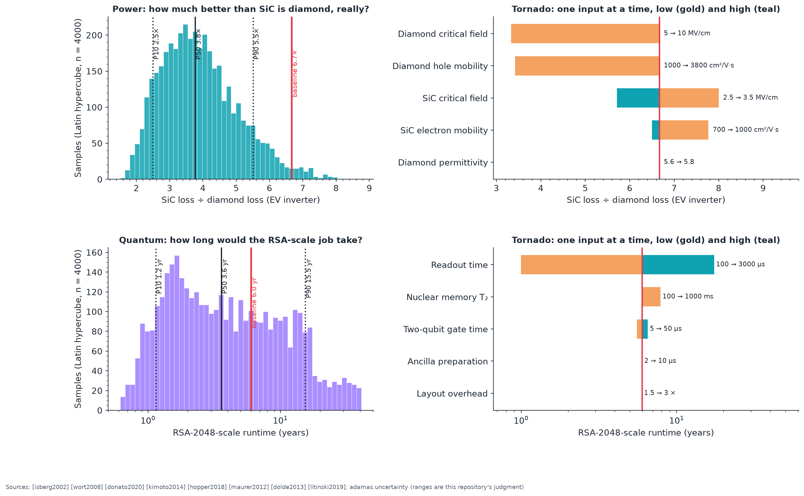

# Validation matrix

_Generated from `adamas/validation.py` (`make validation`). Interactive version: [validation.html](https://normansrule.github.io/adamas-diamond-framework/validation.html)._

**19 checks: 18 pass, 1 known discrepancy (explained), 0 fail.** Evidence types: *literature* (reproduces a published result), *cross-tool* (two independent implementations agree), *analytic* (recovers a known or injected answer).

| Area | Check | Type | Model | Reference | Tolerance | Status | Source | How |
|---|---|---|---|---|---|---|---|---|
| Error correction | Phenomenological surface-code threshold (equal data and readout error) | literature | 3.1 | 2.93 | ±10% | pass | [wang2003] | adamas.surface_sim with PyMatching, chapter E6 (Figure 27) |
| Qubits | Preparation probability implied by the measured Bell fidelity 0.67 | literature | 0.7496 | 0.725 | ±5% | pass | [dolde2013] [aslam2013] | adamas.gate_budget with the published pair; reference is the middle of the 0.70 to 0.75 NV⁻ fraction under green light |
| Qubits | Same budget explains the optimal-control result 0.82 with a higher q (must exceed the 2013 value) | literature | 0.8732 | 0.7496 | ±25% | pass | [dolde2014] | consistency: optimal control removed pulse error, leaving q as the free parameter |
| Qubits | Single-NV readout contrast, 300 ns window | literature | 0.4455 | 0.3 | ±20% | known discrepancy: the model has no background light and perfect timing; measured single-NV contrast is typically 20 to 35% | [doherty2013] [gruber1997] | adamas.photophysics five-level model with measured rates [tetienne2012] |
| Power | Measured diamond MOSFETs lie between diamond's and silicon's one-dimensional limits | literature | 3 | 3 | exact | pass | [saha2021] [saha2022] [saha2023] [baliga1982] | no real device may beat its own material limit |
| Logic | Five-stage ring-oscillator period, browser model vs ngspice | cross-tool | 24.6 | 22.4 | ±15% | pass | circuits/spice/ring_oscillator.cir | web/tests/sim.test.mjs; the constant-capacitance node model explains the 10% gap |
| Logic | DIA-4 JavaScript emulator vs Icarus Verilog, random programs identical | cross-tool | 25 | 25 | exact | pass | circuits/digital/dia4.v | tests/test_web.py::test_dia4_emulator_matches_verilog_on_random_programs |
| Logic | Inverter transfer curve, JavaScript vs Python: fraction of points within 0.01 V | cross-tool | 1 | 1 | exact | pass | adamas.logic | web/tests/sim.test.mjs; largest difference 0.003 V at seven input voltages |
| Power | Power Lab switch loss, JavaScript vs adamas.converter | cross-tool | 1 | 1 | ±1% | pass | adamas.converter | tests/test_web.py::test_power_lab_javascript_matches_python (five switches, two temperatures) |
| Systems | Machine Builder runtime, JavaScript vs adamas.resource | cross-tool | 1 | 1 | ±1e-07% | pass | adamas.resource | tests/test_web.py::test_machine_builder_javascript_matches_python |
| Qubits | Photon Lab readout contrast, JavaScript vs Python | cross-tool | 1 | 1 | ±2% | pass | adamas.photophysics | tests/test_photophysics.py::test_photon_lab_matches_python |
| Error correction | Native XZZX circuit equals the standard code under depolarizing noise (ratio of logical errors) | cross-tool | 1.071 | 1 | ±20% | pass | [bonillaataides2021] | adamas.xzzx_native: Clifford-equivalent circuits must perform the same; 40,000 shots each |
| Systems | Sobol first-order index recovers the exact value 0.8 for Y = a + 2b (uniform inputs) | analytic | 0.8038 | 0.8 | ±3% | pass | [sobol2001] [jansen1999] | adamas.decision pick-freeze estimator, 8,000 samples |
| Hardware | ADF4351 registers R2 to R5 vs evaluation-board defaults | cross-tool | 4 | 4 | exact | pass | ADF4351 data sheet | adamas.hw.adf4351, tests/test_hardware.py |
| Thermal | Steady hot-spot ratio silicon/diamond equals the conductivity ratio | analytic | 14.67 | 14.67 | ±1% | pass | [carslaw1959] | web/assets/sim/heat.js steady solver (unit test to 1%) |
| Doping | Arrhenius analysis recovers the boron acceptor energy put into the model (eV) | analytic | 0.3661 | 0.37 | ±3% | pass | [lagrange1998] | adamas.experiments B3 with the density-of-states and mobility correction |
| Sensing | Dipole-law slope recovered from noisy A2 data | analytic | -3.014 | -3 | ±3% | pass | magnetostatics | adamas.experiments A2, 5% simulated noise |
| Analysis | Rabi fit recovers the simulated 5 MHz drive | analytic | 4.996 | 5 | ±1% | pass | adamas.fitting | docs/data/examples/rabi.csv |
| Analysis | g⁽²⁾ fit recovers the simulated g⁽²⁾(0) = 0.2 | analytic | 0.1797 | 0.2 | ±15% | pass | [kurtsiefer2000] | docs/data/examples/g2.csv |

## How sure are the headline numbers?

Figure 49 propagates documented parameter ranges through two headline results (`adamas.uncertainty`). With diamond's critical field and hole mobility spanning the published spread, the silicon-carbide-to-diamond inverter loss ratio falls from the baseline 6.7× to a median near 3.8× (P10 to P90 about 2.5× to 5.5×): still a large advantage, but the baseline sits at the optimistic end. The room-temperature machine's runtime is dominated by readout time, with P10 to P90 spanning roughly 1 to 15 years.
