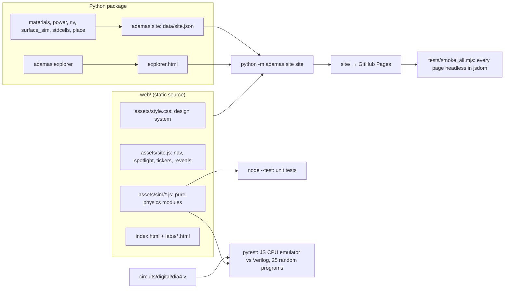

# The ADAMAS website

Live at https://normansrule.github.io/adamas-diamond-framework/ , rebuilt by `.github/workflows/pages.yml` on every push to `main`.

## Architecture

## Principles

1. **Same physics as the package.** Every simulation is a pure JavaScript module with no DOM access, unit-tested against the Python results or against the Verilog. The pages only draw.
2. **Every number cites.** Labs list their sources as bibliography keys; `tools/check_citations.py` scans the website too, so a key that does not resolve fails the build.
3. **Three reading levels everywhere.** "I am 10", "Student", "Researcher", same as the Explorer.
4. **Honest labels.** Simplifications are stated where they happen (greedy decoder in Break the Code, 2-D cross-section in Heat Race, second-order field shift in the Lattice Lab).
5. **Motion with restraint.** Animations use GSAP ScrollTrigger when available and fall back to IntersectionObserver; everything respects `prefers-reduced-motion`. Visual language borrows from open-source motion kits (Magic UI's shimmering borders and number tickers, React Bits and Motion Primitives style spotlight cards and reveals), rebuilt here in plain CSS and JavaScript so the site has no build step.

## Libraries (from CDN)

three.js 0.160 (3-D crystal, Bloch sphere, bloom post-processing), GSAP 3.12 with ScrollTrigger (scroll animations), Plotly 2.35 (Explorer charts), Inter and JetBrains Mono (Google Fonts). No framework and no bundler: `web/` is served as is after `adamas.site` injects data.

## Pages

| Page | Rendering | Physics or data module |
|---|---|---|
| Landing (`index.html`) | three.js crystal with bloom, GSAP scroll, heat painting | `sim/physics.js`, `sim/paint.js`, `data/site.json` |
| Qubit Lab | three.js Bloch sphere, 2-D sweep plot | `sim/bloch.js` |
| Heat Race | four live canvases | `sim/heat.js` |
| Lattice Lab | three.js crystal, magnet, live spectrum | `sim/physics.js` |
| Diamond CPU | registers, program memory, placed-layout viewer | `sim/dia4.js`, `data/site.json` |
| Break the Code | interactive SVG surface code, Monte Carlo plot | `sim/surface.js` |
| Transistor Lab | I–V, transfer curve, ring-oscillator canvases | `sim/fet.js` (vs `adamas.logic` and ngspice) |
| Power Lab | animated half-bridge SVG, loss bars | `sim/converter.js` + `data/site.json` power block (vs `adamas.converter`) |
| Photon Lab | energy-level canvas with quantum jumps, fluorescence curves, photon histogram | `sim/photophys.js` (vs `adamas.photophysics`) |
| Wafer Lab | wafer canvas with falling defects | `sim/yield.js` (Monte Carlo vs Poisson; formulas vs `adamas.wafer`) |
| Experiments | three.js apparatus per experiment with animated beams and step highlighting, parts and cost meter, expected-results plot | `data/site.json` experiments block (from `adamas.experiments`) |
| Process Traveler | animated SVG cross-section per step, run log with pass/fail, CSV export, print view | `data/site.json` traveler block (from `adamas.traveler`) |
| Gallery | masonry grid, search, lightbox | generated by `adamas.site` from figure docstrings |
| Machine Builder | wafer and patch-array canvas, runtime bars | `sim/resource.js` + `data/site.json` resource block (vs `adamas.resource`) |
| Fab Walkthrough | animated SVG cross-section | (step data inline) |
| The Chip Stack | scroll-driven exploded three.js stack | `sim/stack.js` |
| Who is building it | three.js dot-matrix globe (Natural Earth land mask) | `sim/world.js`, `sim/landmask.js` |
| Explorer | Plotly | generated by `adamas.explorer` |

## The course

`web/course/` is generated at build time from `adamas/course.py` (lesson text, lab tasks, code, quizzes), together with `notebooks/lesson_N.ipynb` (`make notebooks`). Quiz grading and progress live in `assets/course.js`; progress is stored only in the visitor's browser.

## Adding a lab

1. Put the physics in `web/assets/sim/<name>.js` as exported pure functions and add tests to `web/tests/sim.test.mjs`.
2. Copy an existing lab page in `web/labs/`, keep the `<!--HEAD-->` placeholder, the `.panel` / `.stage` / `.explain` structure, and the three `.lvl` explanations with sources.
3. Add it to `LINKS` in `web/assets/site.js`, to the bento grid in `web/index.html`, and to `PAGES` in `web/tests/smoke_all.mjs`.
4. `make web-test` must pass.
