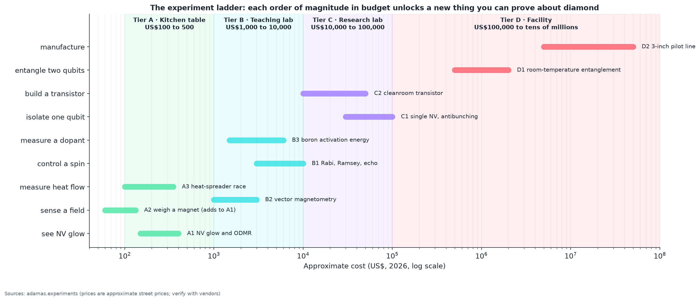
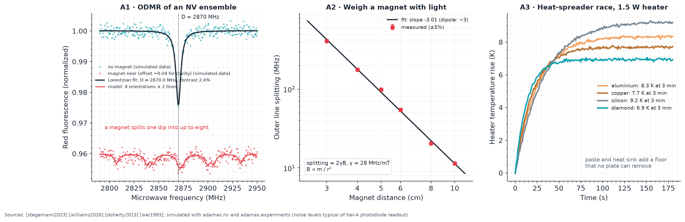
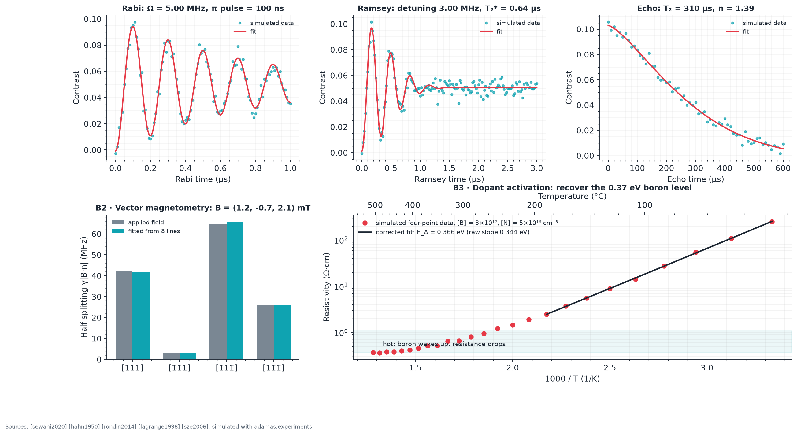
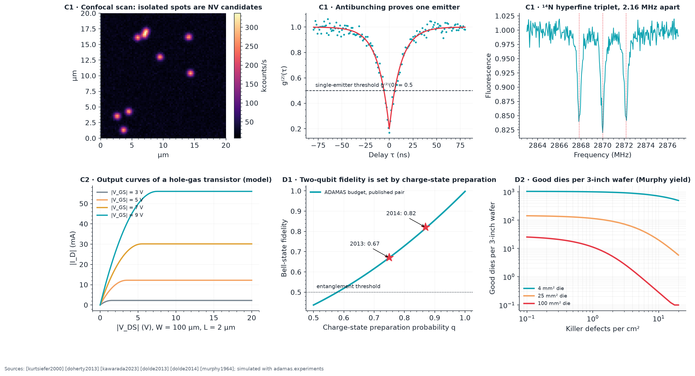

# Experiments: from a kitchen table to a pilot line

_Generated from `adamas/experiments.py` (`make experiments`). Interactive 3-D version: [experiments.html](https://normansrule.github.io/adamas-diamond-framework/experiments.html)._

Ten experiments in four price tiers. Prices are approximate 2026 US-dollar street prices for generic parts and change with vendors and exchange rates; check before buying. Safety notes summarize hazards and never replace your institution's training.

| Tier | Budget | For |
|---|---|---|
| A · Kitchen table | US$100 to 500 | high school, outreach, first-year labs, home |
| B · Teaching lab | US$1,000 to 10,000 | upper-division undergraduate and master's labs |
| C · Research lab | US$10,000 to 100,000 | graduate research groups, shared facilities |
| D · Facility | US$100,000 to tens of millions | national labs, companies, consortia |

## A1 · See the qubit glow, then hear it resonate (ODMR)

*Tier A (Kitchen table) · about US$150 to 400 · one afternoon · needs: soldering, basic Python*

**Goal.** Watch NV centers glow red under green light, then sweep a microwave source through 2.87 GHz and see the glow dip: optically detected magnetic resonance.

**You will learn.** Spin-dependent fluorescence (why mₛ = 0 is bright); The zero-field splitting D = 2.87 GHz; Lock-free signal averaging.

| Part | Specification | Approx. cost (US$) |
|---|---|---|
| NV-rich diamond | Microdiamond powder or a small HPHT plate with high NV density (irradiated and annealed) | 50 to 250 |
| Green source | High-power green LED (safer, visible) or a laser module under 1 mW at 532 nm | 10 to 60 |
| Red filter | Longpass filter near 600 to 650 nm, or red filter foil | 5 to 80 |
| Photodetector | Silicon photodiode with a JFET-input transimpedance amplifier (for example TL082) | 10 to 40 |
| Microwave source | PLL synthesizer board covering 2.7 to 3.0 GHz (ADF4351-class) | 30 to 60 |
| Antenna | Short microstrip line or a copper wire loop under the diamond | 5 to 20 |
| Controller | Microcontroller with ADC and USB (sweeps frequency, reads the detector) | 10 to 40 |
| Mechanics | 3-D printed cube mounts or a breadboard; neodymium magnet | 10 to 50 |

**Safety.** Even a 1 mW green laser can damage eyes: never look into the beam; use a phone camera to align. The LED version avoids laser hazards. Microwave powers here are milliwatts; keep the antenna enclosed and away from the body anyway.

**Steps.**

1. **Mount the diamond on the antenna.** Glue the diamond (or a spot of powder) onto the microstrip or inside the loop; the microwave field must reach it.
2. **Illuminate.** Point the green source at the diamond from a few millimeters. Through the red filter you see red fluorescence: NV centers emitting.
3. **Detect.** Place the filter and photodiode to collect the red light; check that the amplifier output rises when the green light is on.
4. **Sweep.** Step the synthesizer from 2800 to 2940 MHz in 0.5 MHz steps, averaging the detector at each step.
5. **Find the dip.** Plot detector signal versus frequency. A dip of about 0.5 to 3% near 2870 MHz is ODMR. Average longer if it is buried in noise.
6. **Split it.** Bring the magnet closer: the single dip splits into up to eight (four NV orientations × two), moving apart as the field grows.

**Analysis.** Fit Lorentzians to the dips. The center is D ≈ 2870 MHz; each pair splits by 2γB∥ with γ = 28 MHz/mT. Compare with the Lattice Lab.

**Try it first in the browser:** [labs/lattice.html](https://normansrule.github.io/adamas-diamond-framework/labs/lattice.html). Sources: [stegemann2023] [williams2026] [gruber1997] [doherty2013].

## A2 · Weigh a magnet with light

*Tier A (Kitchen table) · about US$0 to 50 · one hour (uses the A1 setup) · needs: A1 completed*

**Goal.** Measure how the ODMR splitting shrinks as a magnet moves away, and recover the inverse-cube law of a dipole field.

**You will learn.** Zeeman splitting 2γB; Dipole fields fall as 1/r³; Calibrating a sensor.

| Part | Specification | Approx. cost (US$) |
|---|---|---|
| Ruler or printed rail | Millimeter scale along the magnet axis | 0 to 10 |
| Second magnet (optional) | Different size to compare dipole moments | 0 to 20 |
| Non-magnetic stand | Wood or plastic; no steel near the diamond | 0 to 20 |

**Safety.** Neodymium magnets pinch fingers and wipe cards; keep them apart from electronics and pacemakers.

**Steps.**

1. **Align the magnet.** Place the magnet on the rail, pointing at the diamond, starting 3 cm away.
2. **Record a spectrum.** Sweep as in A1 and note the frequencies of the outermost dip pair.
3. **Step the distance.** Repeat at 3, 4, 5, 6, 8, and 10 cm.
4. **Plot log-log.** Plot splitting against distance on log-log axes; fit a straight line.

**Analysis.** The slope should be close to −3. The intercept gives the magnet's dipole moment; a 10 mm N52 cube is about 1.2 A·m².

**Try it first in the browser:** [labs/lattice.html](https://normansrule.github.io/adamas-diamond-framework/labs/lattice.html). Sources: [rondin2014] [doherty2013].

## A3 · Heat-spreader race: diamond against copper, aluminium, and silicon

*Tier A (Kitchen table) · about US$100 to 350 · one afternoon · needs: basic electronics*

**Goal.** Put the same heater on plates of four materials and record how hot the heater gets. Diamond, with about five times copper's conductivity, keeps it coolest.

**You will learn.** Thermal conductivity and spreading resistance; Why GaN amplifiers sit on diamond; Lumped thermal RC time constants.

| Part | Specification | Approx. cost (US$) |
|---|---|---|
| CVD diamond heat-spreader plate | About 10 × 10 × 0.5 mm, thermal grade | 50 to 200 |
| Copper, aluminium plates | Same size | 5 to 15 |
| Silicon piece | Broken wafer piece, same size | 0 to 20 |
| Heater | Surface-mount power resistor (for example 1 Ω, 2 W) with a small contact area | 2 to 10 |
| Temperature sensors | Thermocouples or thermistors, or a low-cost thermal camera | 10 to 150 |
| Supply | Bench or USB-C supply with current reading | 20 to 60 |
| Heat sink | Aluminium block under all plates | 5 to 20 |

**Safety.** The heater can exceed 100 °C: do not touch; limit power; never leave unattended.

**Steps.**

1. **Assemble.** Put each plate on the heat sink with thin thermal paste; bond the heater to the center of the plate.
2. **Instrument.** Attach a sensor to the heater and one to the plate edge.
3. **Power on.** Apply the same power (for example 1.5 W) to each in turn; log temperature every second for 3 minutes.
4. **Compare.** Plot heater temperature rise against time for all four plates.

**Analysis.** At steady state the heater's rise scales roughly as the inverse of the plate's conductivity (plus the paste and sink). Diamond gives the smallest rise and the fastest settling.

**Try it first in the browser:** [labs/heat.html](https://normansrule.github.io/adamas-diamond-framework/labs/heat.html). Sources: [wei1993] [carslaw1959] [francis2010].

## B1 · Pulsed control: Rabi oscillations, Ramsey fringes, and spin echo

*Tier B (Teaching lab) · about US$3,000 to 10,000 · two to four lab sessions · needs: RF, optics alignment, Python*

**Goal.** Drive the NV spin with timed microwave pulses and read it out with timed laser pulses, turning the spin into a qubit you can rotate and measure.

**You will learn.** Rabi frequency and π pulses; T₂* from Ramsey fringes; T₂ from spin echo.

| Part | Specification | Approx. cost (US$) |
|---|---|---|
| NV ensemble plate | CVD or HPHT, 1 to 10 ppm NV | 300 to 1,500 |
| 532 nm laser | Tens of mW, with an acousto-optic modulator or direct modulation | 500 to 2,500 |
| Optics | Lenses, mirrors, 600 nm longpass and 900 nm shortpass filters, kinematic mounts | 400 to 1,500 |
| Photodetector | Amplified silicon photodiode or avalanche photodiode | 150 to 1,000 |
| Microwave chain | Synthesizer, fast RF switch, 1 to 10 W amplifier, circulator or dump | 800 to 3,000 |
| Pulse timing | FPGA board (for example Red Pitaya) or a pulse generator with 10 ns resolution | 300 to 1,500 |
| Coils | Bias coils or a permanent magnet on a translation stage | 100 to 500 |

**Safety.** Class 3B laser: enclosed beam path, wavelength-rated goggles, interlock. Amplified microwaves at watts: terminate every output, never run an open amplifier.

**Steps.**

1. **Polarize and read.** Program: 3 µs laser pulse (initialize), wait, microwave pulse of length τ, 300 ns laser readout window.
2. **Find resonance.** Run continuous ODMR (A1) to find a line; bias field so one NV class is separated.
3. **Rabi.** Sweep τ from 0 to 1 µs: the readout oscillates; half a period is the π pulse.
4. **Ramsey.** π/2, wait τ, π/2 with a small detuning: fringes that decay with T₂*.
5. **Echo.** π/2, τ/2, π, τ/2, π/2: the decay envelope gives T₂, far longer than T₂*.

**Analysis.** Fit a damped cosine to Rabi, a decaying cosine to Ramsey (T₂*), and exp(−(τ/T₂)ⁿ) to echo. Compare with the Qubit Lab.

**Try it first in the browser:** [labs/qubit.html](https://normansrule.github.io/adamas-diamond-framework/labs/qubit.html). Sources: [sewani2020] [jelezko2004a] [hahn1950] [childress2006].

## B2 · Vector magnetometry with three-axis coils

*Tier B (Teaching lab) · about US$1,000 to 3,000 · two lab sessions · needs: B1 or A1 completed*

**Goal.** Apply known fields in three directions and recover the full field vector from the eight ODMR lines of the four NV orientations.

**You will learn.** The four ⟨111⟩ NV axes; Least-squares fitting of a vector; Sensor calibration.

| Part | Specification | Approx. cost (US$) |
|---|---|---|
| Helmholtz coil set | Three orthogonal pairs, a few mT | 400 to 1,500 |
| Current supplies | Three channels, 0 to 3 A | 300 to 1,000 |
| Single-crystal NV plate | Known crystal orientation | 300 to 800 |

**Safety.** Coils heat up at high current: monitor temperature and limit duty cycle.

**Steps.**

1. **Calibrate each axis.** Apply current to one coil pair at a time; record the eight line positions.
2. **Unknown field.** Set an arbitrary combination of currents; record the spectrum.
3. **Fit.** Fit the field vector that best reproduces all eight lines; compare with the coil calibration.

**Analysis.** The line pair of each orientation gives |B·n̂ᵢ|; four orientations over-determine the three components. Residuals test the model.

**Try it first in the browser:** [labs/lattice.html](https://normansrule.github.io/adamas-diamond-framework/labs/lattice.html). Sources: [rondin2014] [barry2020] [doherty2013].

## B3 · Watch boron wake up: dopant activation in diamond

*Tier B (Teaching lab) · about US$1,500 to 6,000 · two lab sessions · needs: four-point measurement, hot stage*

**Goal.** Measure the resistance of lightly boron-doped single-crystal diamond from room temperature to about 500 °C and extract the 0.37 eV acceptor energy from an Arrhenius plot.

**You will learn.** Deep dopants and incomplete ionization; Arrhenius analysis; Why diamond electronics improve when hot.

| Part | Specification | Approx. cost (US$) |
|---|---|---|
| Boron-doped single-crystal diamond | [B] about 10¹⁷ cm⁻³ with some compensating nitrogen (about 10¹⁶ to 10¹⁷ cm⁻³), four Ti/Pt/Au contacts | 800 to 3,500 |
| Hot stage | To about 500 °C, in air or nitrogen | 300 to 1,500 |
| Source-measure unit or precision source + meter | Nanoampere to milliampere | 300 to 2,000 |
| Probes and wiring | High-temperature probes | 100 to 400 |

**Safety.** Hot stage burns; use tongs and heat-resistant gloves. Heavily doped electrode-grade material behaves almost like a metal and will not show activation: use lightly doped samples.

**Steps.**

1. **Contact check.** Verify ohmic contacts with I–V at room temperature (straight line through zero).
2. **Heat in steps.** Step 25 to 500 °C in 25 °C steps; wait for stability; record resistance in both current directions.
3. **Arrhenius plot.** Plot ln(R) against 1000/T and fit the straight part.

**Analysis.** A raw Arrhenius slope underestimates the acceptor energy because the density of states grows as T^1.5 and the lattice mobility falls as about T^-2.2; fit ln(R·T^-0.7) instead. In the compensated regime the corrected slope gives E_A ≈ 0.37 eV (without compensation it approaches E_A/2). A Hall measurement separates density from mobility directly.

**Try it first in the browser:** [explorer.html#ion](https://normansrule.github.io/adamas-diamond-framework/explorer.html#ion). Sources: [lagrange1998] [sze2006] [pernot2010].

## C1 · One qubit at a time: single NV centers and photon antibunching

*Tier C (Research lab) · about US$30,000 to 100,000 · weeks to build, days per measurement · needs: confocal microscopy, photon counting*

**Goal.** Build a confocal microscope that sees individual NV centers, prove each is a single quantum emitter by photon antibunching, and measure its hyperfine-resolved resonance.

**You will learn.** Confocal imaging; Hanbury Brown–Twiss correlation g⁽²⁾(τ); Nuclear-spin hyperfine structure.

| Part | Specification | Approx. cost (US$) |
|---|---|---|
| Oil or air objective | Numerical aperture 0.9 to 1.4 | 1,500 to 8,000 |
| Scanning | Galvo mirrors or a piezo stage | 3,000 to 20,000 |
| Single-photon detectors | Two silicon avalanche photodiodes in Geiger mode | 6,000 to 20,000 |
| Time tagger | Picosecond-resolution correlator | 5,000 to 20,000 |
| Laser and optics | 532 nm, fiber coupling, pinhole, filters | 3,000 to 15,000 |
| Electronic-grade diamond | Low-nitrogen CVD with sparse NV | 500 to 3,000 |
| Microwave and control | Arbitrary waveform generator, amplifier | 5,000 to 30,000 |

**Safety.** Class 3B/4 laser; fiber ends and objective focus are especially hazardous. Immersion oil: keep off optics other than the objective.

**Steps.**

1. **Scan.** Raster-scan a 20 × 20 µm field; isolated bright spots are NV candidates.
2. **Correlate.** Park on a spot; split fluorescence onto two detectors; histogram photon-pair delays.
3. **Check g⁽²⁾(0).** A dip below 0.5 at zero delay proves a single emitter.
4. **Resolve hyperfine.** Low-power ODMR on that NV shows three lines 2.16 MHz apart from the ¹⁴N nucleus.

**Analysis.** Fit g⁽²⁾(τ) = 1 − (1 − g₀) e^(−|τ|/τ₁); background lifts g₀ above zero. The hyperfine triplet is the nuclear memory used in chapter E5.

**Try it first in the browser:** [labs/photon.html](https://normansrule.github.io/adamas-diamond-framework/labs/photon.html). Sources: [kurtsiefer2000] [gruber1997] [jelezko2004a] [doherty2013].

## C2 · Make and test a diamond transistor (university cleanroom)

*Tier C (Research lab) · about US$10,000 to 50,000 · one to three months · needs: cleanroom training*

**Goal.** Run process traveler T1 (power variant) on one or two plates in a university cleanroom and measure transistor and ring-oscillator curves on a hot chuck.

**You will learn.** Surface transfer doping in practice; Transistor parameter extraction; Why hot operation matters.

| Part | Specification | Approx. cost (US$) |
|---|---|---|
| Single-crystal plates | 3 × 3 to 5 × 5 mm, (100) | 1,000 to 6,000 |
| Cleanroom access | Tool-time fees for lithography, evaporation, ALD, plasma | 5,000 to 30,000 |
| Hydrogen plasma | MPCVD time at a partner lab | 1,000 to 5,000 |
| Probe station and analyzer | Often available in the department | 0 to 10,000 |

**Safety.** All cleanroom hazards in the process traveler: perchloric and hydrofluoric acids, NO₂, trimethylaluminium, plasmas.

**Steps.**

1. **Plan the run.** Pick the variant in docs/process/APPLICATIONS.md; draw the PDK-0 monitor die (make layout).
2. **Run the traveler.** Follow S01 to S17 in process.html, logging every check.
3. **Test.** Measure TLM, MOS capacitor, transistor, and ring oscillator at 25 and 200 °C.
4. **Calibrate the models.** Enter the measured parameters into adamas.logic and the SPICE models (projects P-3, D-2).

**Analysis.** Extract threshold voltage, mobility, contact resistance, and ring-oscillator stage delay; compare with the Transistor Lab and the ngspice deck.

**Try it first in the browser:** [process.html](https://normansrule.github.io/adamas-diamond-framework/process.html). Sources: [kawarada2023] [kasu2012] [liu2017].

## D1 · Two entangled qubits at room temperature

*Tier D (Facility) · about US$500,000 to 2,000,000 · one to three years · needs: research group*

**Goal.** Implant NV pairs about 25 nm apart, find coupled pairs, and entangle them with echoed dipolar gates, reproducing and then improving on the 2013 result.

**You will learn.** Nanoscale implantation; Dipolar two-qubit gates; Why charge-state preparation limits fidelity.

| Part | Specification | Approx. cost (US$) |
|---|---|---|
| Implantation | Aperture implantation or scanning-probe implantation of ¹⁵N | 100,000 to 800,000 |
| Confocal setups | Two-color, with charge-state readout | 150,000 to 400,000 |
| Control electronics | Multi-channel arbitrary waveform generators, amplifiers | 100,000 to 300,000 |
| Materials | Isotopically purified ¹²C diamond | 20,000 to 100,000 |

**Safety.** Institutional laser, radiation (implanter), and high-voltage programs.

**Steps.**

1. **Place pairs.** Implant through 20 nm apertures; anneal; tri-acid clean (traveler S06, S07).
2. **Find pairs.** Measure the dipolar splitting; keep pairs with 5 to 20 kHz coupling.
3. **Entangle.** Echoed gate sequence; Bell-state tomography.
4. **Beat the budget.** Add charge-state verification before the gate; compare with the adamas.gate_budget prediction.

**Analysis.** Fidelity against preparation probability q follows the chapter E5 budget: 0.67 at q ≈ 0.75, rising toward 0.998 as q → 1.

**Try it first in the browser:** [explorer.html#gate](https://normansrule.github.io/adamas-diamond-framework/explorer.html#gate). Sources: [dolde2013] [dolde2014] [aslam2013] [pezzagna2010].

## D2 · A diamond pilot line on 3-inch wafers

*Tier D (Facility) · about US$5,000,000 to 50,000,000 · years · needs: company or consortium*

**Goal.** Run PDK-0 on 3-inch heteroepitaxial wafers with statistical process control, and measure how many working dies each wafer yields.

**You will learn.** Yield and defect density; Statistical process control; Cost per good die.

| Part | Specification | Approx. cost (US$) |
|---|---|---|
| MPCVD reactors | Wafer-scale growth | 1,000,000 to 10,000,000 |
| Lithography and deposition | Steppers, e-beam, evaporators, ALD, etchers | 2,000,000 to 20,000,000 |
| Metrology | Defect inspection, Raman mapping, probe cards | 1,000,000 to 10,000,000 |
| Wafers | 3-inch single-crystal, per year | 500,000 to 5,000,000 |

**Safety.** Full semiconductor-fab environmental health and safety program.

**Steps.**

1. **Baseline.** Run the monitor die on every wafer; track each check of the traveler as a control chart.
2. **Yield learning.** Map killer defects; compare good dies with the Poisson and Murphy models.
3. **Product.** Move to the product variant with the best economics (power or sensors first).

**Analysis.** Good dies per wafer versus defect density and die size, as in the Wafer Lab; cost per good die sets which products are viable.

**Try it first in the browser:** [labs/wafer.html](https://normansrule.github.io/adamas-diamond-framework/labs/wafer.html). Sources: [e6orbray2026] [murphy1964] [stapper1983] [kim2021].

