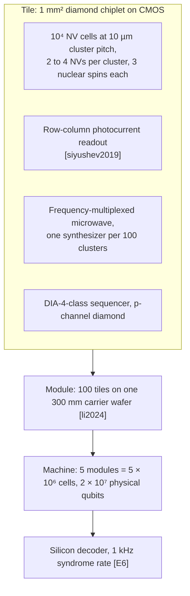
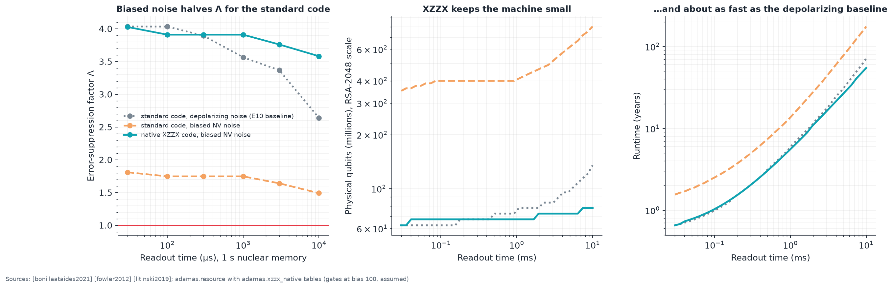
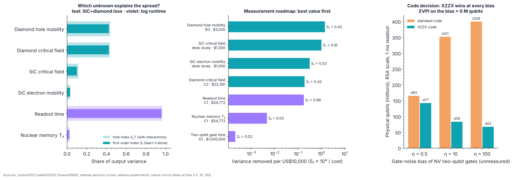

# E10 · Sizing a scalable room-temperature quantum computer

**Plain-language summary.** Chapters 8 and E6 said what one cell can do and how many cells a logical qubit needs. This chapter asks the blunt questions: how big a diamond chip, how many wafers, how much power, and how long would known algorithms take? The answers say what a room-temperature diamond machine is for.

Code: `adamas.scaling`, `adamas.surface_sim`, `adamas.qec`.

## E10.1 Workloads people actually want

| Task | Physical qubits (surface code, 10⁻³ error) | Time at a 1 µs cycle | Source |
|---|---|---|---|
| Factor RSA-2048 (2021 layout) | 20 million | 8 hours | [gidney2021] |
| Factor RSA-2048 (2025 layout) | under 1 million | about a week | [gidney2025] |
| FeMoco nitrogenase ground-state energy | about 1 million | days | [reiher2017], [babbush2018] |
| 100 logical qubits at distance 17 | 57,700 | (memory) | [fowler2012] |

Layout theory: [litinski2019]. Current best hardware: below-threshold surface code on 105 superconducting qubits [google2025] (see also [google2023], [arute2019], [kjaergaard2020]), logical processors on neutral atoms [bluvstein2024], ion traps [monroe2013].

## E10.2 Time: the room-temperature penalty

The error-correction cycle is limited by readout. Superconducting qubits read out in about 1 µs; an NV electron read by repetitive nuclear-assisted readout takes 0.1 to 10 ms ([neumann2010science], [hopper2018]). Wall-clock time scales with the cycle:

| Cycle time | RSA-2048 (2021 layout) | 100-logical-qubit job of 1 hour at 1 µs |
|---|---|---|
| 1 µs (superconducting) | 8 hours | 1 hour |
| 100 µs (NV, electrical readout, proposed) | 33 days | 4 days |
| 1 ms (NV, optical repetitive readout) | about 1 year | 42 days |

**Conclusion.** A room-temperature NV machine is a poor factoring engine and a poor general-purpose accelerator for deep circuits. That is not a defect to hide; it is a design input. The workloads that fit are those where slow, long-lived, cryostat-free qubits win: quantum memories and repeaters at the network edge, sensing-coupled computation, small variational or sampling tasks [peruzzo2014], [preskill2018], and embedded deployments ([qbpawsey2023], [olcf2025]).

## E10.3 Area: not the constraint

At a 1 µm cell pitch, 60 percent fill, 4 qubits per cell, `adamas.scaling` gives:

| Task | NV cells | Die side (mm) at 100% yield | at 10% yield | Fraction of one 76 mm wafer |
|---|---|---|---|---|
| RSA-2048 (2021) | 5,000,000 | 2.9 | 9.1 | < 1% |
| FeMoco | 250,000 | 0.65 | 2.0 | < 0.1% |
| 100 logical qubits | 14,425 | 0.16 | 0.5 | ≈ 0 |

Even the largest published workload fits on one die. The binding constraints are **yield of working cells** ([Chapter 7](../07_nv_fabrication_and_placement.md)) and **control wiring**, not diamond area. Compare superconducting hardware, where wiring and cryostat capacity dominate scaling ([krinner2019], [reilly2015], [vandersypen2017], [vandijk2019]).

## E10.4 Control and power

Per driven cell: about 1 mW of microwave and 0.1 to 1 mW of green light. With 10 percent of cells active per cycle, a 5-million-cell machine draws about 650 W of qubit-side power and no cryostat, against tens of kilowatts for a dilution refrigerator plus its electronics [krinner2019]. Multiplexing is mandatory: a million individually wired microwave lines is not buildable, so the architecture needs frequency addressing within clusters ([Chapter 9](../09_cmos_control_integration.md)), row-column electrode selection for electrical readout ([siyushev2019]), and the DIA-4-class on-diamond sequencers of [E3](E3_digital_and_cpu_design.md) as local controllers.

## E10.5 A reference machine (proposal)

```mermaid
flowchart TB
    subgraph tile["Tile: 1 mm² diamond chiplet on CMOS"]
        c1["10⁴ NV cells at 10 µm cluster pitch,<br/>2 to 4 NVs per cluster, 3 nuclear spins each"]
        c2["Row-column photocurrent readout<br/>[siyushev2019]"]
        c3["Frequency-multiplexed microwave,<br/>one synthesizer per 100 clusters"]
        c4["DIA-4-class sequencer, p-channel diamond"]
    end
    tile --> mod["Module: 100 tiles on one 300 mm carrier wafer [li2024]"]
    mod --> mach["Machine: 5 modules = 5 × 10⁶ cells, 2 × 10⁷ physical qubits"]
    mach --> dec["Silicon decoder, 1 kHz syndrome rate [E6]"]
```

Requirements this machine imposes, in order of difficulty: link error below 1.3 percent ([E6](E6_error_correction_and_system_architecture.md)); cluster yield above 10 percent with detect-and-repair ([Chapter 11](../11_proposed_experiments_and_roadmap.md), C-5); ancilla readout below about 1% of the nuclear-memory coherence time ([E6](E6_error_correction_and_system_architecture.md), Section E6.1c; electrical readout at about 100 µs meets it even for a 0.1 s memory); and 1 µm-pitch qubit lithography ([E1](E1_lithography_from_euv_to_electron_beam.md)).

## E10.5b From circuit-level error rates to a machine (project X-2, done)

Sections E10.2 to E10.5 scaled published physical-qubit counts. `adamas.resource` instead derives the machine from the bottom up. It fits the circuit-level logical error of [E6](E6_error_correction_and_system_architecture.md) (Section E6.1c) to the standard form $p_L(d) = A\,\Lambda^{-(d+1)/2}$ for every readout time and memory lifetime; picks the smallest odd distance with $n_L \cdot D \cdot d \cdot p_L(d) \le 1\%$ for $n_L$ logical qubits and $D$ logical steps of $d$ rounds each ([litinski2019]); and prices one round as ancilla preparation (5 µs) plus four dipolar gates (25 µs each at 25 nm, [dolde2013]) plus readout. Routing and magic-state factories double the patch count.

| Job (illustrative scale) | Readout | Memory T₂ | Distance | Physical qubits | Die side | Round | Runtime | Superconducting, measured Λ |
|---|---|---|---|---|---|---|---|---|
| Chemistry demo | 0.1 ms | 1 s | 33 | 0.4 M | 0.4 mm | 205 µs | 2 h | 1 min |
| Chemistry demo | 1 ms | 1 s | 37 | 0.5 M | 0.5 mm | 1105 µs | 11 h | 1 min |
| Chemistry demo | 1 ms | 0.1 s | 49 | 1.0 M | 0.6 mm | 1105 µs | 15 h | 1 min |
| Materials simulation | 0.1 ms | 1 s | 47 | 8.8 M | 1.9 mm | 205 µs | 112 days | 27 h |
| Materials simulation | 1 ms | 1 s | 51 | 10.4 M | 2.1 mm | 1105 µs | 652 days | 27 h |
| Materials simulation | 1 ms | 0.1 s | 69 | 19.0 M | 2.8 mm | 1105 µs | 2.4 years | 27 h |
| RSA-2048 scale | 0.1 ms | 1 s | 51 | 62.4 M | 5.1 mm | 205 µs | 363 days | 4 days |
| RSA-2048 scale | 1 ms | 1 s | 57 | 78.0 M | 5.7 mm | 1105 µs | 6.0 years | 4 days |
| RSA-2048 scale | 1 ms | 0.1 s | 75 | 135.0 M | 7.5 mm | 1105 µs | 7.9 years | 4 days |

Three findings follow.

1. **Area stays small, time does not.** Even the RSA-2048-scale job fits on a diamond die under 8 mm on a side, but it runs for years at millisecond readout, against about 4 days on a superconducting machine with today's measured error suppression.
2. **Slow readout costs twice.** It lengthens every round, and through the idle errors of Section E6.1c it lowers Λ, which raises the distance, which multiplies both qubit count and runtime. With a 0.1 s memory and 1 ms readout, the RSA-scale distance rises from 57 to 75.
3. **Fast readout moves the bottleneck to the gates.** At 0.1 ms readout, four 25 µs dipolar gates are half of every round. Halving the spacing speeds the coupling eightfold ($1/r^3$), so the next lever is placement precision ([E1](E1_lithography_from_euv_to_electron_beam.md)), not readout.

The asymmetry must be stated: the NV numbers assume a 0.3% link error, far better than the best demonstrated room-temperature NV–NV entangling fidelity (0.82, [dolde2014]), while the superconducting column uses a measured Λ = 2.14 ([google2025]). The comparison therefore shows what NV hardware would need, not what it has. The interactive version is the [Machine Builder](https://normansrule.github.io/adamas-diamond-framework/labs/machine.html).

## E10.5c The code choice matters if the noise is biased (project X-5, applied)

E10.5b used the standard surface code with depolarizing noise. Chapter E6.1e showed that if NV gate errors are dominated by dephasing, the standard code loses much of its margin while the XZZX code gains. The resource tables were therefore rebuilt with the native circuits of `adamas.xzzx_native` under biased NV noise: gates at bias η = 100 (an assumption: the bias of NV dipolar gates has not been measured), 0.3% gate error, 1% readout, 0.2% preparation, and pure dephasing during readout (100,000 shots per point, worse memory basis). Same RSA-2048-scale job, 1 ms readout, 1 s memory:

| Code and noise model | Λ at 1 ms | Distance | Physical qubits | Die side | Runtime |
|---|---|---|---|---|---|
| standard code, depolarizing gate and idle noise (chapter E10) | 3.56 | 57 | 78 M | 5.7 mm | 6.0 years |
| standard code, biased NV noise (gates at bias 100, dephasing idle) | 1.75 | 129 | 399 M | 12.9 mm | 13.6 years |
| native XZZX code, biased NV noise (gates at bias 100, dephasing idle) | 3.91 | 53 | 67 M | 5.3 mm | 5.6 years |

**Reading the table.** If NV noise really is strongly biased, the standard-code estimate of E10.5b is optimistic: Λ drops to about 1.75, the distance more than doubles, and the machine needs about six times as many qubits. The native XZZX code recovers, and slightly improves on, the depolarizing baseline. Section E10.5d asks what measuring the bias is worth and finds that it does not change the code choice: XZZX is better at every bias, so the bias matters for planning the machine's size, not for choosing its code. The Machine Builder lab has a selector for all three models.

## E10.5d What to measure next (decision analysis)

E10.5c raised a question it did not answer: if the bias of NV two-qubit gates decides which code to run, how much is measuring it worth? `adamas.decision` answers that and its broader cousin, which unknown in the whole framework is worth measuring first.

**Variance-based sensitivity.** The tornado of Figure 49 moves one input at a time. Sobol indices [sobol2001] instead ask what share of the output variance each input explains when all inputs vary together. The first-order index S₁ of an input is exactly the fraction of the variance that would disappear, on average, if that input were known perfectly; the total index S_T adds its interactions. They are estimated with the pick-freeze scheme of Saltelli and Jansen [saltelli2002] [jansen1999] on 16,000 Latin-hypercube samples (seed-to-seed scatter about ±0.02; the validation matrix checks the estimator against an exact case).

- **Power** (silicon-carbide-to-diamond inverter loss): diamond's hole mobility (S₁ ≈ 0.42) and critical field (0.42) share almost all of the spread, as expected from the ratio's dependence on μE_c²; silicon carbide's own parameters add about 0.13.
- **Quantum** (log runtime of the RSA-scale job): readout time explains 96% of the variance; every other input is at or near the estimator's resolution.

**Measurement roadmap.** Each input is mapped to the experiment that pins it down (costs are geometric means of the price ranges in [EXPERIMENTS.md](../experiments/EXPERIMENTS.md); desk studies are a nominal US$1,000), and ranked by variance removed per dollar:

| Rank | Input | Study | S₁ | How it is measured | Cost | S₁ per US$10k |
|---|---|---|---|---|---|---|
| 1 | Diamond hole mobility | power | 0.42 | B3 (Hall and four-point measurement on doped single-crystal diamond) | $3,000 | 1.414 |
| 2 | SiC critical field | power | 0.10 | desk study (literature review of commercial 4H-SiC) | $1,000 | 0.997 |
| 3 | SiC electron mobility | power | 0.03 | desk study (literature review of commercial 4H-SiC) | $1,000 | 0.312 |
| 4 | Diamond critical field | power | 0.42 | C2 (breakdown of sacrificial devices from a traveler run) | $22,361 | 0.189 |
| 5 | Readout time | quantum | 0.96 | C1 (single-shot readout on a single NV by photon counting or photocurrent) | $54,772 | 0.175 |
| 6 | Nuclear memory T₂ | quantum | 0.03 | C1 (nuclear-spin echo while the electron is read out) | $54,772 | 0.005 |
| 7 | Two-qubit gate time | quantum | 0.02 | D1 (dipolar coupling of implanted pairs) | $1,000,000 | 0.000 |

The cheapest high-value measurement in the framework is a **Hall measurement of hole mobility in doped single-crystal diamond** (experiment B3, a few thousand dollars), which addresses about 40% of the uncertainty in the power case. Desk studies of silicon carbide rank high only because they are nearly free; they can narrow the range only as far as the literature agrees. On the quantum side, single-NV readout experiments (C1) dominate everything else by a wide margin.

**The code decision under unknown bias.** Native-circuit resource tables were built at gate-noise bias η = 0.5 (depolarizing gates), 10, and 100, for both codes, always with dephasing idle errors during readout (RSA-scale job, 1 ms readout, 1 s memory; entries are distance · physical qubits · runtime):

| Gate-noise bias | Standard code | XZZX code |
|---|---|---|
| η = 0.5 | 83 · 165 M · 8.7 yr | 77 · 142 M · 8.1 yr |
| η = 10 | 121 · 351 M · 12.7 yr | 59 · 84 M · 6.2 yr |
| η = 100 | 129 · 399 M · 13.6 yr | 53 · 67 M · 5.6 yr |

The XZZX code needs fewer qubits and less time at every bias, so it **dominates**: the expected value of perfect information on the bias for this decision [howard1966] is 0 M qubits and 0.0 years. This refines E10.5c. Measuring the bias does not change which code to run; choose XZZX regardless. It still matters for *planning*, because under XZZX the machine ranges from 67 M qubits (strong bias) to 142 M (no bias). Even at η = 0.5 XZZX wins because the idle error during readout is pure dephasing.

Caveats: these native tables put an independent single-qubit channel of probability p on each qubit after a two-qubit gate, about twice the error of the two-qubit depolarizing channel used in E10.5b, so their absolute numbers are more pessimistic than the E10.5b baseline; compare codes within one model, not across models. The prior over the bias (uniform over three values) is an assumption, but because XZZX dominates, any prior gives the same choice. XZZX's practical cost (CZ and XCX gates on one sublattice, a mixed-basis readout) is assumed equal to the standard code's for NV hardware, where all gates come from the same dipolar coupling and microwave rotations.

## E10.6 Projects

| ID | Item | Deliverable |
|---|---|---|
| X-2 | Full resource estimate from circuit-level error rates | **Done in v0.13.0** (Section E10.5b, `adamas.resource`, Machine Builder lab) |
| X-3 | Multiplexing study: crosstalk versus number of clusters per synthesizer | Maximum multiplexing ratio at 10⁻³ gate error |
| X-4 | Compare with a cryogenic silicon-spin or superconducting machine of equal logical capacity on cost, power, and footprint | Decision matrix for which workloads justify room temperature |
