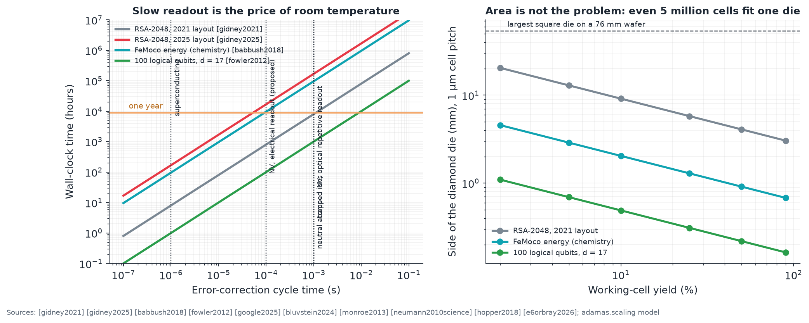
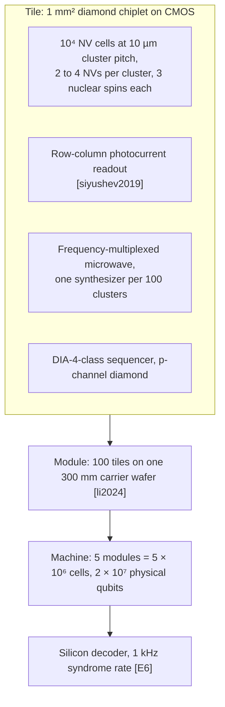
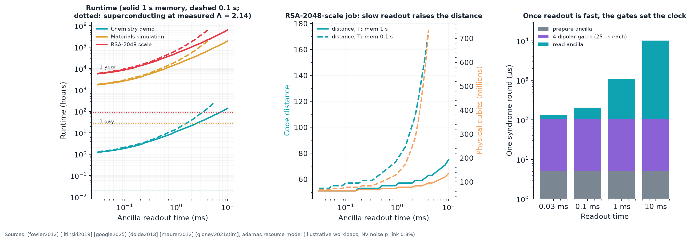

# E10 · Sizing a scalable room-temperature quantum computer

**Plain-language summary.** Chapters 8 and E6 said what one cell can do and how many cells a logical qubit needs. This chapter asks the blunt questions: how big a diamond chip, how many wafers, how much power, and how long would known algorithms take? The answers say what a room-temperature diamond machine is for.

Code: `adamas.scaling`, `adamas.surface_sim`, `adamas.qec`.

## E10.1 Workloads people actually want

| Task | Physical qubits (surface code, 10⁻³ error) | Time at a 1 µs cycle | Source |
|---|---|---|---|
| Factor RSA-2048 (2021 layout) | 20 million | 8 hours | [gidney2021] |
| Factor RSA-2048 (2025 layout) | under 1 million | about a week | [gidney2025] |
| FeMoco nitrogenase ground-state energy | about 1 million | days | [reiher2017], [babbush2018] |
| 100 logical qubits at distance 17 | 57,700 | (memory) | [fowler2012] |

Layout theory: [litinski2019]. Current best hardware: below-threshold surface code on 105 superconducting qubits [google2025] (see also [google2023], [arute2019], [kjaergaard2020]), logical processors on neutral atoms [bluvstein2024], ion traps [monroe2013].

## E10.2 Time: the room-temperature penalty

The error-correction cycle is limited by readout. Superconducting qubits read out in about 1 µs; an NV electron read by repetitive nuclear-assisted readout takes 0.1 to 10 ms ([neumann2010science], [hopper2018]). Wall-clock time scales with the cycle:

| Cycle time | RSA-2048 (2021 layout) | 100-logical-qubit job of 1 hour at 1 µs |
|---|---|---|
| 1 µs (superconducting) | 8 hours | 1 hour |
| 100 µs (NV, electrical readout, proposed) | 33 days | 4 days |
| 1 ms (NV, optical repetitive readout) | about 1 year | 42 days |

**Conclusion.** A room-temperature NV machine is a poor factoring engine and a poor general-purpose accelerator for deep circuits. That is not a defect to hide; it is a design input. The workloads that fit are those where slow, long-lived, cryostat-free qubits win: quantum memories and repeaters at the network edge, sensing-coupled computation, small variational or sampling tasks [peruzzo2014], [preskill2018], and embedded deployments ([qbpawsey2023], [olcf2025]).

## E10.3 Area: not the constraint

At a 1 µm cell pitch, 60 percent fill, 4 qubits per cell, `adamas.scaling` gives:

| Task | NV cells | Die side (mm) at 100% yield | at 10% yield | Fraction of one 76 mm wafer |
|---|---|---|---|---|
| RSA-2048 (2021) | 5,000,000 | 2.9 | 9.1 | < 1% |
| FeMoco | 250,000 | 0.65 | 2.0 | < 0.1% |
| 100 logical qubits | 14,425 | 0.16 | 0.5 | ≈ 0 |

Even the largest published workload fits on one die. The binding constraints are **yield of working cells** ([Chapter 7](../07_nv_fabrication_and_placement.md)) and **control wiring**, not diamond area. Compare superconducting hardware, where wiring and cryostat capacity dominate scaling ([krinner2019], [reilly2015], [vandersypen2017], [vandijk2019]).

## E10.4 Control and power

Per driven cell: about 1 mW of microwave and 0.1 to 1 mW of green light. With 10 percent of cells active per cycle, a 5-million-cell machine draws about 650 W of qubit-side power and no cryostat, against tens of kilowatts for a dilution refrigerator plus its electronics [krinner2019]. Multiplexing is mandatory: a million individually wired microwave lines is not buildable, so the architecture needs frequency addressing within clusters ([Chapter 9](../09_cmos_control_integration.md)), row-column electrode selection for electrical readout ([siyushev2019]), and the DIA-4-class on-diamond sequencers of [E3](E3_digital_and_cpu_design.md) as local controllers.

## E10.5 A reference machine (proposal)

```mermaid
flowchart TB
    subgraph tile["Tile: 1 mm² diamond chiplet on CMOS"]
        c1["10⁴ NV cells at 10 µm cluster pitch,<br/>2 to 4 NVs per cluster, 3 nuclear spins each"]
        c2["Row-column photocurrent readout<br/>[siyushev2019]"]
        c3["Frequency-multiplexed microwave,<br/>one synthesizer per 100 clusters"]
        c4["DIA-4-class sequencer, p-channel diamond"]
    end
    tile --> mod["Module: 100 tiles on one 300 mm carrier wafer [li2024]"]
    mod --> mach["Machine: 5 modules = 5 × 10⁶ cells, 2 × 10⁷ physical qubits"]
    mach --> dec["Silicon decoder, 1 kHz syndrome rate [E6]"]
```

Requirements this machine imposes, in order of difficulty: link error below 1.3 percent ([E6](E6_error_correction_and_system_architecture.md)); cluster yield above 10 percent with detect-and-repair ([Chapter 11](../11_proposed_experiments_and_roadmap.md), C-5); ancilla readout below about 1% of the nuclear-memory coherence time ([E6](E6_error_correction_and_system_architecture.md), Section E6.1c; electrical readout at about 100 µs meets it even for a 0.1 s memory); and 1 µm-pitch qubit lithography ([E1](E1_lithography_from_euv_to_electron_beam.md)).

## E10.5b From circuit-level error rates to a machine (project X-2, done)

Sections E10.2 to E10.5 scaled published physical-qubit counts. `adamas.resource` instead derives the machine from the bottom up. It fits the circuit-level logical error of [E6](E6_error_correction_and_system_architecture.md) (Section E6.1c) to the standard form $p_L(d) = A\,\Lambda^{-(d+1)/2}$ for every readout time and memory lifetime; picks the smallest odd distance with $n_L \cdot D \cdot d \cdot p_L(d) \le 1\%$ for $n_L$ logical qubits and $D$ logical steps of $d$ rounds each ([litinski2019]); and prices one round as ancilla preparation (5 µs) plus four dipolar gates (25 µs each at 25 nm, [dolde2013]) plus readout. Routing and magic-state factories double the patch count.

| Job (illustrative scale) | Readout | Memory T₂ | Distance | Physical qubits | Die side | Round | Runtime | Superconducting, measured Λ |
|---|---|---|---|---|---|---|---|---|
| Chemistry demo | 0.1 ms | 1 s | 33 | 0.4 M | 0.4 mm | 205 µs | 2 h | 1 min |
| Chemistry demo | 1 ms | 1 s | 37 | 0.5 M | 0.5 mm | 1105 µs | 11 h | 1 min |
| Chemistry demo | 1 ms | 0.1 s | 49 | 1.0 M | 0.6 mm | 1105 µs | 15 h | 1 min |
| Materials simulation | 0.1 ms | 1 s | 47 | 8.8 M | 1.9 mm | 205 µs | 112 days | 27 h |
| Materials simulation | 1 ms | 1 s | 51 | 10.4 M | 2.1 mm | 1105 µs | 652 days | 27 h |
| Materials simulation | 1 ms | 0.1 s | 69 | 19.0 M | 2.8 mm | 1105 µs | 2.4 years | 27 h |
| RSA-2048 scale | 0.1 ms | 1 s | 51 | 62.4 M | 5.1 mm | 205 µs | 363 days | 4 days |
| RSA-2048 scale | 1 ms | 1 s | 57 | 78.0 M | 5.7 mm | 1105 µs | 6.0 years | 4 days |
| RSA-2048 scale | 1 ms | 0.1 s | 75 | 135.0 M | 7.5 mm | 1105 µs | 7.9 years | 4 days |

Three findings follow.

1. **Area stays small, time does not.** Even the RSA-2048-scale job fits on a diamond die under 8 mm on a side, but it runs for years at millisecond readout, against about 4 days on a superconducting machine with today's measured error suppression.
2. **Slow readout costs twice.** It lengthens every round, and through the idle errors of Section E6.1c it lowers Λ, which raises the distance, which multiplies both qubit count and runtime. With a 0.1 s memory and 1 ms readout, the RSA-scale distance rises from 57 to 75.
3. **Fast readout moves the bottleneck to the gates.** At 0.1 ms readout, four 25 µs dipolar gates are half of every round. Halving the spacing speeds the coupling eightfold ($1/r^3$), so the next lever is placement precision ([E1](E1_lithography_from_euv_to_electron_beam.md)), not readout.

The asymmetry must be stated: the NV numbers assume a 0.3% link error, far better than the best demonstrated room-temperature NV–NV entangling fidelity (0.82, [dolde2014]), while the superconducting column uses a measured Λ = 2.14 ([google2025]). The comparison therefore shows what NV hardware would need, not what it has. The interactive version is the [Machine Builder](https://normansrule.github.io/adamas-diamond-framework/labs/machine.html).

## E10.6 Projects

| ID | Item | Deliverable |
|---|---|---|
| X-2 | Full resource estimate from circuit-level error rates | **Done in v0.13.0** (Section E10.5b, `adamas.resource`, Machine Builder lab) |
| X-3 | Multiplexing study: crosstalk versus number of clusters per synthesizer | Maximum multiplexing ratio at 10⁻³ gate error |
| X-4 | Compare with a cryogenic silicon-spin or superconducting machine of equal logical capacity on cost, power, and footprint | Decision matrix for which workloads justify room temperature |
