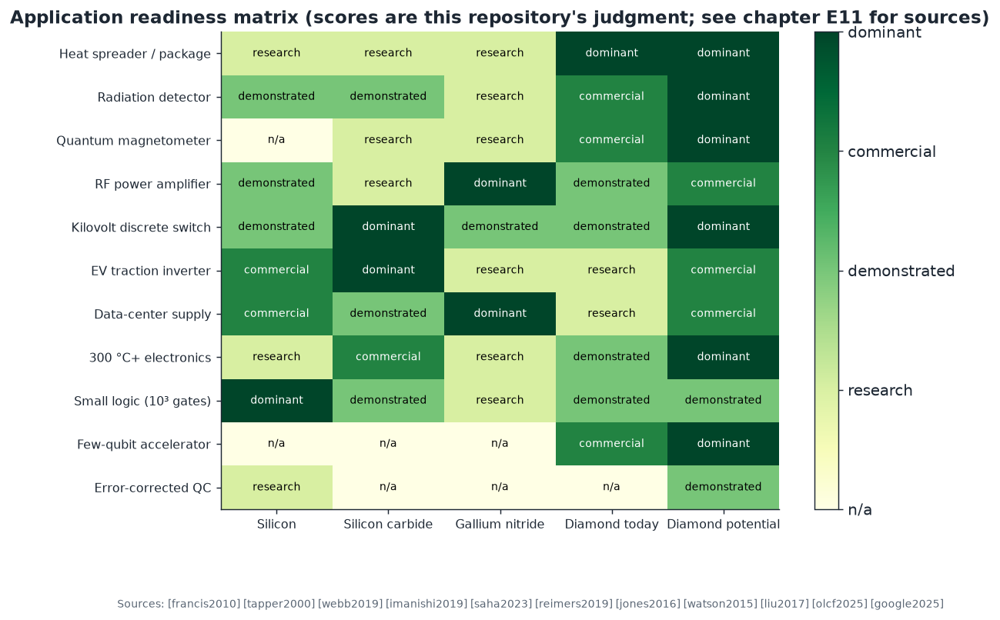
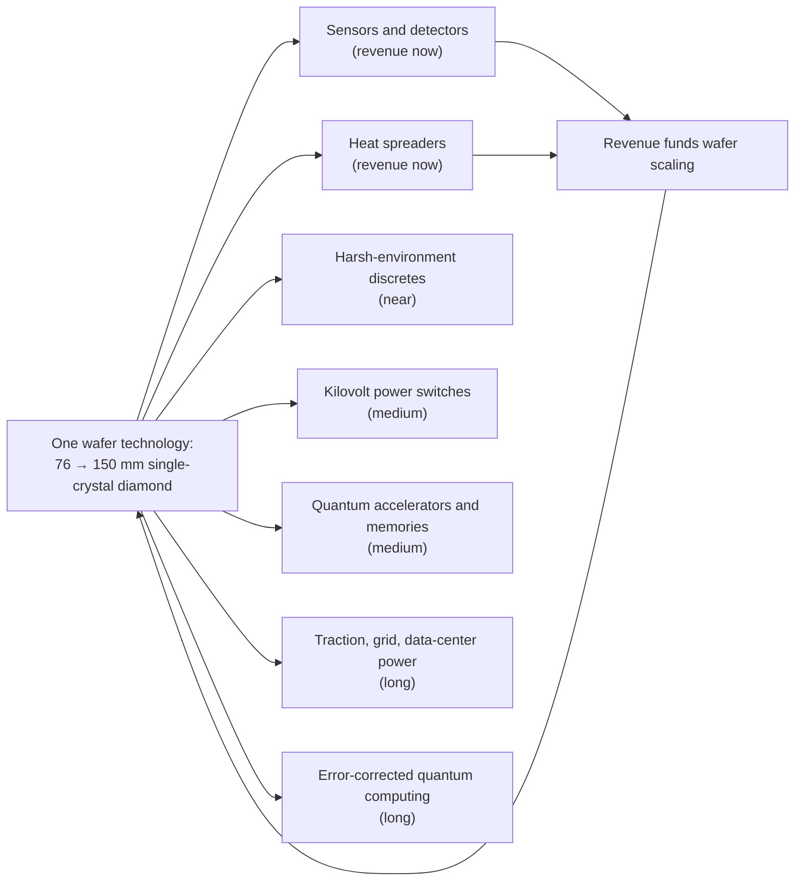

# E11 · Application atlas: what a diamond wafer platform is for

**Plain-language summary.** A new semiconductor pays for its factories only if many products share them. This chapter lists the products, from those on sale today to those a decade out, with what each needs from the wafer and the evidence behind it. It also says, for each, what the competing technology is and how diamond would have to beat it.

Scores in the matrix are this repository's judgment. The rows, with sources:

| Application | Diamond's edge | Competitor | Evidence today | What unlocks the next level |
|---|---|---|---|---|
| Heat spreaders, GaN-on-diamond | 22 W/(cm·K) | Copper, SiC | Commercial ([francis2010], [pomeroy2014], [yates2018]) | Lower-cost polycrystalline wafers |
| Particle and X-ray detectors | Radiation hardness, low leakage | Silicon | Installed at colliders ([tapper2000], [pernegger2005]) | Larger single crystals |
| Quantum magnetometers, gyroscopes, thermometers | Room-temperature spin readout | Fluxgates, SQUIDs, atomic vapor | Commercial sensors ([webb2019], [stuerner2021], [barry2020]); gyroscope proposals ([ledbetter2012], [ajoy2012]) | Chip-scale integration ([kim2019cmos]) |
| Nanoscale NMR and cell imaging | Sensor size | None at that scale | Demonstrated ([staudacher2013], [mamin2013], [lovchinsky2016], [lesage2013], [barry2016]) | Shallow-NV coherence ([sangtawesin2019]) |
| RF power amplifiers | Heat and voltage | GaN | 3.8 W/mm ([imanishi2019]) versus GaN's tens of W/mm | Higher hole-gas density and mobility |
| Kilovolt discrete switches | Field and heat | SiC | 3659 V lateral ([saha2023]) | Vertical device (W-5) |
| Traction inverters | Efficiency, uncooled operation | SiC | Model only ([E9](E9_power_circuits_diamond_vs_gan_sic.md)) | 150 mm wafers, vertical MOSFET |
| Data-center power | Efficiency | GaN, SiC | Model only | Price parity |
| 300 °C+ and radiation electronics | Bandgap | SiC | 400 °C FETs ([kawarada2014]); SiC precedent on Venus ([neudeck2019]) | Small logic and analog ([E3](E3_digital_and_cpu_design.md), [E4](E4_analog_and_mixed_signal_design.md)) |
| Small logic, sequencers | Ruggedness, co-location with qubits | Silicon | Inverters and gates ([liu2017]); DIA-4 synthesized here | Complementary logic ([liao2024]) |
| Few-qubit room-temperature accelerators | No cryostat | Cryogenic platforms | Rack-mounted units installed ([qbpawsey2023], [olcf2025]) | Placement yield, link fidelity |
| Quantum network memories and repeaters | Long nuclear memory | Cryogenic NV and ions | Demonstrated cold ([pompili2021], [hermans2022]); room-temperature proposals ([ji2022]) | Room-temperature photonic interface (unsolved) |
| Error-corrected computer | Room temperature, area | Superconducting, atoms, ions | Sizing only ([E10](E10_scaling_a_room_temperature_quantum_computer.md)) | Everything in Chapter 11 |
| Masers, hyperpolarization, MEMS | Unique physics | Various | Demonstrated ([breeze2018], [ajoy2018], [tao2014]) | Packaging |
| Thermionic and vacuum devices | Negative electron affinity | None | Emission shown ([koeck2009], [yater2000]) | Device engineering |
| Betavoltaic and radiation batteries | Radiation hardness | Silicon cells | Demonstrated ([bormashov2018]) | Efficiency |

## E11.1 The platform argument

Silicon carbide followed exactly this pattern: Schottky diodes for power supplies funded the wafers that later made traction inverters possible ([palmour2014], [she2017]). Diamond's equivalent seed products are sensors, detectors, and heat spreaders, all shipping today.

## E11.2 Requirements each product places on the wafer

| Requirement | Sensors | Detectors | Power switches | Logic | Qubits |
|---|---|---|---|---|---|
| Single crystal | preferred | yes | yes | yes | yes |
| Dislocation density | any | < 10⁴ cm⁻² | < 10³ cm⁻² in drift | any | < 10⁴ cm⁻² near NV |
| Nitrogen | 1 to 10 ppm (dense NV) | < 1 ppm | < 1 ppm | any | < 1 ppb + ¹²C |
| Doping | none | intrinsic | thick boron drift, phosphorus for vertical | surface | none in the qubit layer |
| Wafer size | 5 mm plates suffice | 5 to 25 mm | 50 to 150 mm | 50 mm | 25 to 76 mm |
| Sources | [barry2020] | [tapper2000] | [umezawa2018], [donato2020] | [liu2017] | [teraji2015], [achard2020] |

The qubit and power requirements pull in opposite directions (nitrogen-free ¹²C epilayer versus thick doped drift). The combined chip of Chapter 9 therefore stacks them: a thin quantum layer on an electronic-grade wafer, as [Chapter 2](../02_wafer_manufacturing.md) already proposed.
