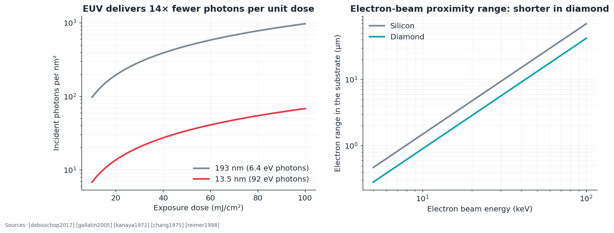
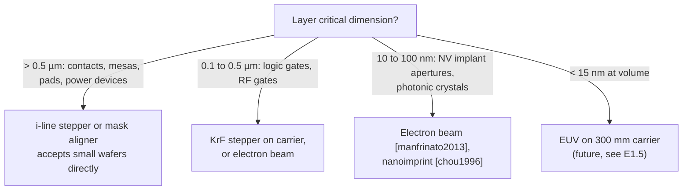

# E1 · Patterning diamond wafers: from extreme ultraviolet (EUV) lithography to electron beams

**Plain-language summary.** Lithography is the printing press of chipmaking. The most advanced presses use 13.5 nm extreme ultraviolet light and cost about as much as a passenger jet. They only accept 300 mm silicon-sized wafers, and diamond wafers are 76 mm at best. This chapter works out which printing tools diamond can use now, what physics changes when the substrate is diamond, and what would have to be true for diamond to ride in an EUV scanner.

Prerequisites: [Chapter 2](../02_wafer_manufacturing.md), [Chapter 3](../03_process_flow_vs_cmos.md). Code: `adamas.litho`.

## E1.1 Scaling laws

Resolution and depth of focus for projection optics of numerical aperture $\mathrm{NA}$ at wavelength $\lambda$ ([mack2007], [levinson2019]):

$$\mathrm{HP} = k_1\frac{\lambda}{\mathrm{NA}}, \qquad \mathrm{DOF} = k_2\frac{\lambda}{\mathrm{NA}^2}$$

| Tool class | $\lambda$ (nm) | NA | $k_1$ used | Half pitch (nm) | DOF (nm, $k_2$ = 1) | Wafer sizes | Sources |
|---|---|---|---|---|---|---|---|
| i-line stepper | 365 | 0.60 | 0.50 | 304 | 1014 | 50 to 200 mm, pieces | [mack2007] |
| Krypton fluoride (KrF) | 248 | 0.80 | 0.40 | 124 | 387 | 150 to 300 mm | [mack2007] |
| Argon fluoride (ArF) dry | 193 | 0.93 | 0.35 | 73 | 223 | 200, 300 mm | [levinson2019] |
| ArF immersion | 193 | 1.35 | 0.30 | 43 | 106 | 300 mm | [levinson2019] |
| EUV | 13.5 | 0.33 | 0.32 | 13 | 124 | 300 mm | [wagner2010], [asmleuv2026] |
| High-NA EUV | 13.5 | 0.55 | 0.32 | 8 | 45 | 300 mm | [vanschoot2017], [asmleuv2026] |

Status in 2026: high-NA systems have shipped to several chipmakers and research centers, with the first high-volume logic product announced in July 2026 ([asmlhighna2026], [imec2026]). Every EUV scanner is a 300 mm tool.

## E1.2 What EUV physics means for any substrate

**Source and optics.** A tin-droplet laser-produced plasma emits 13.5 nm light [fomenkov2017]. Nothing is transparent at 92 eV [henke1993], so the optics are molybdenum/silicon multilayer mirrors reflecting about 70 percent each [bajt2002]. Ten mirrors pass $0.70^{10} \approx 2.8\%$ of the light (`adamas.litho.mirror_throughput`), which is why source power dominated EUV's development ([wagner2010], [bakshi2018]).

**Photon shot noise.** At equal dose, EUV delivers 14 times fewer photons than 193 nm light: 20 photons/nm² at 30 mJ/cm². A 10 nm × 10 nm resist pixel absorbing 20 percent of them sees a one-sigma dose fluctuation of 5 percent. Stochastic printing failures follow ([debisschop2017], [gallatin2005]).

**Resist chemistry.** EUV exposure is driven by photoelectrons and their secondary-electron cascade, a few nanometers in range, and not by direct photochemistry ([kozawa2010], [ito2005]).

## E1.3 What changes when the substrate is diamond

These points are this repository's analysis, assembled from cited physics. Items marked **hypothesis** have no direct measurement in the literature that we know of, and each maps to an experiment in E1.6.

| Issue | Physics | Consequence | Status |
|---|---|---|---|
| Wafer diameter | EUV, immersion, and most KrF tools handle 300 mm only | Diamond needs a **carrier**: a 300 mm silicon wafer with a pocket or bonded diamond tile, co-planar to within the depth of focus | Engineering; chiplet-style handling shown in [li2024] |
| Flatness versus depth of focus | DOF is 124 nm (EUV) and 45 nm (high-NA); diamond polishing is slow and heteroepitaxial wafers bow ([schuelke2013], [schreck2017]) | Local thickness variation must fall below about 50 nm over a 26 × 33 mm field (smaller fields relax this) | **Hypothesis**: achievable for ≤ 10 mm tiles; experiment L-1 |
| Transparency | Diamond absorbs only below about 225 nm [clark1964]; index about 2.4 to 2.7 in the near ultraviolet [zaitsev2001] | At 365 and 248 nm, light enters the wafer and reflects from the back face; front-face reflectance is about 17 percent (`fresnel_reflectance(2.42)`). Needs a bottom anti-reflective coating or a roughened, absorbing backside. At 193 nm and 13.5 nm diamond is opaque, so the problem vanishes. | Known optics |
| Charging | Undoped diamond is an insulator | Electron-beam writing needs a conductive discharge layer, or use of the hydrogen-terminated surface's own hole gas [maier2000] as the ground plane | Practice in [toyli2010], [hausmann2010]; hole-gas grounding is a **hypothesis** (L-3) |
| Secondary electrons from the substrate | Hydrogen-terminated diamond has negative electron affinity [himpsel1979] and very high secondary-electron yield ([shih1997], [yater2000]) | Extra low-energy electrons injected into the resist from below could raise effective EUV sensitivity and add blur at the interface | **Hypothesis** (L-4) |
| Electron backscatter | Kanaya-Okayama range $R = 0.0276\,A E^{1.67}/(Z^{0.89}\rho)$ µm [kanaya1972]: 5.6 µm in diamond against 9.3 µm in silicon at 30 keV; low atomic number also lowers the backscatter coefficient [reimer1998] | Weaker, tighter proximity effect [chang1975]: dense nanometer patterns (implant masks for NV arrays) are easier to write on diamond than on silicon | Model result; L-2 |
| Heat during exposure | Thermal conductivity 22 W/(cm·K) [wei1993] | Negligible resist heating and wafer distortion | Advantage |
| Pattern transfer | Oxygen-plasma etch with metal, oxide, or hydrogen silsesquioxane (HSQ) hard masks ([hwang2004], [lee2008], [hausmann2010], [grigorescu2009]); quasi-isotropic undercut for suspended structures ([khanaliloo2015], [burek2012]) | Organic resists erode in oxygen plasma, so every layer needs a hard mask | Established |

## E1.4 Which tool for which layer

**Nanoimprint lithography** ([chou1995], [chou1996]) deserves attention for diamond: it is indifferent to wafer diameter, resolves below 10 nm, and suits the highly repetitive patterns that NV arrays and standard-cell logic need. Its defectivity limits matter less for small dies ([Chapter 2](../02_wafer_manufacturing.md), Figure 16).

**Electron-beam lithography** resolves single-digit nanometers [manfrinato2013] and is how nearly every published NV implant mask was made ([toyli2010], [bayn2015], [scarabelli2016]).

## E1.5 Does diamond ever need EUV?

| Application | Feature needed | Tool that suffices |
|---|---|---|
| Power devices | 1 to 10 µm | Mask aligner |
| p-channel logic, 10³ to 10⁴ gates ([E3](E3_digital_and_cpu_design.md)) | 0.25 to 2 µm | i-line or KrF |
| RF transistors | 50 to 200 nm gates | Electron beam or KrF |
| NV implant apertures | 10 to 30 nm holes on a 15 to 50 nm pitch ([Chapter 7](../07_nv_fabrication_and_placement.md)) | Electron beam now; **EUV or nanoimprint for volume** |

The only layer in this framework that approaches EUV territory is the **qubit implant mask**. A dense array of 15 nm apertures on a 30 nm pitch is squarely a high-NA EUV pattern, and a 1 cm² quantum layer would take an electron-beam tool days to write. So the realistic long-term split is: EUV or nanoimprint for the qubit-defining layer, relaxed optical lithography for everything else, on a 300 mm carrier.

**Beyond lithography.** Scanning-probe hydrogen depassivation places single dopants in silicon with atomic precision ([schofield2003], [fuechsle2012]), and the hydrogen-terminated diamond surface has been imaged with atomic resolution by resonant electron injection [bobrov2001]. Patterning the hydrogen termination itself at the atomic scale would define hole-gas wires and NV-friendly regions with no resist at all (moonshot M-1 in [E7](E7_beyond_the_framework.md)).

## E1.6 Proposed experiments

| ID | Experiment | Success metric |
|---|---|---|
| L-1 | Interferometric map of local thickness variation and bow on commercial 3 to 10 mm plates and a heteroepitaxial wafer, before and after chemical-mechanical polishing | Site flatness distribution; fraction of 5 × 5 mm sites below 100 nm and below 45 nm |
| L-2 | Electron-beam proximity point-spread function on diamond versus silicon at 30 and 100 keV (doughnut test patterns) | Backscatter range and ratio; compare with `adamas.litho.kanaya_okayama_range_um` |
| L-3 | Electron-beam writing with the two-dimensional hole gas as the only discharge path | Placement error and pattern distortion no worse than with a metal discharge layer |
| L-4 | Resist dose-to-clear on hydrogen-terminated versus oxygen-terminated diamond versus silicon, under electron-beam and (through a user facility) EUV exposure | Any termination-dependent sensitivity shift larger than 5 percent |
| L-5 | Pocket-carrier co-planarity: diamond tile in a silicon carrier, measured by stepper focus sensors | Step below 100 nm; focus-exposure matrix printed across the tile edge |
| L-6 | Nanoimprint of a 30 nm pitch aperture array on diamond, pattern transfer into an implant mask | Aperture diameter uniformity below 2 nm (one sigma) over 1 mm² |
