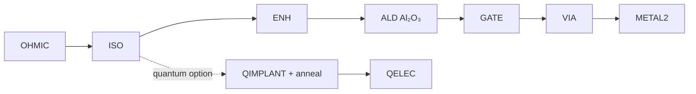
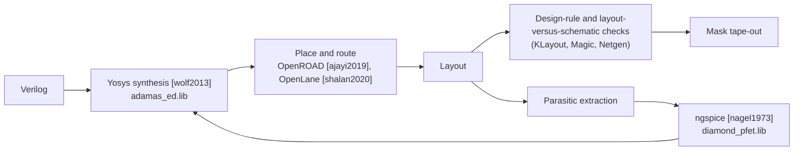

# E2 · From patterns to real circuits: process integration and a process design kit (PDK)

**Plain-language summary.** A factory process becomes useful to circuit designers only when it is frozen into a rulebook: which layers exist, how small and how close shapes may be, and how the resulting transistors behave in a simulator. Silicon foundries call that rulebook a process design kit. Diamond has none. This chapter specifies a first one, "ADAMAS-PDK-0," small enough for a university cleanroom.

## E2.1 Layer stack and masks

Process basis: hydrogen-terminated diamond MOSFET flow of [Chapter 3](../03_process_flow_vs_cmos.md) ([kawarada2014], [kitabayashi2017], [saha2021]), two threshold flavors as in [liu2017].

| Mask | Layer | Purpose | Minimum feature (proposed) | Tool ([E1](E1_lithography_from_euv_to_electron_beam.md)) |
|---|---|---|---|---|
| 1 | `OHMIC` | Gold source/drain; also protects the hydrogen termination | 2 µm | i-line |
| 2 | `ISO` | Oxygen-plasma isolation outside active areas | 2 µm | i-line |
| 3 | `ENH` | Partial oxidation of the channel for enhancement-mode devices [kitabayashi2017] | 2 µm | i-line |
| 4 | `GATE` | Gate metal on atomic-layer-deposited Al₂O₃ | 2 µm (0.5 µm option) | i-line / electron beam |
| 5 | `VIA` | Openings in Al₂O₃ | 3 µm | i-line |
| 6 | `METAL2` | Interconnect and pads | 3 µm | i-line |
| Q1 (optional) | `QIMPLANT` | Nitrogen implant apertures in oxygen-terminated regions | 20 nm | electron beam |
| Q2 (optional) | `QELEC` | Photocurrent electrodes and microwave line | 1 µm | i-line |

Design rules follow the scalable lambda convention of [meadconway1980] with λ = 1 µm: minimum width 2λ, spacing 2λ, gate overlap of active 2λ, via enclosure 1λ. Conservative rules trade density for yield, which is the right trade at this maturity ([Chapter 2](../02_wafer_manufacturing.md), yield model).

## E2.2 Process control monitors

Every die carries test structures, because in an immature process the monitors are worth more than the circuits.

| Structure | Extracts | Reference method |
|---|---|---|
| Transfer-length-method ladder | Contact resistance, sheet resistance | [sze2006] |
| Van der Pauw and Hall cross | Hole sheet density and mobility of the hole gas | [sasama2018], [kawarada2017] |
| Metal-oxide-semiconductor capacitor | Oxide capacitance, interface charge, flat-band voltage | [sze2006], [matsumoto2016] |
| Transistor array, W and L sweep | Threshold, transconductance parameter, channel-length modulation, **mismatch coefficient** $A_{VT}$ | [pelgrom1989] |
| Ring oscillators, 5 to 51 stages | Gate delay, static current | [liu2017]; `circuits/spice/ring_oscillator.cir` |
| Serpentine and comb | Metal opens and shorts, defect density $D_0$ for the yield model | [stapper1983] |
| Isolation leakage pair | Oxygen-termination isolation quality | [kawarada2014] |
| NV witness region | Charge-state fraction and $T_2$ next to active circuits | [hauf2011], [grotz2012] |

## E2.3 Compact model ladder

| Level | Model | Use | Status |
|---|---|---|---|
| 0 | Square law (SPICE level 1 [nagel1973], [sze2006]) | Hand analysis, this repository | Done: `circuits/spice/diamond_pfet.lib`, tested |
| 1 | Charge-based all-region model (EKV [enz1995], [tsividis2011]) | Analog design with gm/I_D [silveira1996] | Proposed (S-5) |
| 2 | Verilog-A surface-potential model including hole-gas density versus gate bias, temperature-activated contact resistance, and self-heating | Power and radio-frequency design | Proposed |
| 3 | Statistical corners from the monitor data | Yield-aware design | Requires fabricated lots |

The Python and SPICE level-0 models agree: a 5-stage ring oscillator gives 2.2 ns per stage in ngspice and 3.3 ns in the first-order formula of `adamas.digital`. The hand formula is pessimistic by about 1.5 times, which is normal for first-order delay estimates [rabaey2003].

## E2.4 Open-source design flow

The synthesis step already runs in this repository (`circuits/digital/`). Place and route needs a technology file (layer map, LEF abstract views of the cells), which is project P-2 below. The open 130 nm silicon flow of [shalan2020] is the template.

## E2.5 Projects

| ID | Project | Deliverable |
|---|---|---|
| P-1 | Draw the PDK-0 monitor die in KLayout with the rules above | GDS file + rule deck |
| P-2 | Create LEF/technology files for the five-cell library and run OpenROAD on DIA-4 ([E3](E3_digital_and_cpu_design.md)) | Routed layout, die area estimate |
| P-3 | Fit level-0 and EKV parameters to digitized curves of [liu2017] and [kawarada2014] | Model cards with fit error |
| P-4 | Fabricate the monitor die (4 masks) on a 3 to 5 mm plate | Measured parameter table that replaces every placeholder in this repository |
