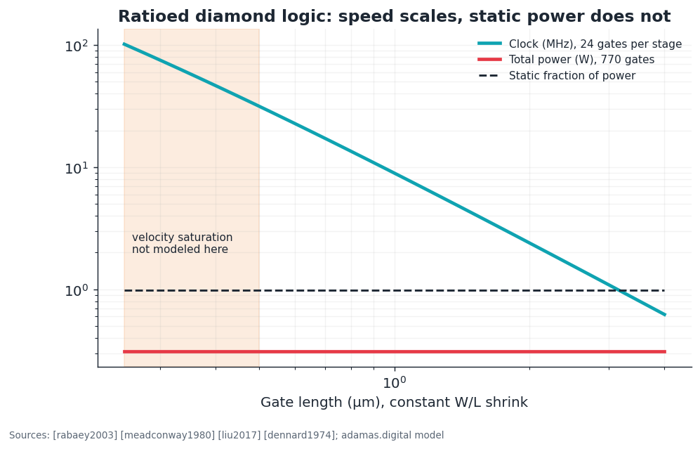
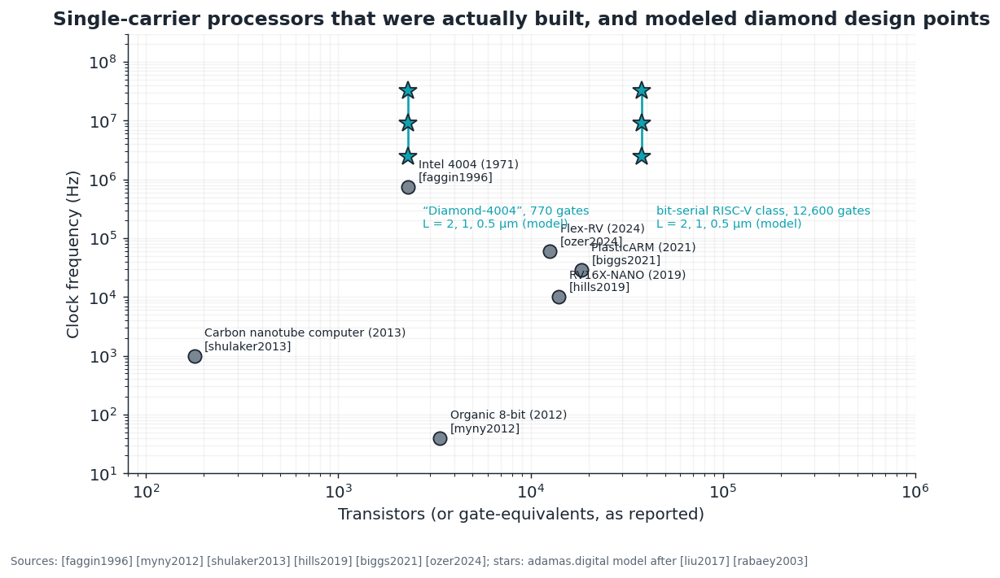

# E3 · Digital design and processors on diamond

**Plain-language summary.** Could you build a computer processor entirely from diamond transistors? Yes, a small one. Diamond today offers one transistor polarity, the same constraint under which the first microprocessor was designed in 1971 and under which plastic and carbon-nanotube processors are built now. This chapter sizes such a processor, synthesizes a working example with open-source tools, and shows where the approach stops making sense.

Code: `adamas.digital`, `circuits/digital/`, `circuits/spice/ring_oscillator.cir`.

## E3.1 Logic families available to a p-channel-only technology

| Family | Load | Static power | Swing | Used by |
|---|---|---|---|---|
| Resistor load | Thin-film resistor | High | Ratioed | [biggs2021] |
| Enhancement load (diode-connected) | Same device type | High | Loses one threshold | early silicon MOS [meadconway1980] |
| **Enhancement/depletion (E/D)** | Normally-on transistor, gate tied to source | Medium | Ratioed, near rail-to-rail | [liu2014], [liu2017]; silicon n-channel era [rabaey2003] |
| Pseudo-complementary / dual-gate | Extra devices emulate the missing polarity | Lower | Near rail | organic processors [myny2012] |
| Dynamic (precharge/evaluate) | Clocked | Low static | Full | [weste2011]; needs low leakage, which a 5.47 eV bandgap provides |
| Hybrid complementary | n-channel device from **another material** (gallium nitride or silicon carbide) beside the diamond p-channel | None | Full | power half-bridges [kawai2025], [chu2025]; diamond's own 1600 V-class p-channel [kawarada2017] |
| True diamond complementary | Needs the n-channel MOSFET of [liao2024] integrated with p-channel [zhao2024] | None | Full | not yet demonstrated |

Diamond's wide bandgap makes **dynamic logic** unusually attractive: junction and subthreshold leakage, the usual enemies of charge storage, are negligible even at 300 °C ([neudeck2002], [kawarada2014]). This is proposal D-4.

## E3.2 Delay and power model

First-order switching model [rabaey2003], with transistor current from the square law [sze2006]:

$$t_{rise} = \frac{C_L V_{DD}/2}{I_{load}}, \quad t_{fall} = \frac{C_L V_{DD}/2}{I_{drv} - I_{load}}, \quad P = \underbrace{V_{DD} I_{load}\, \beta}_{static} + \underbrace{\alpha C_L V_{DD}^2 f}_{dynamic}, \quad C_L = \mathrm{FO}\cdot C_{ox} W L + C_{wire}$$

Reference gate (`adamas.digital.EDGate`): driver W/L = 16/2 µm, load 2/2 µm, 30 nm Al₂O₃, mobility 150 cm²/(V·s), 10 V, fan-out 3.

| Quantity | Python model | ngspice (`ring_oscillator.cir`, fan-out 1) |
|---|---|---|
| Stage delay, fan-out 1 | 3.3 ns | **2.2 ns** |
| Stage delay, fan-out 3 | 8.7 ns | n/a |
| Static power per gate | 0.40 mW (output low half the time) | 0.90 mW per stage while oscillating |

Speed improves with the square of gate length at constant W/L, and **static power does not change at all**, since it is set by the load current needed to meet the rise time. More than 98 percent of the power is static. This is the structural reason silicon abandoned single-polarity logic ([meadconway1980], [dennard1974]), and it sets diamond's practical ceiling near 10⁴ gates per die unless dynamic or complementary logic arrives. Heat is not the limit: 5 W in a 3 mm diameter block raises a diamond die by 0.4 K against 5.7 K for silicon (`adamas.thermal`, [carslaw1959]). Supply current and battery budgets are.

## E3.3 Processors that were built under the same constraint

| Processor | Technology | Size | Clock | Source |
|---|---|---|---|---|
| Intel 4004 | p-channel silicon-gate MOS, 10 µm, 15 V | 2,300 transistors | 740 kHz | [faggin1996], [faggin1970] |
| Organic 8-bit | p-type organic thin-film transistors | about 3,400 transistors | 40 instructions/s | [myny2012] |
| Carbon nanotube computer | p-type nanotube transistors | 178 transistors | 1 kHz | [shulaker2013] |
| RV16X-NANO | complementary nanotube transistors, RISC-V | > 14,000 transistors | about 10 kHz | [hills2019] |
| PlasticARM | n-type metal-oxide thin film, resistor load | 18,334 gate-equivalents | 29 kHz | [biggs2021] |
| Flex-RV | n-type metal-oxide thin film, bit-serial RISC-V | about 12,600 gates | 60 kHz | [ozer2024] |
| Silicon carbide junction-transistor circuits | n-channel only, 500 °C | 10¹ to 10² transistors | kHz | [neudeck2016], [neudeck2019] |

Gate counts marked "about" are recalled from the papers and should be re-verified before quotation. Instruction-set background: [patterson2017], [waterman2019].

## E3.4 Worked project: DIA-4, synthesized in this repository

`circuits/digital/dia4.v` is a 4-bit accumulator machine with nine instructions. Results reproduced on Ubuntu with Icarus Verilog and Yosys 0.33 [wolf2013]:

| Step | Result |
|---|---|
| Behavioral simulation | PASS (countdown program) |
| Synthesis to `adamas_ed.lib` | 220 cells: 13 DFF, 34 INV, 49 NAND2, 100 NOR2, 24 NOR3 |
| Transistor count | **897** (39 percent of a 4004) |
| Gate-level simulation of the synthesized netlist | PASS |
| Estimate at 2 µm gates (about 311 gate-equivalents) | 2.4 MHz clock, 0.13 W |
| Estimate at 0.5 µm gates | 31 MHz, 0.13 W (optimistic: no velocity saturation) |

| Design point | Gates | Clock at 2 µm | Power |
|---|---|---|---|
| DIA-4 | 311 | 2.4 MHz | 0.13 W |
| "Diamond-4004" class | 770 | 2.4 MHz | 0.31 W |
| Bit-serial RISC-V class (Flex-RV scale) | 12,600 | 2.4 MHz | 5.1 W |

A diamond 4004-class processor would therefore run about three times faster than the original at one-fifth the feature size, on a process with six masks. Its reason to exist is the environment: 400 °C, radiation, or co-location with NV qubits as a sequencer ([Chapter 9](../09_cmos_control_integration.md)).

## E3.5 Design methodology notes

- **Sizing.** Logical effort [sutherland1999] applies with a ratioed twist: the pull-up is fixed by the static-power budget, so only the driver is sized. Keep driver-to-load strength above 8 ([Chapter 5](../05_digital_logic.md)).
- **Interconnect.** Elmore delay [elmore1948] with gold or aluminum wires; diamond's low permittivity (5.7) reduces substrate coupling. Rent's rule [landman1971] wiring estimates carry over unchanged.
- **Clocking.** Two-phase non-overlapping clocks with dynamic latches, the 4004's own style [faggin1996], cut the flip-flop from 22 transistors to about 8.
- **Testability.** Scan chains cost static power in this technology; prefer built-in self-test of small blocks.
- **Fundamental limits.** Landauer's bound $k_BT\ln 2$ [landauer1961] is 3 × 10⁻²¹ J at 300 K; an E/D gate here spends about 10⁻¹¹ J per transition plus static burn. There are ten orders of magnitude of headroom, as in every real technology [pop2010].
- **Three-dimensional devices.** Fin and vertical hole-gas transistors raise current per footprint ([huang2018], [oi2018]).

## E3.6 Experiments and projects

| ID | Item | Success metric |
|---|---|---|
| D-1 | Run the `circuits/digital` flow; extend DIA-4 with a stack pointer and subroutine call | Still under 2,300 transistors; gate-level PASS |
| D-2 | Fabricate 5- to 51-stage ring oscillators in PDK-0 ([E2](E2_process_integration_and_pdk.md)) | Measured stage delay within 2× of 2.2 ns; populate Liberty timing |
| D-3 | 4-bit adder and 8-bit shift register at 25 to 400 °C | Functional across range; static current versus temperature |
| D-4 | Dynamic (precharge) diamond logic gate | Hold time of a floating node > 1 s at 300 °C; power reduction > 10× over E/D |
| D-5 | Hybrid complementary inverter: diamond p-channel bonded beside a gallium nitride n-channel | Static current below 1 µA; builds on [kawai2025], [chu2025] |
| D-6 | DIA-4 on diamond | First all-diamond stored-program processor |
| D-7 | Qubit sequencer: a DIA-4-class block issuing microwave-switch and laser-gate timing for a Rabi experiment | NV Rabi oscillation driven by diamond logic on the same die |
