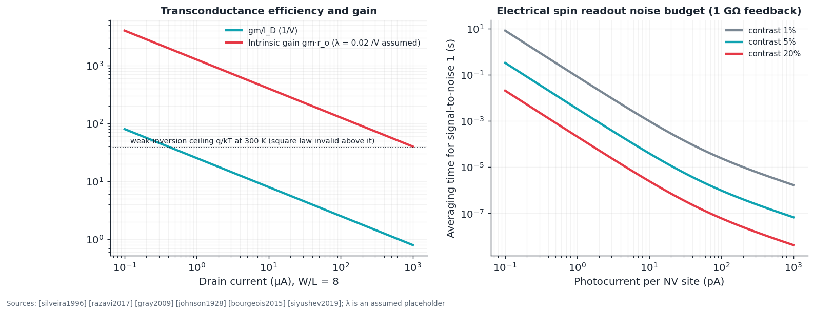

# E4 · Analog and mixed-signal design on diamond

**Plain-language summary.** Analog circuits amplify, compare, and measure. For diamond they matter twice: as the control and sensing electronics of high-voltage power chips, and as the amplifiers that must pick out a qubit's picoampere photocurrent. This chapter carries standard analog design methods over to diamond transistors and states which device parameters nobody has measured yet.

Code: `adamas.analog`.

## E4.1 Small-signal quantities

Square-law saturation region ([gray2009], [razavi2017]):

$$g_m = \sqrt{2 k I_D} = \frac{2 I_D}{V_{ov}}, \qquad r_o = \frac{1}{\lambda I_D}, \qquad A_0 = g_m r_o = \frac{2}{\lambda V_{ov}}$$

The $g_m/I_D$ methodology sizes transistors by transconductance efficiency, from about $q/k_BT \cdot 1/n \approx 25$ to 38 V⁻¹ in weak inversion down to a few V⁻¹ in strong inversion [silveira1996]; it needs an all-region model such as EKV ([enz1995], [tsividis2011]).

| Parameter | Silicon (typical) | Diamond hole-gas FET | Note |
|---|---|---|---|
| $\mu C_{ox}$ | 100 to 300 µA/V² | 40 µA/V² (150 cm²/V·s, 30 nm Al₂O₃) | [kawarada2014]; boron-nitride gates reach higher mobility [sasama2018] |
| Channel-length modulation $\lambda$ | 0.05 to 0.2 V⁻¹ | **unreported**; 0.02 V⁻¹ assumed | Experiment A-1 |
| Mismatch $A_{VT}$ | 2 to 5 mV·µm [pelgrom1989] | **unreported** | Surface-acceptor randomness suggests it will be large; A-1 |
| Flicker noise | Hooge parameter 10⁻⁵ to 10⁻³ [hooge1994] | **unreported** | Surface conduction suggests high; A-2 |
| Temperature range | −55 to 175 °C | to 400 °C [kawarada2014] | Diamond's advantage |

## E4.2 Building blocks

**Gain stage.** Common-source driver with a depletion load (gate tied to source) acts as a current-source load: $A_v = -g_m/(g_{ds1} + g_{ds2})$. `adamas.analog.cs_amp_gain_depletion_load` gives −63 at 100 µA for the reference transistor with the assumed λ.

**Voltage reference.** Silicon uses bandgap references ([widlar1971], [brokaw1974]), which need bipolar junctions with well-behaved $V_{BE}$. Diamond's junctions are impractical for this ([Chapter 1](../01_materials_physics.md)). The single-polarity alternative is the **threshold-difference reference**: enhancement and depletion transistors of equal size at equal current give $V_{ref} = V_{T,E} - V_{T,D}$, first used in n-channel silicon [blauschild1978]. PDK-0 has exactly those two thresholds. Its temperature coefficient depends on how the two surface terminations drift, which is unknown (A-3).

**Differential pair and comparator.** p-channel input pair with depletion loads. Offset is set by $\sigma(\Delta V_T) = A_{VT}/\sqrt{WL}$ [pelgrom1989]; large devices are cheap here since speed is not the goal.

**Noise.** Input-referred thermal noise $\overline{v_n^2} = 4k_BT\gamma/g_m$ ([johnson1928], [nyquist1928], [razavi2017]): 6.6 nV/√Hz at 100 µA for the reference device.

## E4.3 The qubit readout front end

Photoelectric readout gives picoampere-level currents with spin contrast of a few to tens of percent ([bourgeois2015], [siyushev2019], [gulka2021]). A transimpedance amplifier with feedback resistor $R_f$ has input noise

$$\overline{i_n^2} = \frac{4k_BT}{R_f} + 2qI_{dc}$$

With 1 GΩ: 4.1 fA/√Hz. For 1 pA and 10 percent contrast the averaging time for unit signal-to-noise is about 0.8 ms (`pdmr_averaging_time_s`), comparable to $T_1$ (6 ms [jarmola2012]), so single-shot electrical readout of the electron spin needs either more current per site, spin-to-charge conversion [shields2015], or repetitive readout through a nuclear ancilla ([jiang2009], [neumann2010science]).

Diamond helps here in an unusual way: the substrate is a near-perfect insulator with negligible leakage, so picoampere nodes can be routed on-chip without the guard structures silicon needs.

## E4.4 Power and radio-frequency integrated circuits

The natural first diamond integrated circuit is a **high-voltage switch with its own gate driver and protection** ([Chapter 4](../04_analog_power_rf_devices.md)): level shifter, under-voltage lockout from a threshold-difference reference, and temperature sensing, all in p-channel E/D circuits, around a kilovolt-class transistor ([saha2021], [kawarada2017]). Hybrid half-bridges already pair diamond p-channel with gallium nitride or silicon carbide n-channel switches ([kawai2025], [chu2025]).

## E4.5 Experiments

| ID | Experiment | Success metric |
|---|---|---|
| A-1 | Matched transistor arrays on the PDK-0 monitor die | $A_{VT}$, $A_\beta$, and λ with confidence intervals; first mismatch data for diamond |
| A-2 | Low-frequency noise spectra, 1 Hz to 100 kHz, 25 to 300 °C | Hooge parameter; corner frequency |
| A-3 | Threshold-difference reference | Temperature coefficient below 100 ppm/K over 25 to 300 °C after trimming |
| A-4 | Two-stage amplifier, p-channel only | Gain above 60 dB; unity-gain bandwidth above 1 MHz |
| A-5 | On-diamond multiplexer in front of an off-chip transimpedance amplifier reading NV photocurrent | Added noise below 1 fA/√Hz; channel isolation above 60 dB |
| A-6 | Monolithic kilovolt switch with integrated driver | 1 kV, 1 A, 100 kHz switching with on-chip protection |
