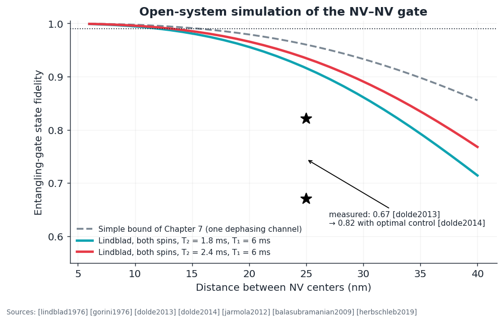
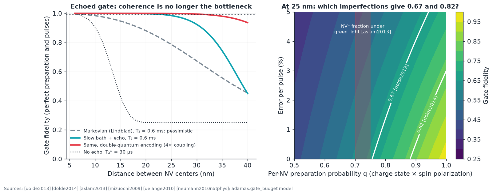
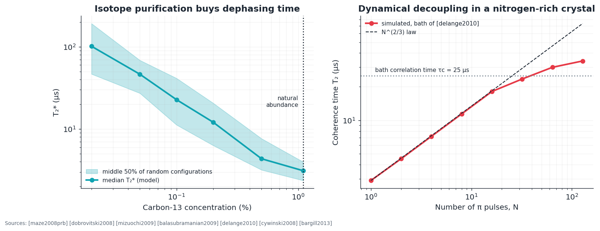

# E5 · NV qubit engineering: open-system models, baths, and control

**Plain-language summary.** Chapters 6 to 8 described the NV qubit with simple formulas. Real qubits lose information to their surroundings, and engineering them means modeling that loss, then designing pulse sequences that fight it. This chapter adds three research-grade tools to the repository (a master-equation gate simulator, a nuclear-spin bath model, and a dynamical-decoupling calculator) and checks each against a published number.

Code: `adamas.opensys`. Foundations of the pulse methods: [rabi1937], [ramsey1950], [hahn1950], [carr1954], [meiboom1958].

## E5.1 Master-equation model of the NV–NV gate

Markovian open-system dynamics ([lindblad1976], [gorini1976]; the formalism implemented by QuTiP [johansson2012]):

$$\dot\rho = -i[H,\rho] + \sum_k \left( c_k\rho c_k^\dagger - \tfrac12\{c_k^\dagger c_k,\rho\}\right)$$

Two electron-spin qubits with $H = 2\pi\nu_{dd}|11\rangle\langle 11|$, $\nu_{dd} = 52\ \mathrm{MHz\,nm^3}/r^3$ ([neumann2010natphys], [dolde2013]); on each spin, dephasing $c = \sqrt{\gamma_\phi/2}\,\sigma_z$ and symmetric relaxation at $1/(2T_1)$ each way, with $1/T_2 = 1/(2T_1) + \gamma_\phi$. Evolving $|{+}{+}\rangle$ for $t_g = 1/(2\nu_{dd})$ should give the maximally entangled state $\mathrm{CZ}|{+}{+}\rangle$.

| Spacing | Simple bound ([Chapter 7](../07_nv_fabrication_and_placement.md)) | Lindblad, $T_2$ = 1.8 ms, $T_1$ = 6 ms |
|---|---|---|
| 10 nm | 0.997 | 0.994 |
| 15 nm | 0.991 | 0.981 |
| 25 nm | 0.960 | 0.916 |
| 30 nm | 0.933 | 0.861 |

**Reading the result.** Both spins dephase, so the true ceiling is lower than the earlier bound. The measured 0.67 [dolde2013] and 0.82 [dolde2014] at 25 nm lie below even this curve; plausible contributors that this model omits are the shorter coherence of that sample, imperfect charge-state and spin initialization ([aslam2013]), and accumulated pulse error over a long sequence. Under this memoryless-noise assumption, 99 percent needs spacing at or below about 12 nm in ¹²C material. Section E5.1b shows that assumption is pessimistic for an echoed gate. Coherence inputs: [balasubramanian2009], [herbschleb2019], [jarmola2012].

### E5.1b Beyond the Markov approximation: an error budget (project Q-1, done)

The master equation above assumes memoryless noise, which gives exponential decay. NV dephasing is dominated by a *slow* nuclear bath: coherence falls as $e^{-(t/T_2^*)^2}$ in free evolution and as $e^{-(t/T_2)^3}$ under an echo ([delange2010], [maze2008prb], [dobrovitski2008]). That changes the design conclusions, so `adamas.gate_budget` models the gate the way it is run in practice.

**Echoed gate.** Write $|11\rangle\langle11| = (1 - Z_1 - Z_2 + Z_1Z_2)/4$. A simultaneous π pulse on both spins at half time [hahn1950] reverses every single-spin $Z$ term, including quasi-static detuning, and leaves $Z_1Z_2$ untouched. The result equals a controlled-phase gate up to local rotations, in the same time $t_g = 1/(2\nu_{dd})$.

**Closed form.** For independent diagonal noise with single-spin coherence factors $w_1, w_2$, the fidelity of $\mathrm{CZ}|{+}{+}\rangle$ is exactly

$$F_{coh} = \frac{(1+w_1)(1+w_2)}{4}$$

(the test suite checks this against the Lindblad solver to six digits). Adding per-NV preparation probability $q$ (negative charge state times spin polarization; a failed preparation is taken as a fully mixed state) and an error $\epsilon$ on each of $n$ pulses:

$$F = q^2 (1-\epsilon)^n F_{coh} + \frac{1-q^2}{4}$$

**Double-quantum encoding.** Using $|{+1}\rangle, |{-1}\rangle$ as the qubit on both centers quadruples the coupling and doubles the magnetic-noise sensitivity, a technique used in NV–NV coupling experiments ([neumann2010natphys], [dolde2013]).

| Echo $T_2$ needed for fidelity | 0.90 | 0.99 | 0.999 |
|---|---|---|---|
| 10 nm spacing | 20 µs | 44 µs | 96 µs |
| 15 nm | 68 µs | 150 µs | 324 µs |
| 25 nm | 315 µs | 695 µs | 1.5 ms |
| 25 nm, double quantum | 125 µs | 276 µs | 595 µs |

**What this changes.**

1. The Markov model is a pessimistic bound. With an echoed gate, natural-abundance coherence (0.6 ms [mizuochi2009]) already permits 0.98 at 25 nm, and ¹²C material (1.8 ms [balasubramanian2009]) permits 0.999. The spacing rule relaxes from "12 nm" to "**25 nm is enough for coherence**," which is a large relief for the placement problem of [Chapter 7](../07_nv_fabrication_and_placement.md).
2. The bottleneck moves to **preparation and pulses**. Under green illumination the NV⁻ fraction is about 0.70 to 0.75 [aslam2013]. Without charge-state post-selection, $q \le 0.75$ caps the fidelity near 0.67 by itself, even with perfect coherence and pulses. The right panel shows every $(q, \epsilon)$ pair consistent with the reported 0.67 [dolde2013] and 0.82 [dolde2014].
3. This is a consistency map, not an explanation of those experiments: their actual sample parameters and post-selection procedures must be read from the papers before drawing conclusions (follow-up Q-1b).
4. Engineering priority therefore shifts toward **charge-state initialization and verification** ([hopper2018], [shields2015], [doi2014]) and robust pulses ([khaneja2005], [rong2015]).

## E5.2 The carbon-13 bath

Quasi-static, secular treatment ([maze2008prb], [dobrovitski2008], [zhao2012]): each ¹³C nucleus at position $\mathbf r_k$ shifts the electron by $\pm A_{zz,k}/2$ with

$$A_{zz} = \frac{\mu_0\gamma_e\gamma_n\hbar}{4\pi r^3}(1 - 3\cos^2\theta) \approx \frac{19.9\ \mathrm{kHz\,nm^3}}{r^3}(1-3\cos^2\theta), \qquad \sigma^2 = \tfrac14\sum_k A_{zz,k}^2, \qquad T_2^{*} = \frac{\sqrt2}{2\pi\sigma}$$

`t2star_us_c13` populates a real diamond lattice at random and returns the distribution over configurations. Nuclei coupled above 200 kHz are treated as resolved register qubits instead of noise (a simplification of this repository).

| ¹³C concentration | Median $T_2^{*}$ (model) | Experiment |
|---|---|---|
| 1.1% (natural) | 3.1 µs | 1 to 5 µs ([childress2006], [mizuochi2009]) |
| 0.3% | 8.4 µs | 1.8 ms **echo** $T_2$ at 0.3% in [balasubramanian2009] (different quantity) |
| 0.03% | 69 µs | tens to 100 µs class ([bauch2018]) |

The spread between configurations is a manufacturing fact: two NV centers in the same crystal differ in $T_2^{*}$ by a factor of two or more, so every cell needs individual calibration. The echo time $T_2$ requires nuclear pair dynamics and the cluster-correlation expansion [yang2008]; that is simulation S-3.

## E5.3 Dynamical decoupling

Periodic π pulses average out slow noise ([viola1999], [carr1954], [meiboom1958]; compensated XY sequences [gullion1990]). For classical Gaussian noise with correlation $b^2 e^{-|\tau|/\tau_c}$, the coherence is $e^{-\chi}$ with

$$\chi(t) = \tfrac12\int_0^t\!\!\int_0^t y(t_1)\,y(t_2)\,b^2 e^{-|t_1-t_2|/\tau_c}\,dt_1 dt_2$$

where $y = \pm1$ flips at each pulse [cywinski2008]. With the bath parameters measured in [delange2010] ($b$ = 3.6 µs⁻¹, $\tau_c$ = 25 µs) `t2_under_cpmg_us` returns a Hahn-echo $T_2$ of 2.9 µs (they measured 2.8 µs) and reproduces the $N^{2/3}$ scaling until $T_2$ approaches $\tau_c$, where the curve bends over. The same scaling reaches 0.6 s at 77 K [bargill2013].

## E5.4 Control quality

| Tool | Purpose | Source |
|---|---|---|
| Gradient-ascent pulse engineering | Numerically optimized pulses; raised NV–NV entanglement from 0.67 to 0.82 | [khaneja2005], [dolde2014] |
| Derivative-removal shaping | Suppresses leakage to neighboring hyperfine lines | [motzoi2009] |
| Noise-filtering composite gates | 99.92 percent two-qubit gate | [xie2023], [rong2015] |
| Geometric and holonomic gates | Robustness to amplitude error | [zu2014], [arroyo2014] |
| Randomized benchmarking | Gate error independent of preparation and readout | [knill2008], [magesan2011] |
| Quantum volume | System-level benchmark | [cross2019] |
| Algorithms on NV hardware | Deutsch–Jozsa at 300 K; programmable two-qubit processor; quantum Fourier transform | [shi2010], [wu2019], [vorobyov2021] |

## E5.5 Experiments and simulation projects

| ID | Item | Success metric |
|---|---|---|
| Q-1 | Non-Markovian error budget for the echoed gate | **Done in v0.3.0** (`adamas.gate_budget`, Section E5.1b) |
| Q-1b | Extract sample parameters ($T_2^*$, $T_2$, spacing, post-selection, pulse counts) from [dolde2013] and [dolde2014] and test whether the budget reproduces 0.67 and 0.82 with no free parameters | Agreement within 0.05, or identification of the missing mechanism |
| Q-2 | Cluster-correlation-expansion $T_2$ (pairs, then triples) | 0.6 ms natural, 1.8 ms at 0.3% within a factor of two ([mizuochi2009], [balasubramanian2009]) |
| Q-3 | Pulse optimization for the ¹⁴N-selective π pulse of `adamas.register` under 1 percent amplitude noise | Fidelity above 0.999 with amplitude robustness |
| Q-4 | Randomized benchmarking on a benchtop ensemble ([Chapter 11](../11_proposed_experiments_and_roadmap.md), B-5) | Error per Clifford gate with uncertainty |
| Q-5 | Map $T_2^{*}$ of 100 single NVs in one ¹²C-enriched sample | Distribution compared with `t2star_us_c13` |
| Q-6 | Electrical readout of a nuclear-spin register through the electron [gulka2021] on a PDK-0 die | Nuclear Rabi oscillation detected as photocurrent |
