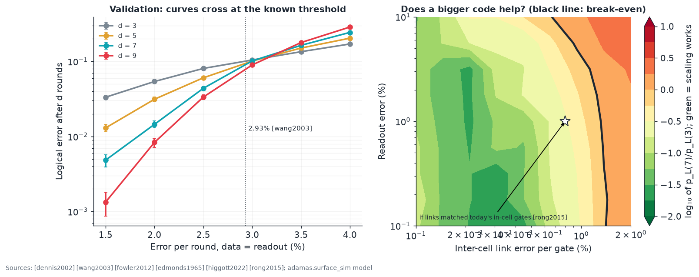
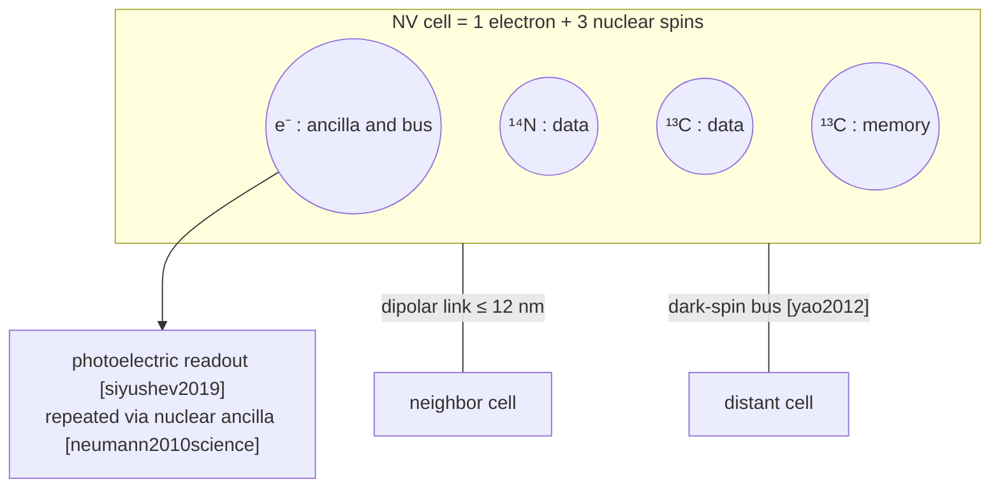
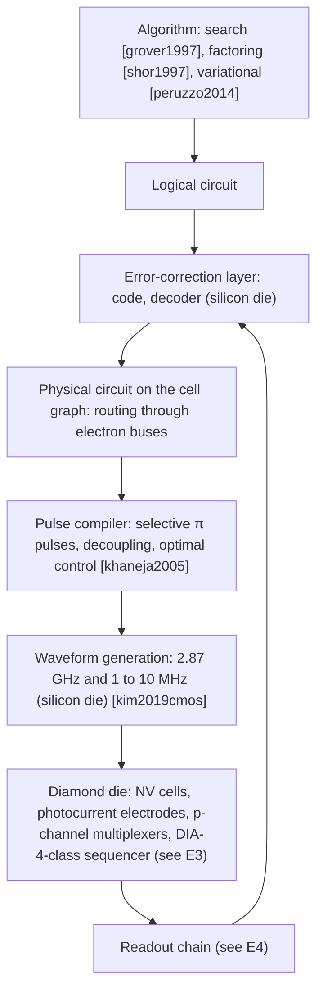

# E6 · Error correction and system architecture

**Plain-language summary.** Every qubit makes mistakes. A useful quantum computer hides those mistakes by spreading each "logical" qubit across many physical ones. This chapter counts how many NV cells that takes, shows why better links matter more than more qubits, and lays out the full computing stack from algorithm to microwave pulse.

Code: `adamas.qec`.

## E6.1 Codes

| Code | Idea | Overhead | Needs | Source |
|---|---|---|---|---|
| Three-qubit repetition | Majority vote on one error type; $p_L = 3p^2 - 2p^3$ | 3 | Any three coupled spins | [shor1995]; room-temperature NV demonstration [waldherr2014] |
| Steane and other stabilizer codes | Parity checks on both error types | 7+ | All-to-all within a cell | [steane1996], [gottesman1997]; five-qubit code at 4 K [abobeih2022] |
| Surface code | Two-dimensional grid, nearest-neighbor checks, threshold near 1% | $2d^2 - 1$ | Planar nearest-neighbor links | [kitaev2003], [dennis2002], [fowler2012] |
| Quantum low-density parity-check codes | About 10× fewer qubits than surface code | lower | **Long-range links** | [bravyi2024] |
| Modular / networked cells | Small processors joined by noisy links plus purification | high, but tolerant of 10% link error | Heralded entanglement | [nickerson2014], [nemoto2014] |

Surface-code scaling [fowler2012]:

$$p_L \approx 0.1\left(\frac{p}{p_{th}}\right)^{(d+1)/2}, \qquad p_{th}\approx 10^{-2}$$

| Physical error | Target logical error | Distance | Physical qubits | NV cells (4 qubits each) |
|---|---|---|---|---|
| 10⁻³ | 10⁻⁹ | 17 | 577 | 145 |
| 10⁻³ | 10⁻¹² (×100 logical qubits) | 23 | 105,700 | 26,425 |
| 8 × 10⁻³ ([rong2015] two-qubit) | 10⁻⁹ | > 150 | impractical | impractical |

**The lesson.** Gates inside a cell already sit near or below threshold ([rong2015], [xie2023]). The code distance, and with it the machine size, is governed by the *worst* operation in the syndrome cycle, which is the inter-cell link ([E5](E5_nv_qubit_engineering.md)) and the readout. A factor of ten in link error is worth more than a factor of ten in qubit count.

### E6.1b Simulation with three separate error rates (project X-1, done)

The scaling formula above lumps everything into one number $p$. NV hardware has three very different ones: errors inside a cell ($p_{intra}$, already near 10⁻³ [xie2023]), errors on the inter-cell link ($p_{link}$, the weak point, [E5](E5_nv_qubit_engineering.md)), and readout errors ($p_{meas}$). `adamas.surface_sim` runs a Monte Carlo memory experiment on the planar surface code with a minimum-weight perfect-matching decoder ([edmonds1965], through PyMatching [higgott2022]) under phenomenological noise ([dennis2002], [wang2003]):

$$p_d = p_{intra} + 4\cdot\tfrac{8}{15} f_{link}\, p_{link}, \qquad p_m = p_{meas} + 4\cdot\tfrac{8}{15} f_{link}\, p_{link}$$

Each data qubit takes part in four syndrome gates per round, 8 of the 15 two-qubit Pauli errors flip a given qubit, and $f_{link}$ is the fraction of those gates that cross between cells. This first-order mapping is a model of this repository; hook errors need the circuit-level follow-up X-1b.

**Validation.** With $p_d = p_m$ the distance-5 and distance-9 curves cross at 3.1 percent, against the published 2.93 percent [wang2003]; the small excess is the usual finite-size drift.

**Results for NV cells** (in-cell error 0.1 percent, one data qubit per cell, so $f_{link} = 1$):

| Link error | Readout error | $p_L$, d = 3 | d = 5 | d = 7 | Verdict |
|---|---|---|---|---|---|
| 0.05% | 1% | 8 × 10⁻⁴ | < 3 × 10⁻⁴ | < 3 × 10⁻⁴ | Scaling works |
| 0.2% | 1% | 4 × 10⁻³ | 3 × 10⁻⁴ | < 3 × 10⁻⁴ | Scaling works |
| 0.5% | 1% | 1.7 × 10⁻² | 7.5 × 10⁻³ | 2 × 10⁻³ | Works, slowly |
| 1.0% | 1% | 6.5 × 10⁻² | 4.6 × 10⁻² | 3.4 × 10⁻² | Marginal |

Logical error is per $d$-round memory experiment, 4000 shots each, so entries below about 3 × 10⁻⁴ are upper limits.

**Three design conclusions.**

1. **The break-even link error is about 1.3 percent per gate**, and it barely moves as readout error rises from 0.1 to 3 percent. Time-like matching absorbs readout mistakes well, so **readout is the forgiving parameter and the link is the unforgiving one.** This makes electrical readout with a few percent error ([siyushev2019], [E4](E4_analog_and_mixed_signal_design.md)) acceptable for error correction.
2. Combining with [E5](E5_nv_qubit_engineering.md): an echoed gate at 25 nm can reach coherence-limited fidelity of 0.98 to 0.999, that is, link errors of 0.1 to 2 percent. **The placement and charge-state problems, not coherence, decide which side of the break-even line a processor lands on.**
3. Packing several data qubits into one cell (nuclear spins around one electron, $f_{link} < 1$) moves the operating point left on the map in proportion, at the cost of slower, serialized syndrome extraction.

## E6.2 Mapping codes onto NV hardware

Design choices this repository recommends (proposals):

1. **Electron as ancilla, nuclei as data.** Syndrome extraction needs repeated readout, and nuclear spins survive optical readout of the electron ([jiang2009], [neumann2010science], [maurer2012]).
2. **Syndrome cycle budget.** Nuclear gate 10 to 100 µs, electron gate 10 to 100 ns, repetitive readout 1 to 10 ms ([dutt2007], [vandersar2012], [neumann2010science]). The cycle is readout-limited at roughly 100 Hz to 1 kHz, five to six orders slower than superconducting hardware. Room-temperature NV machines will be memory-rich and slow, which suits sensing, networking, and embedded co-processing more than large-scale factoring ([shor1997]).
3. **Hierarchy.** Small code inside each cell (repetition or a 5-qubit code as in [abobeih2022]) concatenated with a surface or modular code between cells, so inter-cell links can be noisier ([nickerson2014]).

## E6.3 The full stack

Near-term machines skip the error-correction layer and run shallow circuits [preskill2018]; their figure of merit is quantum volume [cross2019], verified by randomized benchmarking ([knill2008], [magesan2011]).

## E6.4 Projects

| ID | Project | Deliverable |
|---|---|---|
| X-1 | Monte Carlo surface-code simulator with separate intra-cell, inter-cell, and readout error rates | **Done in v0.4.0** (`adamas.surface_sim`, Section E6.1b) |
| X-1b | Circuit-level version: explicit syndrome-extraction circuits with hook errors, serialized gates through one electron per cell, and idle errors during millisecond readout | Thresholds in ($p_{link}$, $p_{meas}$, readout time / $T_2$) |
| X-2 | Compiler from a gate list to `adamas.register` pulse sequences for a 1-electron + 2-nuclei cell | Verified Deutsch–Jozsa [shi2010] and Grover [grover1997] on the simulator |
| X-3 | Architecture trade study: direct dipolar lattice versus dark-spin bus versus modular cells, using yields from `adamas.coupling.pair_yield` | Cells per logical qubit versus nitrogen-to-NV conversion yield |
| X-4 | Decoder latency budget on the silicon die | Decoder that keeps pace with a 1 kHz syndrome cycle (easy) and headroom analysis |
