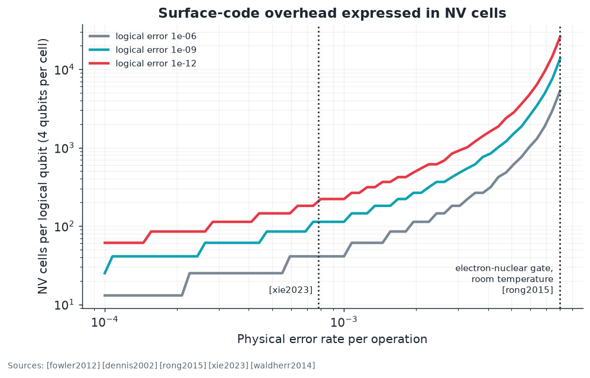
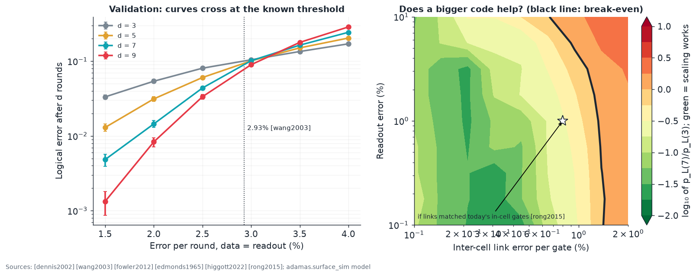
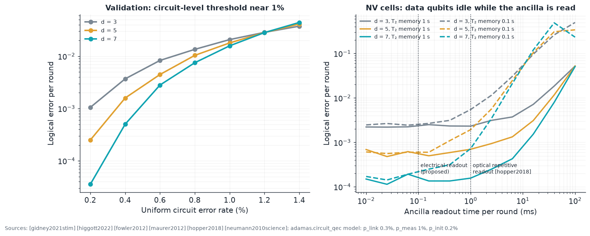
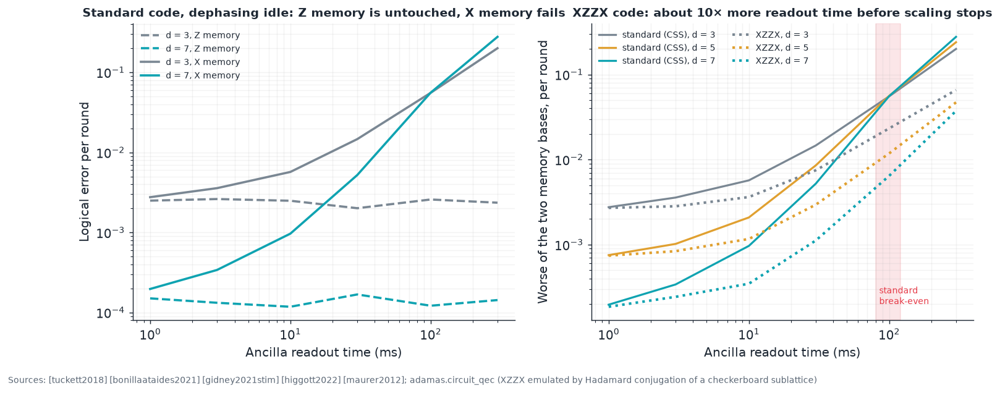
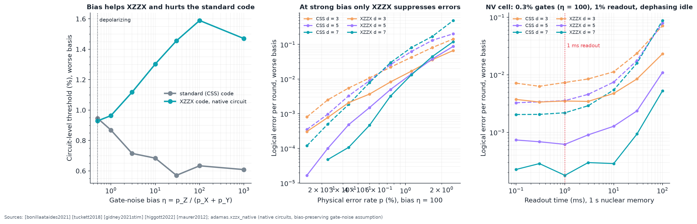
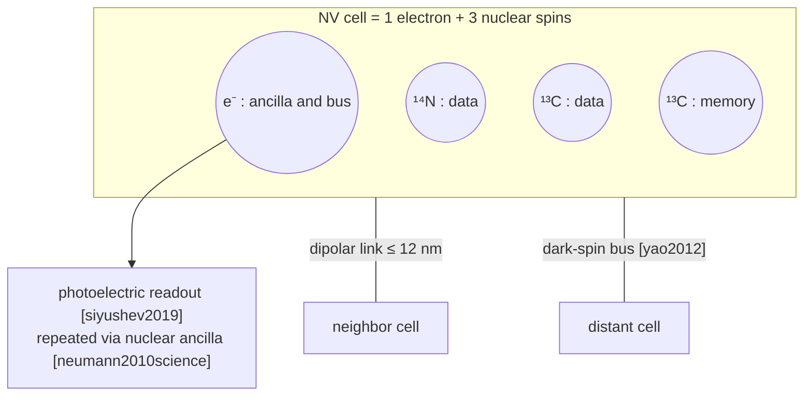
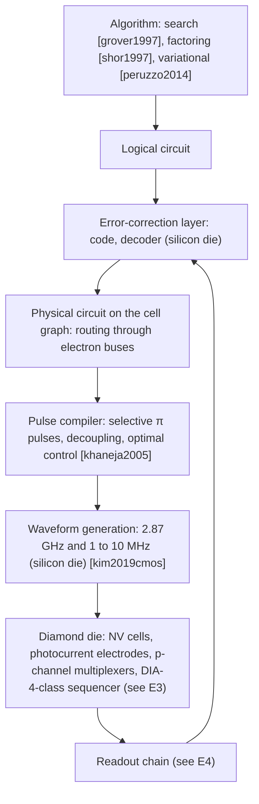

# E6 · Error correction and system architecture

**Plain-language summary.** Every qubit makes mistakes. A useful quantum computer hides those mistakes by spreading each "logical" qubit across many physical ones. This chapter counts how many NV cells that takes, shows why better links matter more than more qubits, and lays out the full computing stack from algorithm to microwave pulse.

Code: `adamas.qec`.

## E6.1 Codes

| Code | Idea | Overhead | Needs | Source |
|---|---|---|---|---|
| Three-qubit repetition | Majority vote on one error type; $p_L = 3p^2 - 2p^3$ | 3 | Any three coupled spins | [shor1995]; room-temperature NV demonstration [waldherr2014] |
| Steane and other stabilizer codes | Parity checks on both error types | 7+ | All-to-all within a cell | [steane1996], [gottesman1997]; five-qubit code at 4 K [abobeih2022] |
| Surface code | Two-dimensional grid, nearest-neighbor checks, threshold near 1% | $2d^2 - 1$ | Planar nearest-neighbor links | [kitaev2003], [dennis2002], [fowler2012] |
| Quantum low-density parity-check codes | About 10× fewer qubits than surface code | lower | **Long-range links** | [bravyi2024] |
| Modular / networked cells | Small processors joined by noisy links plus purification | high, but tolerant of 10% link error | Heralded entanglement | [nickerson2014], [nemoto2014] |

Surface-code scaling [fowler2012]:

$$p_L \approx 0.1\left(\frac{p}{p_{th}}\right)^{(d+1)/2}, \qquad p_{th}\approx 10^{-2}$$

| Physical error | Target logical error | Distance | Physical qubits | NV cells (4 qubits each) |
|---|---|---|---|---|
| 10⁻³ | 10⁻⁹ | 17 | 577 | 145 |
| 10⁻³ | 10⁻¹² (×100 logical qubits) | 23 | 105,700 | 26,425 |
| 8 × 10⁻³ ([rong2015] two-qubit) | 10⁻⁹ | > 150 | impractical | impractical |

**The lesson.** Gates inside a cell already sit near or below threshold ([rong2015], [xie2023]). The code distance, and with it the machine size, is governed by the *worst* operation in the syndrome cycle, which is the inter-cell link ([E5](E5_nv_qubit_engineering.md)) and the readout. A factor of ten in link error is worth more than a factor of ten in qubit count.

### E6.1b Simulation with three separate error rates (project X-1, done)

The scaling formula above lumps everything into one number $p$. NV hardware has three very different ones: errors inside a cell ($p_{intra}$, already near 10⁻³ [xie2023]), errors on the inter-cell link ($p_{link}$, the weak point, [E5](E5_nv_qubit_engineering.md)), and readout errors ($p_{meas}$). `adamas.surface_sim` runs a Monte Carlo memory experiment on the planar surface code with a minimum-weight perfect-matching decoder ([edmonds1965], through PyMatching [higgott2022]) under phenomenological noise ([dennis2002], [wang2003]):

$$p_d = p_{intra} + 4\cdot\tfrac{8}{15} f_{link}\, p_{link}, \qquad p_m = p_{meas} + 4\cdot\tfrac{8}{15} f_{link}\, p_{link}$$

Each data qubit takes part in four syndrome gates per round, 8 of the 15 two-qubit Pauli errors flip a given qubit, and $f_{link}$ is the fraction of those gates that cross between cells. This first-order mapping is a model of this repository; hook errors need the circuit-level follow-up X-1b.

**Validation.** With $p_d = p_m$ the distance-5 and distance-9 curves cross at 3.1 percent, against the published 2.93 percent [wang2003]; the small excess is the usual finite-size drift.

**Results for NV cells** (in-cell error 0.1 percent, one data qubit per cell, so $f_{link} = 1$):

| Link error | Readout error | $p_L$, d = 3 | d = 5 | d = 7 | Verdict |
|---|---|---|---|---|---|
| 0.05% | 1% | 8 × 10⁻⁴ | < 3 × 10⁻⁴ | < 3 × 10⁻⁴ | Scaling works |
| 0.2% | 1% | 4 × 10⁻³ | 3 × 10⁻⁴ | < 3 × 10⁻⁴ | Scaling works |
| 0.5% | 1% | 1.7 × 10⁻² | 7.5 × 10⁻³ | 2 × 10⁻³ | Works, slowly |
| 1.0% | 1% | 6.5 × 10⁻² | 4.6 × 10⁻² | 3.4 × 10⁻² | Marginal |

Logical error is per $d$-round memory experiment, 4000 shots each, so entries below about 3 × 10⁻⁴ are upper limits.

**Three design conclusions.**

1. **The break-even link error is about 1.3 percent per gate**, and it barely moves as readout error rises from 0.1 to 3 percent. Time-like matching absorbs readout mistakes well, so **readout is the forgiving parameter and the link is the unforgiving one.** This makes electrical readout with a few percent error ([siyushev2019], [E4](E4_analog_and_mixed_signal_design.md)) acceptable for error correction.
2. Combining with [E5](E5_nv_qubit_engineering.md): an echoed gate at 25 nm can reach coherence-limited fidelity of 0.98 to 0.999, that is, link errors of 0.1 to 2 percent. **The placement and charge-state problems, not coherence, decide which side of the break-even line a processor lands on.**
3. Packing several data qubits into one cell (nuclear spins around one electron, $f_{link} < 1$) moves the operating point left on the map in proportion, at the cost of slower, serialized syndrome extraction.

### E6.1c Circuit level, and the readout-time budget (project X-1b, done)

The phenomenological model above hides two things. One gate fault in a syndrome-extraction circuit can spread to two qubits, and, specific to NV hardware, the data qubits sit idle while the ancilla electron is read out. Room-temperature single-shot readout takes about a millisecond by repeated nuclear-assisted measurement ([neumann2010science], [hopper2018]), a thousand times longer than a superconducting cycle, while the data live in nuclear spins whose memory under decoupling reaches about a second ([maurer2012]).

`adamas.circuit_qec` builds the full rotated surface-code memory circuit with Stim ([gidney2021stim]) and decodes it with PyMatching ([higgott2022]). The NV-specific term is an idle depolarization on every data qubit each round, $p_{idle} = \tfrac34(1 - e^{-t_{read}/T_{2,mem}})$, on top of two-qubit link error (0.3%), readout error (1%), and ancilla preparation error (0.2%).

| Result | Value |
|---|---|
| Circuit-level threshold, uniform noise (validation) | about 1.2% (curves cross between 1.0 and 1.2%) |
| Readout time at which distance 7 stops beating distance 3, $T_{2,mem}$ = 1 s | about 100 ms |
| Same, $T_{2,mem}$ = 0.1 s | about 10 ms |
| Readout time that adds less than a factor of 2 to the distance-7 logical error | about 1% of $T_{2,mem}$ |

**Design rule.** Keep the ancilla readout below about one percent of the nuclear-memory coherence time under illumination. With a 1 s memory, today's millisecond optical readout already meets it; with 0.1 s it does not, and electrical readout (about 0.1 ms, proposed in [E4](E4_analog_and_mixed_signal_design.md)) becomes necessary. This ties the readout electronics of E4, the nuclear memory of [E5](E5_nv_qubit_engineering.md), and the machine sizing of [E10](E10_scaling_a_room_temperature_quantum_computer.md), whose wall-clock times assumed a 1 ms cycle.

Caveats: the idle channel is modeled as depolarizing; real nuclear dephasing under illumination is biased and depends on the hyperfine coupling, which favors bias-tailored codes. Leakage out of the NV⁻ charge state enters only through the preparation error.

### E6.1d The noise is biased: use it (project X-5, first result)

Section E6.1c modeled the idle error as depolarizing. A nuclear spin waiting under green light mostly *dephases*: its phase wanders, it rarely flips ([maurer2012]). That is a biased channel, dominated by Z errors, and standard surface codes waste the bias while bias-tailored codes exploit it ([tuckett2018], [bonillaataides2021]).

`adamas.circuit_qec` now supports a pure-dephasing idle channel and both memory bases, and emulates the XZZX code at circuit level: an XZZX code is the standard (CSS) code with a Hadamard on one checkerboard sublattice of data qubits, so a Z error on those qubits acts as an X error in the standard frame. The emulation keeps the standard gate sequence, so it captures the idle-noise effect, not XZZX-specific hook errors.

| Result (1 s nuclear memory, other noise as in E6.1c) | Standard code | XZZX code |
|---|---|---|
| Z-memory error vs readout time | flat: dephasing is invisible to it | rises slowly |
| X-memory error vs readout time | rises as with depolarizing noise | rises slowly |
| Worse basis, d = 7, 30 ms readout | 5.2 × 10⁻³ per round | 1.1 × 10⁻³ per round |
| Readout time at which d = 7 stops beating d = 3 (worse basis) | about 100 ms | about 1 s |

**Reading.** A computation needs both bases, so the standard code is limited by its X memory and gains nothing from the bias. Spreading the dephasing across both logical sectors, as XZZX does, buys about ten times more readout time before scaling stops (break-even moves from about 10% to about 100% of the memory coherence time). The stricter budget of E6.1c, readout that at most doubles the distance-7 error, relaxes less: from about 5 ms to about 12 ms for a 1 s memory, or roughly 0.5% to 1.2% of the coherence time. The remaining project (X-5): a native XZZX syndrome circuit with its own hook errors, bias-aware decoding, and the effect on the resource estimate of [E10](E10_scaling_a_room_temperature_quantum_computer.md).

### E6.1e Native XZZX circuits with biased gate noise (project X-5, done)

E6.1d emulated the XZZX code by changing only the idle noise. A real XZZX processor measures different stabilizers with different gates, so one gate fault can spread differently ("hook" errors), and the gates themselves can have biased noise. `adamas.xzzx_native` builds the circuit natively: it takes Stim's rotated surface-code memory and rewrites it gate by gate, so that on one checkerboard sublattice of data qubits resets become RX, measurements become MX, CX(ancilla → data) becomes CZ, and CX(data → ancilla) becomes XCX [bonillaataides2021]. Stim confirms that every detector and the logical observable of the rewritten circuit are deterministic without noise, in both memory bases. The same noise is then inserted into both codes: an independent biased Pauli channel after every two-qubit gate with bias η = p_Z/(p_X + p_Y), readout and reset flips, and Z-only dephasing on the data during each ancilla readout. Errors after ideal gates keep their bias; for the NV dipolar interaction, a diagonal ZZ coupling, dephasing commutes with the gate, which motivates this assumption [dolde2013] [tuckett2018].

Results (Figure 50, worse of the two memory bases, distances 3 and 5 for thresholds):

| Gate-noise bias η | 0.5 (depolarizing) | 10 | 100 |
|---|---|---|---|
| Standard (CSS) threshold | 0.95% | 0.68% | 0.63% |
| XZZX threshold (native) | 0.93% | 1.30% | 1.59% |

1. **Sanity check.** Under depolarizing noise the two codes are Clifford-equivalent and must perform the same; they do, within sampling error (validation matrix).
2. **Bias hurts the standard code and helps XZZX.** The CSS threshold falls as the noise concentrates on Z, because its X-memory sector sees all of it; the XZZX threshold rises, because the code spreads Z errors over both sectors.
3. **For an NV cell** (0.3% gates at η = 100, 1% readout, 0.2% preparation, 1 s nuclear memory), at 1 ms readout the distance-7 XZZX code reaches a worse-basis logical error about 12× lower than the standard code, and distance 7 still beats distance 3 at 100 ms readout.

The native result confirms the E6.1d emulation and strengthens it: with biased gates the advantage holds at the gate level, not only in the idle. Caveats: the bias of NV two-qubit gates has not been measured, decoding uses matching on decomposed errors (a bias-tailored decoder would do better), and the resource estimate of E10 still uses the standard code, so it is conservative.

## E6.2 Mapping codes onto NV hardware

```mermaid
flowchart TB
    subgraph cell["NV cell = 1 electron + 3 nuclear spins"]
        e((e⁻ : ancilla and bus))
        n1((¹⁴N : data))
        c1((¹³C : data))
        c2((¹³C : memory))
    end
    cell -- "dipolar link ≤ 12 nm" --- cell2["neighbor cell"]
    cell -- "dark-spin bus [yao2012]" --- cell3["distant cell"]
    e --> ro["photoelectric readout [siyushev2019]<br/>repeated via nuclear ancilla [neumann2010science]"]
```

Design choices this repository recommends (proposals):

1. **Electron as ancilla, nuclei as data.** Syndrome extraction needs repeated readout, and nuclear spins survive optical readout of the electron ([jiang2009], [neumann2010science], [maurer2012]).
2. **Syndrome cycle budget.** Nuclear gate 10 to 100 µs, electron gate 10 to 100 ns, repetitive readout 1 to 10 ms ([dutt2007], [vandersar2012], [neumann2010science]). The cycle is readout-limited at roughly 100 Hz to 1 kHz, five to six orders slower than superconducting hardware. Room-temperature NV machines will be memory-rich and slow, which suits sensing, networking, and embedded co-processing more than large-scale factoring ([shor1997]).
3. **Hierarchy.** Small code inside each cell (repetition or a 5-qubit code as in [abobeih2022]) concatenated with a surface or modular code between cells, so inter-cell links can be noisier ([nickerson2014]).

## E6.3 The full stack

```mermaid
flowchart TB
    a["Algorithm: search [grover1997], factoring [shor1997], variational [peruzzo2014]"] --> b["Logical circuit"]
    b --> c["Error-correction layer: code, decoder (silicon die)"]
    c --> d["Physical circuit on the cell graph: routing through electron buses"]
    d --> e["Pulse compiler: selective π pulses, decoupling, optimal control [khaneja2005]"]
    e --> f["Waveform generation: 2.87 GHz and 1 to 10 MHz (silicon die) [kim2019cmos]"]
    f --> g["Diamond die: NV cells, photocurrent electrodes, p-channel multiplexers, DIA-4-class sequencer (see E3)"]
    g --> h["Readout chain (see E4)"] --> c
```

Near-term machines skip the error-correction layer and run shallow circuits [preskill2018]; their figure of merit is quantum volume [cross2019], verified by randomized benchmarking ([knill2008], [magesan2011]).

## E6.4 Projects

| ID | Project | Deliverable |
|---|---|---|
| X-1 | Monte Carlo surface-code simulator with separate intra-cell, inter-cell, and readout error rates | **Done in v0.4.0** (`adamas.surface_sim`, Section E6.1b) |
| X-5 | Bias-tailored codes for dephasing-dominated nuclear memory: native XZZX circuits, bias-aware decoding, resource impact | First result in v0.14.0 (Section E6.1d): about 10× longer tolerable readout |
| X-1b | Circuit-level version with idle errors during readout | **Done in v0.12.0** (Section E6.1c): readout must stay below about 1% of the nuclear memory time |
| X-2 | Compiler from a gate list to `adamas.register` pulse sequences for a 1-electron + 2-nuclei cell | Verified Deutsch–Jozsa [shi2010] and Grover [grover1997] on the simulator |
| X-3 | Architecture trade study: direct dipolar lattice versus dark-spin bus versus modular cells, using yields from `adamas.coupling.pair_yield` | Cells per logical qubit versus nitrogen-to-NV conversion yield |
| X-4 | Decoder latency budget on the silicon die | Decoder that keeps pace with a 1 kHz syndrome cycle (easy) and headroom analysis |
