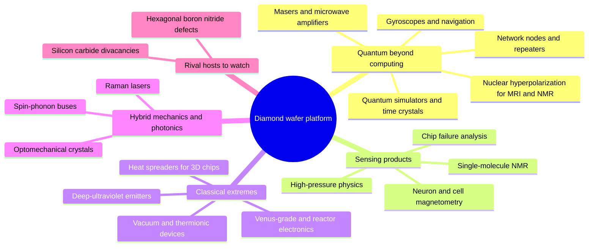

# E7 · Beyond the framework: what else a diamond wafer platform enables

**Plain-language summary.** Once you can make diamond wafers, pattern them, and place NV centers, a long list of other devices comes almost for free. Some are already laboratory facts and some are moonshots. This chapter sorts them, because a wafer platform pays for itself through many products, the same way silicon did.

## E7.1 Map

## E7.2 Quantum devices that are not computers

| Device | What NV centers provide | Status | Sources |
|---|---|---|---|
| **Room-temperature maser** | Optically pumped population inversion at 9 GHz in a cavity: a continuous-wave solid-state maser with no cryogenics | Demonstrated | [breeze2018] |
| **Hyperpolarized nuclear spins** | Transfer of the NV's optical polarization to ¹³C, boosting magnetic-resonance signals by orders of magnitude | Demonstrated in crystals and powders | [london2013], [king2015], [ajoy2018], [jacques2009] |
| **Gyroscope** | Rotation sensing through geometric phase of NV or ¹⁴N nuclear spins | Proposed, early demonstrations | [ledbetter2012], [ajoy2012] |
| **Many-body quantum simulator** | Dense NV ensembles show discrete time-crystalline order and emergent hydrodynamics at room temperature | Demonstrated | [choi2017], [zu2021]; cryogenic register version [randall2021] |
| **Surface-spin simulator** | Nuclear spins of a patterned fluorine or hydrogen layer on the diamond surface, read by shallow NVs | Proposed | [cai2013] |
| **Quantum network node** | NV and group-IV centers as memory nodes | Demonstrated at cryogenic temperature | [kimble2008], [wehner2018], [briegel1998], [bennett1993], [pompili2021], [hermans2022], [knaut2024] |

## E7.3 Sensing products that fund the wafer roadmap

| Product | Evidence |
|---|---|
| Magnetic imaging of currents in working integrated circuits | [turner2020] |
| Nanoscale and single-protein nuclear magnetic resonance | [staudacher2013], [mamin2013], [lovchinsky2016], [aslam2017], [glenn2018] |
| Magnetic imaging of living cells and single-neuron action potentials | [lesage2013], [barry2016], [kucsko2013] |
| Stress and magnetism inside diamond-anvil cells at megabar pressure | [hsieh2019] |
| Chip-scale magnetometers with integrated electronics | [kim2019cmos], [ibrahim2021], [stuerner2021] |

A self-referential use closes the loop: NV magnetic imaging [turner2020] is a natural failure-analysis tool for the diamond circuits of [E3](E3_digital_and_cpu_design.md), built into the same substrate.

## E7.4 Classical extremes

- **Harsh-environment systems.** Silicon carbide circuits survived 60 days at Venus surface conditions ([neudeck2016], [neudeck2019]). Diamond logic ([E3](E3_digital_and_cpu_design.md)) targets the same missions plus reactor instrumentation [ookuma2026] and particle detectors [pernegger2005].
- **Vacuum microelectronics and thermionic conversion.** Negative electron affinity gives efficient electron emission ([himpsel1979], [shih1997], [yater2000]); phosphorus-doped films show low-work-function thermionic emission [koeck2009].
- **Deep-ultraviolet and single-photon emitters.** 235 nm excitonic emission from pn junctions [koizumi2001]; electrically driven single-photon sources ([mizuochi2012], [lohrmann2011]).
- **Energy.** Betavoltaic cells [bormashov2018].
- **Thermal backbone for three-dimensional integration.** Heat-spreading layers under gallium nitride today ([francis2010], [pomeroy2014], [malakoutian2021]); the limits of nanoscale heat removal are reviewed in [pop2010].
- **Superconducting diamond.** Heavily boron-doped diamond superconducts [ekimov2004], which suggests all-diamond superconducting-spin hybrids (compare [kubo2010], [zhu2011]).
- **Valleytronics.** [isberg2013].

## E7.5 Mechanics and photonics

| Element | Role | Sources |
|---|---|---|
| Strain-coupled mechanical resonators | Phonon bus between distant spins; a candidate for the missing room-temperature link | [ovartchaiyapong2014], [teissier2014], [rabl2010] |
| Optomechanical crystals | GHz mechanics coupled to telecom light | [burek2016] |
| Transferable membranes | Wafer-scale thin diamond films for heterogeneous integration | [guo2021], [riedel2017] |
| Undercut nanophotonics | Cavities and waveguides in bulk diamond | [khanaliloo2015], [burek2012], [hausmann2012] |
| Raman lasers and optics | High-power wavelength conversion | [mildren2013], [zaitsev2001] |

## E7.6 Rival hosts to benchmark against

| Host | Strength | Weakness versus diamond NV | Sources |
|---|---|---|---|
| Silicon carbide divacancy and silicon vacancy | 150 to 200 mm wafers, mature doping and devices, room-temperature coherent control, near-telecom emission | Lower readout contrast at 300 K; best results are cryogenic | [koehl2011], [widmann2015], [anderson2022] |
| Hexagonal boron nitride defects | Two-dimensional, integrates by stacking; room-temperature spin readout | Short coherence, immature material | [tran2016], [gottscholl2020] |
| Silicon donors | Foundry compatibility | Millikelvin operation | [kane1998], [fuechsle2012] |

A rigorous framework should re-run [Chapter 12](../12_silicon_vs_diamond_scorecard.md) against silicon carbide every year: if its defects reach NV-class room-temperature readout, its wafer maturity wins.

## E7.7 Moonshots (speculative; proposals of this repository)

| ID | Idea | Why it might work | First test |
|---|---|---|---|
| M-1 | **Resist-free atomic patterning** of the hydrogen termination by scanning-probe depassivation, writing hole-gas wires and NV-safe windows directly | Shown for silicon dopants ([schofield2003], [fuechsle2012]); diamond C–H surface imaged atomically [bobrov2001] | Write a 10 nm hole-gas wire; measure conduction |
| M-2 | **Phononic NV–NV link at 300 K** through a high-Q diamond nanobeam | Strain coupling is demonstrated ([ovartchaiyapong2014], [teissier2014]); thermal phonon occupation is the obstacle | Measure spin-mechanical cooperativity versus temperature |
| M-3 | **Maser-assisted readout**: use the NV maser transition [breeze2018] as a microwave-domain, lens-free spin readout for ensembles on chip | Avoids optics collection loss | Threshold pump power in a chip-scale dielectric resonator |
| M-4 | **Self-diagnosing power chip**: NV layer under a kilovolt diamond transistor maps its own current and temperature during switching | [turner2020], [kucsko2013], [saha2021] | Correlate NV maps with electrical failure sites |
| M-5 | **Hyperpolarized-diamond memory**: bulk ¹³C polarization as a long-lived classical-quantum hybrid store | [king2015], [maurer2012] | Storage time and retrieval fidelity at 300 K |
| M-6 | **All-diamond computer**: DIA-4-class sequencer, analog readout, and an NV register on one die with no silicon | [E3](E3_digital_and_cpu_design.md), [E4](E4_analog_and_mixed_signal_design.md), [E5](E5_nv_qubit_engineering.md) | Experiment D-7, then Q-6 |
