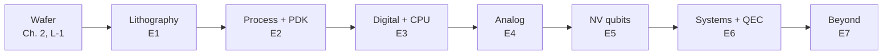

# E8 · Project ladder: from a weekend to a dissertation

**Plain-language summary.** This page turns the framework into work packages, ordered the way the technology stacks: wafer → lithography → process → digital → analog → qubits → systems → beyond. Each has a scope label so a student, a laboratory, or a program manager can pick one.

Scope labels: **W** weekend (laptop only) · **C** course project (4 to 8 weeks) · **T** master's thesis (6 to 12 months) · **D** doctoral-scale · **G** multi-group program.

| Stage | ID | Project | Scope | Needs | Where specified |
|---|---|---|---|---|---|
| Wafer | S-1 | Reproduce all 27 figures and the test suite | W | Laptop | README |
| Wafer | L-1 | Flatness and bow statistics of commercial diamond plates | C | Optical profiler | [E1](E1_lithography_from_euv_to_electron_beam.md) |
| Wafer | F-3 | (111) ¹²C phosphorus-doped quantum epilayer on heteroepitaxial wafer | G | Growth partner | [Ch. 11](../11_proposed_experiments_and_roadmap.md) |
| Lithography | L-2 | Electron-beam proximity function on diamond versus silicon | C/T | Electron-beam tool | E1 |
| Lithography | L-4 | Termination-dependent resist sensitivity | T | Electron-beam tool; EUV user facility | E1 |
| Lithography | L-6 | Nanoimprint NV aperture arrays | T/D | Imprint tool | E1 |
| Process | P-1 | PDK-0 monitor die layout | C | KLayout | [E2](E2_process_integration_and_pdk.md) |
| Process | P-3 | Compact-model fitting to published curves | C | ngspice, Python | E2 |
| Process | P-4 / C-1 | Fabricate the 4-mask monitor die | T | Cleanroom, diamond plates | E2, Ch. 11 |
| Digital | D-1 | Extend and re-synthesize DIA-4 | W/C | Yosys, Icarus Verilog | [E3](E3_digital_and_cpu_design.md) |
| Digital | P-2 | OpenROAD place-and-route of DIA-4 on PDK-0 | C/T | OpenROAD | E2 |
| Digital | D-2, D-3 | Ring oscillators and logic to 400 °C | T | P-4 wafers, hot probe station | E3 |
| Digital | D-4 | Dynamic diamond logic | T/D | P-4 wafers | E3 |
| Digital | D-6 | First all-diamond stored-program processor | D | Mature PDK-0 | E3 |
| Analog | A-1, A-2 | First mismatch and noise data for diamond transistors | T | P-4 wafers | [E4](E4_analog_and_mixed_signal_design.md) |
| Analog | A-3 | Threshold-difference reference | T | P-4 wafers | E4 |
| Analog | A-5 | Picoampere multiplexer for photocurrent readout | T/D | P-4 wafers + NV sample | E4 |
| Qubits | B-1 to B-5 | Benchtop optically detected magnetic resonance laboratories | C | About 1k to 15k USD of parts | Ch. 11 |
| Qubits | Q-1, Q-2 | Non-Markovian gate model; cluster-correlation $T_2$ | C/T | Laptop or cluster | [E5](E5_nv_qubit_engineering.md) |
| Qubits | C-4, C-5 | Implant yield with co-doping; detect-and-repair arrays | D | Implanter, confocal microscope, femtosecond laser | Ch. 11 |
| Qubits | C-8 | Nuclear–nuclear entanglement across two NVs at 300 K | D | Coupled-pair sample | Ch. 11 |
| Systems | X-1, X-2 | Three-rate surface-code simulator; pulse compiler | C/T | Laptop | [E6](E6_error_correction_and_system_architecture.md) |
| Systems | X-3 | Architecture trade study with yield models | T | Laptop | E6 |
| Systems | F-1 | 16-cell microscope-free chiplet on CMOS | G | Foundry access | Ch. 11 |
| Beyond | M-3 | Chip-scale maser readout | D | Microwave laboratory | [E7](E7_beyond_the_framework.md) |
| Beyond | M-4 | Self-diagnosing power transistor | T/D | Power device + NV layer | E7 |
| Beyond | M-6 | All-diamond computer | G | Everything above | E7 |

## Suggested sequences

- **Systems-engineering master's thesis, simulation only:** S-1 → X-3 → X-1, with Q-1 as the physics core. Deliverable: a requirements-and-trade document for a room-temperature NV accelerator with quantified yield and fidelity budgets.
- **Electrical-engineering thesis with cleanroom access:** P-1 → P-4 → D-2 → A-1. Deliverable: the first public diamond PDK with measured statistics.
- **Teaching sequence (one semester):** S-1, B-1, B-2, B-3, D-1, P-3. Every step runs on a laptop or a benchtop kit.
