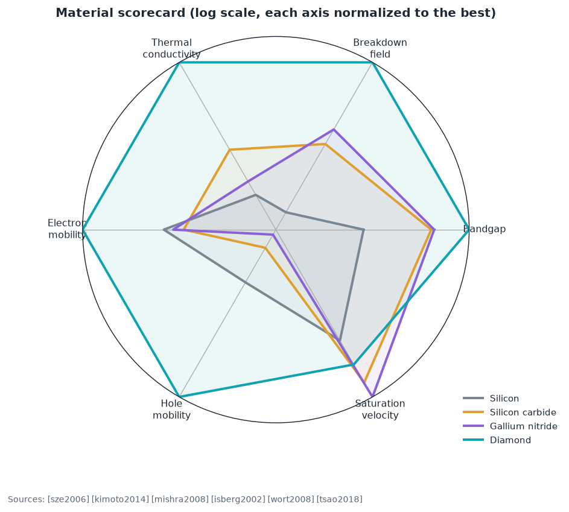
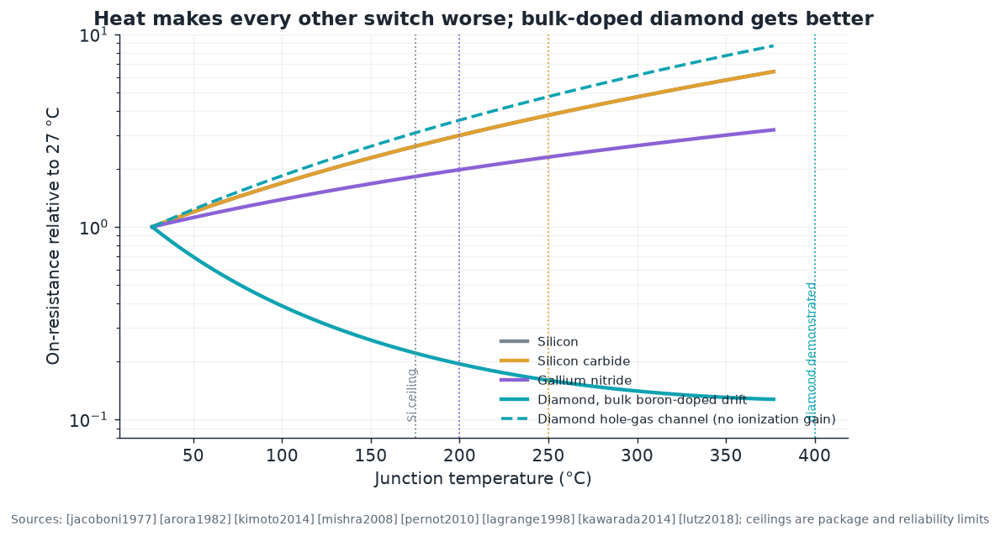
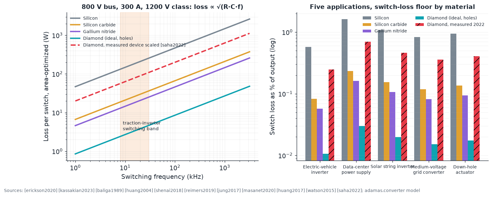
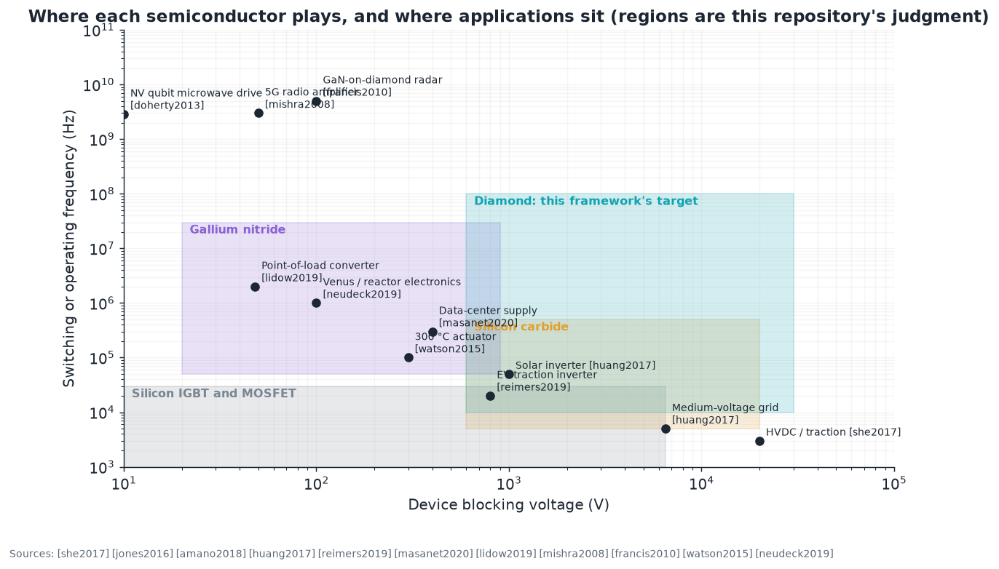

# E9 · Power circuits: diamond against silicon carbide and gallium nitride

**Plain-language summary.** Every electric car, solar inverter, and data center runs on power switches. Silicon dominated until about 2015; silicon carbide (SiC) now owns high-voltage traction, and gallium nitride (GaN) owns fast, lower-voltage converters. This chapter asks, application by application and with a tested loss model, where diamond would win against those two, and what has to happen first.

Code: `adamas.converter`. Textbooks: [baliga2019], [lutz2018], [erickson2020], [kassakian2023].

## E9.1 The incumbents

| | Silicon | Silicon carbide (4H) | Gallium nitride | Diamond |
|---|---|---|---|---|
| Commercial since | 1950s | Schottky 2001, MOSFET 2011 | 2010 | not yet |
| Wafer | 300 mm | 200 mm | 200 mm GaN-on-silicon | 50 to 76 mm |
| Best device class | IGBT to 6.5 kV | MOSFET 650 to 3300 V | HEMT 100 to 650 V | lateral MOSFET to 3659 V (lab) |
| Known weakness | Slow, hot | Gate-oxide reliability, cost | Dynamic on-resistance, no avalanche, vertical devices immature | Everything in [Chapter 3](../03_process_flow_vs_cmos.md) |
| Sources | [lutz2018] | [she2017], [kimoto2015], [palmour2014] | [jones2016], [chen2017gan], [amano2018], [lidow2019], [meneghini2021], [meneghesso2008], [uren2017], [flack2016] | [saha2023], [umezawa2018] |

Cross-technology reviews: [roccaforte2018], [millan2014], [hudgins2003], [tsao2018].

## E9.2 Temperature: the argument that is unique to diamond

Every unipolar switch's resistance rises with temperature as lattice scattering lowers mobility, roughly as $T^{2.4}$ in silicon and SiC ([jacoboni1977], [arora1982], [kimoto2014]) and $T^{1.5}$ in a GaN electron gas [mishra2008]. In bulk boron-doped diamond the mobility falls faster still, about $T^{2.8}$ [pernot2010], yet the resistance **drops**, because the deep 0.37 eV acceptors ionize as the device heats ([lagrange1998]; `adamas.converter.ron_temperature_factor`). A hole-gas channel has no such gain and behaves like the others.

| At junction temperature | Si | SiC | GaN | Diamond, bulk-doped drift |
|---|---|---|---|---|
| 127 °C (400 K) | 2.0× | 2.0× | 1.5× | 0.31× |
| 227 °C (500 K) | 3.4× | 3.4× | 2.2× | 0.17× |
| 327 °C (600 K) | 5.3× (above its 175 °C ceiling) | 5.3× (above 250 °C) | 2.8× (above 200 °C) | 0.13× |

Two consequences. A diamond switch can be **designed to run hot on purpose**, which means a smaller heat sink or none, and diamond is the only material whose conduction loss improves in the environments of [E9.5](#e95-where-diamond-wins-first). Junction ceilings: Si 175 °C [lutz2018], SiC 250 °C package-limited [she2017], GaN 200 °C [meneghini2021], diamond 400 °C demonstrated ([kawarada2014], [umezawa2012], [ikeda2009]).

## E9.3 A tested loss model

Per switch in a hard-switched half-bridge at duty 0.5 ([erickson2020], [kassakian2023]):

$$P = \underbrace{\frac{I^2 R_{on,sp}}{A}}_{conduction} + \underbrace{\tfrac12 C_{oss,sp} A V^2 f}_{switching}, \qquad C_{oss,sp} \approx \frac{\varepsilon E_c}{2\,BV}$$

Choosing the die area to minimize the sum gives $P_{min} = 2IV\sqrt{f R_{on,sp} C_{oss,sp}/2}$: the material figure of merit for hard switching is $\sqrt{R_{on,sp} C_{oss,sp}}$, which is the Baliga high-frequency figure of merit in another form ([baliga1989], [huang2004], [shenai2018]). Gate charge, reverse recovery, and GaN's dynamic on-resistance ([uren2017]) are not in this first-order model.

**Electric-vehicle traction inverter** (800 V bus, 300 A, 20 kHz, 1200 V-class devices, [reimers2019], [jung2017]), loss per switch at the area optimum:

| Material | Loss per switch | Six-switch inverter efficiency (switch losses only) |
|---|---|---|
| Silicon (ideal limit) | 209 W | 99.42% |
| Silicon carbide (ideal) | 30 W | 99.92% |
| Gallium nitride (ideal) | 21 W | 99.94% |
| **Diamond, ideal hole conduction** | **3.8 W** | **99.989%** |
| Diamond, measured 2022 device scaled to 1200 V [saha2022] | 89 W | 99.75% |

The ideal-limit ordering is the figure-of-merit ordering. The measured device is the honest row: **today's diamond beats ideal silicon and loses to ideal SiC**, because it is lateral, sits about 550× above its own limit ([Chapter 4](../04_analog_power_rf_devices.md)), and is not vertical. A vertical diamond MOSFET reaching even 1 percent of the ideal limit would match GaN in this application.

## E9.4 System-level effects the loss model does not show

1. **Cooling.** Diamond's thermal conductivity lets the same die carry more heat flux ([fig31](../img/fig31_thermal_ceiling.png); [moore2014], [barcohen2016], [glassbrenner1964]). Combined with the 400 °C ceiling, a diamond inverter could drop the liquid-cooling loop of today's traction inverters ([reimers2019]), which is a mass and cost saving the switch price does not capture.
2. **Voltage.** Blocking above 3.3 kV pushes SiC into thick, resistive drift regions and GaN out entirely; diamond's 10 MV/cm makes 10 to 20 kV single dies plausible, which suits medium-voltage grid converters and solid-state transformers ([huang2017], [she2017]).
3. **Radiation and reactors.** Diamond's displacement energy and low leakage make it the natural device for reactor instrumentation and space power ([tapper2000], [pernegger2005], [ookuma2026]).
4. **Where GaN stays.** Below 200 V and above 1 MHz, GaN-on-silicon is cheap, lateral by design, and fast ([lidow2019], [jones2016]). Diamond's advantage there is small, and diamond's near-term role is **under** the GaN die as a heat spreader ([francis2010], [pomeroy2014], [yates2018], [cho2014]).

## E9.5 Where diamond wins first

Ranked by (advantage × readiness), this repository's judgment:

| Rank | Application | Why diamond | Competes with | Needs |
|---|---|---|---|---|
| 1 | Heat spreaders and GaN-on-diamond RF | Thermal conductivity, commercial now | Copper, SiC substrates | Nothing new |
| 2 | Radiation-hard and high-temperature discretes (reactor, down-hole, aerospace, Venus) | Only material comfortable above 300 °C ([watson2015], [johnson2004], [neudeck2019]) | SiC | Yield on small dies |
| 3 | 10 to 20 kV discrete switches for medium-voltage grid | Blocking field | SiC (with difficulty), silicon IGBT stacks | Vertical device, thick drift growth |
| 4 | 1200 V traction inverter | Efficiency and cooling | SiC (entrenched) | Vertical MOSFET at ≥ 1% of ideal, 150 mm wafers, cost |
| 5 | Data-center 400 V supplies | Efficiency | GaN, SiC | Same as above plus price parity |
| 6 | Low-voltage, high-frequency point-of-load | Small advantage | GaN | Not worth pursuing |

## E9.6 Experiments and projects

| ID | Item | Success metric |
|---|---|---|
| W-1 | Measure $R_{on}(T)$ of a bulk-doped diamond Schottky diode and of a hole-gas FET from 25 to 400 °C | Exponents and ionization gain within 20% of `adamas.converter` |
| W-2 | Double-pulse switching test of a diamond MOSFET against a SiC MOSFET of equal voltage class | $E_{on}$, $E_{off}$, $C_{oss}$ versus voltage; validate or replace the $C_{oss}$ model |
| W-3 | Hybrid half-bridge: diamond p-channel with SiC or GaN n-channel ([kawai2025], [chu2025]) at 400 V, 100 kHz | Efficiency above 99%; no diamond gate-oxide degradation after 1000 h ([saha2023] reports 190 h stability class) |
| W-4 | Uncooled 300 °C inverter, 1 kW, diamond switches on a diamond heat spreader | Steady-state operation with only natural convection |
| W-5 | Vertical diamond MOSFET, 3 kV | $R_{on,sp}$ below 1 mΩ·cm² (1% of ideal); this single result changes rows 3 to 5 of E9.5 |
