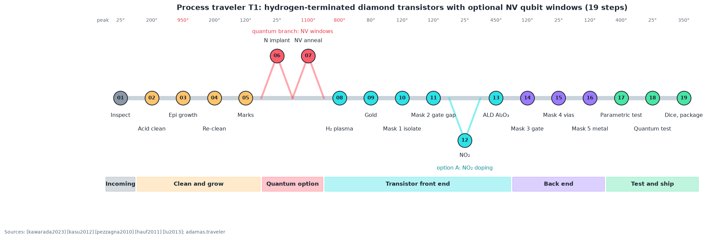
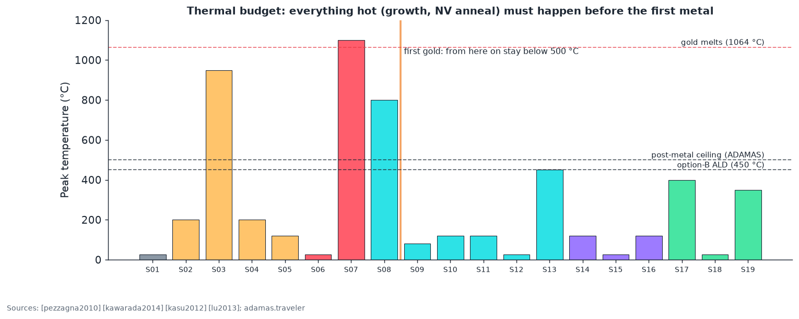
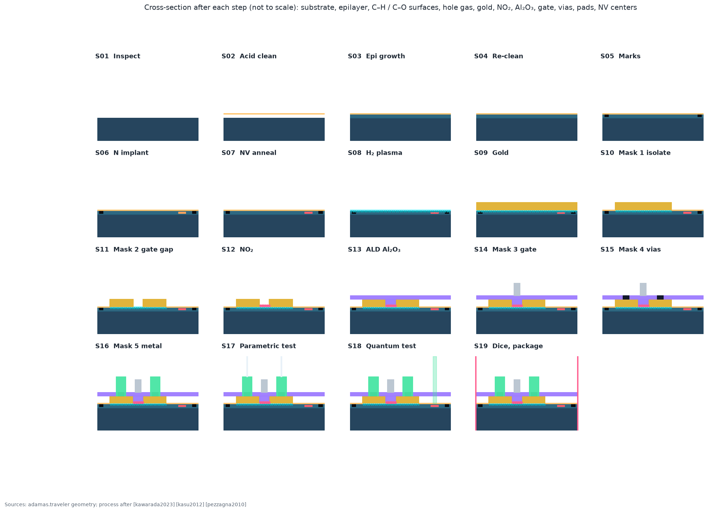

# Process engineering: from a diamond plate to a working chip

This folder turns the framework into something you can run in a cleanroom. It is written for a process engineer or a graduate student who has cleanroom access and wants to build the devices this repository models.

| Document | What it is |
|---|---|
| [TRAVELER.md](TRAVELER.md) | The 19-step run sheet T1: purpose, equipment, starting-point parameters with sources, in-line checks with pass criteria, safety, failure modes, and the silicon equivalent for every step. Generated from `adamas/traveler.py`. |
| [APPLICATIONS.md](APPLICATIONS.md) | Which variant of the flow builds which product: power switch, RF amplifier, high-temperature logic, quantum sensor, qubit chip. Targets, test plans, and the numbers to beat. |
| [Interactive traveler](https://normansrule.github.io/adamas-diamond-framework/process.html) | The same steps in the browser: animated cross-section, variant selector, a run log that checks your measurements against the pass criteria and exports CSV, and a printable traveler. |

## The flow at a glance

Three ideas make a diamond flow different from a silicon one, and the whole traveler follows from them.

1. **The channel is made by surface chemistry, not doping.** A hydrogen-terminated surface plus an acceptor (air, NO₂, or the Al₂O₃ itself) creates a two-dimensional hole gas a few nanometers deep ([maier2000], [kawarada2023]). There is no implant, no activation anneal, and no well. Isolation is simply turning C–H into C–O with an oxygen plasma.
2. **Gold goes on first and protects everything.** The C–H surface is fragile, so it is covered with gold immediately after termination; lithography then removes gold where it is not wanted, and the same openings define isolation and the channel ([kawarada2023]).
3. **Heat is spent early.** Growth (up to about 1000 °C) and the NV anneal (up to about 1100 °C) must come before the first metal, because gold melts at 1064 °C and the hole gas and oxide cannot survive much above 500 °C.

## How to use the traveler on a real line

1. **Pick a variant** in [APPLICATIONS.md](APPLICATIONS.md). It tells you which steps to skip and which options (NO₂ doping, ALD temperature, gate length, NV implant) to choose.
2. **Qualify each step alone first.** Run the check for each step on test pieces before running a device lot; record results in the interactive run log (it flags values outside the pass window) and export CSV for your lab notebook.
3. **Always include the PDK-0 monitor die.** Its transfer-length ladder, van der Pauw cross, MOS capacitor, transistor array, serpentine-comb, ring oscillators, and NV witness array turn every lot into model parameters (`make layout` writes the GDS; chapter [E2](../expert/E2_process_integration_and_pdk.md)).
4. **Feed the numbers back.** Measured contact resistance, sheet resistance, threshold voltage, mismatch, and ring-oscillator period replace the placeholder parameters in `adamas.logic`, `adamas.stdcells`, and the SPICE models (projects P-3 and D-2); measured NV contrast, T₂, and charge-state fraction replace those in `adamas.gate_budget`.

## A note on safety and on the numbers

Several steps use genuinely hazardous materials: hot perchloric-acid mixtures (explosive residues; perchloric-rated hood only), hydrofluoric acid (buffered oxide etch), toxic NO₂, pyrophoric trimethylaluminium, flammable hydrogen and methane, high-power lasers and microwaves. The traveler flags each one, but it summarizes hazards; your facility's training, standard operating procedures, and chemical-hygiene plan always take precedence. Parameters are starting points from the cited literature, to be tuned on your own tools.
