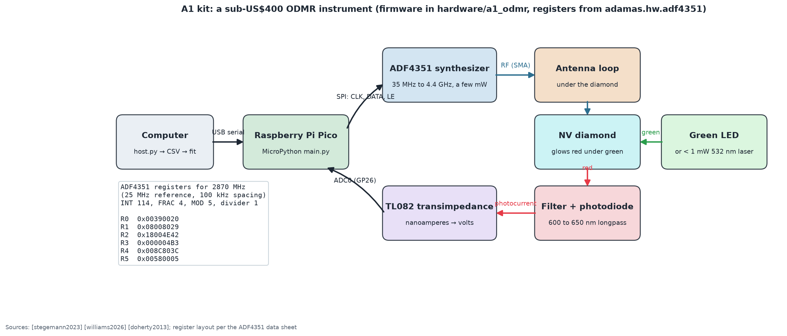

# A1 kit: firmware and host software for a kitchen-table ODMR experiment

Turns the A1 parts list of [EXPERIMENTS.md](../../docs/experiments/EXPERIMENTS.md) into a working instrument: a Raspberry Pi Pico sweeps an ADF4351 synthesizer through the NV resonance, reads the photodiode amplifier, and streams the spectrum to your computer, which saves a CSV and fits it with `adamas.fit`.



## Wiring

| Pico pin | Connects to | Purpose |
|---|---|---|
| GP18 (SPI0 SCK) | ADF4351 CLK | serial clock |
| GP19 (SPI0 TX) | ADF4351 DATA | serial data |
| GP17 | ADF4351 LE | latch enable (rising edge loads a register) |
| GP20 | ADF4351 CE | chip enable (held high) |
| GP26 (ADC0) | transimpedance amplifier output | photodiode signal, 0 to 3.3 V |
| 3V3, GND | ADF4351 board logic and ground; amplifier ground | power and common ground |
| USB | your computer | power, programming, data |

Power the ADF4351 board from its own 5 V input if it has a regulator (most modules do). Connect the synthesizer's RF output (SMA) to the antenna loop or microstrip under the diamond. Keep the amplifier output within 0 to 3.3 V; the TL082 transimpedance stage of [stegemann2023] with a 1 to 10 MΩ feedback resistor suits photocurrents of tens of nanoamperes.

## Install and run

```bash
pip install mpremote pyserial
mpremote cp adamas/hw/adf4351.py :adf4351.py
mpremote cp adamas/hw/odmr_sweep.py :odmr_sweep.py
mpremote cp hardware/a1_odmr/main.py :main.py
mpremote reset
python hardware/a1_odmr/host.py --port /dev/ttyACM0 --start 2800 --stop 2940 --step 0.5 --avg 64 --out sweep.csv
```

On Windows use `--port COM5` (check Device Manager). Under WSL2, attach the Pico first with `usbipd attach --wsl --busid <id>` from an administrator PowerShell, or run `host.py` from Windows Python.

## What to expect

A dip of 0.5 to 3% near 2870 MHz within a few sweeps; bring a magnet close and it splits. The host prints the fit (line centers, contrast, field). Drag `sweep.csv` into the [Data Lab](https://normansrule.github.io/adamas-diamond-framework/datalab.html) to see the fit animate.

## How the synthesizer is programmed

`adamas/hw/adf4351.py` computes the six 32-bit registers for each frequency (phase-frequency detector at 25 MHz, 100 kHz channel spacing, the RF divider that keeps the voltage-controlled oscillator in 2.2 to 4.4 GHz) and the firmware writes them R5 first. The defaults reproduce the common evaluation-board register values, which the test suite checks; the same file runs under CPython and MicroPython, and `adamas/hw/odmr_sweep.py` holds the sweep loop so it can be tested without hardware.

**Safety.** Low-power microwaves only (the ADF4351 delivers a few milliwatts); do not add an amplifier without a shielded enclosure. Follow the laser or LED safety notes of experiment A1.
